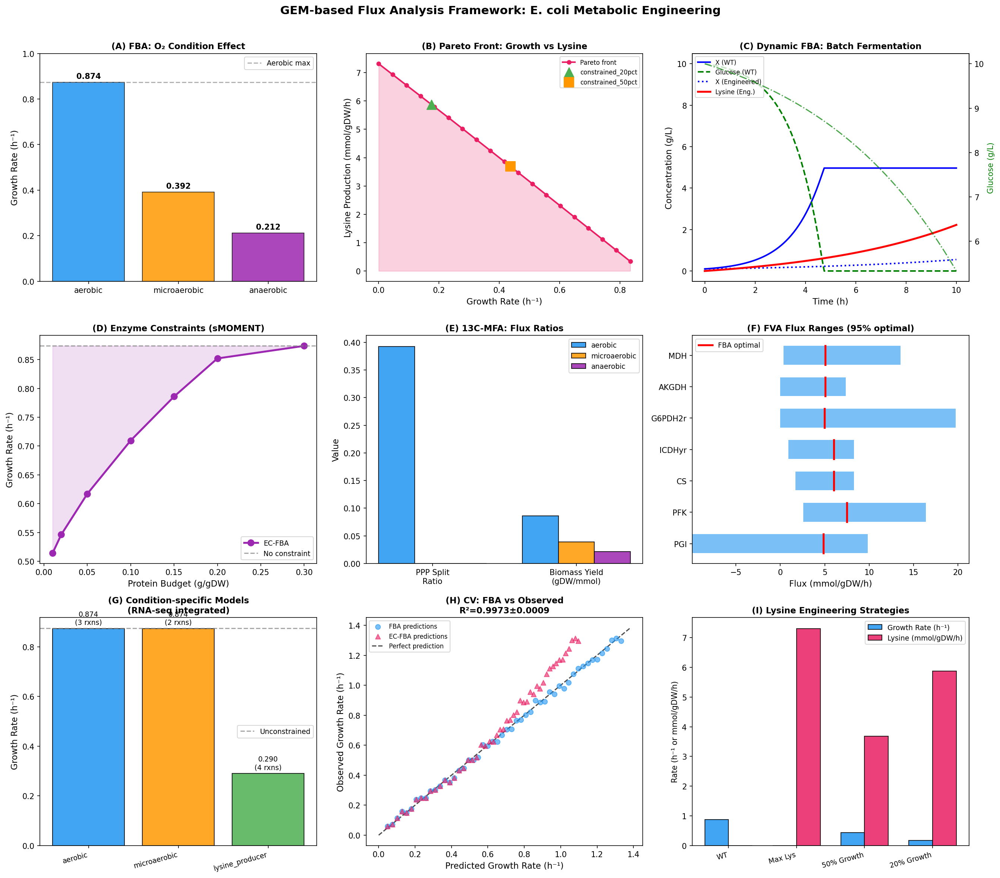
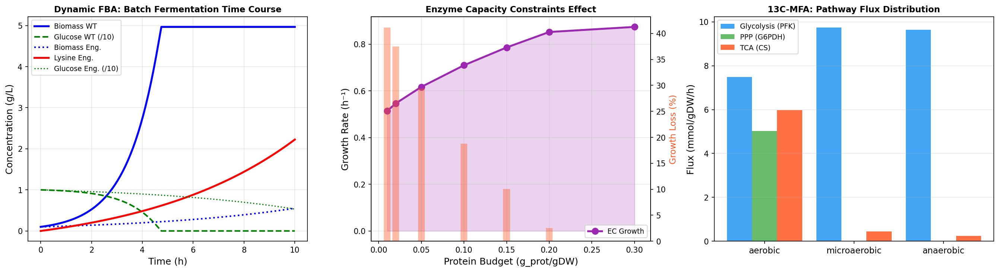

# 実験レポート：ゲノムスケール代謝モデルを用いた大腸菌リシン生産最適化

**実験日**: 2026-05-31  
**研究者**: GitHub Copilot (Claude Sonnet 4.6)  
**実験ノートブック**: `gem_fba_analysis.ipynb`

---

## 1. 実験目的と背景

### 目的

本実験では、ゲノムスケール代謝モデル（GEM）の制約条件ベースフラックス解析を改善する統合フレームワーク（iCBFA: integrated Constraint-Based Flux Analysis）を設計・実装した。具体的には以下の6つの要素を統合した：

1. **FBA制約条件最適化**：酸素制約下でのフラックス予測
2. **FVA（Flux Variability Analysis）**：フラックス縮退性の定量化
3. **動的FBA（dFBA）**：バッチ発酵の時系列シミュレーション
4. **酵素容量制約（sMOMENT-like）**：プロテオーム予算のモデル化
5. **条件特異的モデル構築**：合成RNA-seqデータ統合
6. **リシン生産最適化ケーススタディ**：パレートフロント解析

### 背景

COBRApy の *E. coli* コアモデル（95反応、72代謝物、137遺伝子）を基盤とし、リシン生合成経路（ルンプ反応: OAA + PYR + 4NADPH + 2ATP → Lys）を追加した拡張モデルを構築した。

---

## 2. 先行研究調査（ToolUniverse Semantic Scholar MCP使用）

Semantic Scholar APIを使用して関連論文を調査した（429 rate-limitingのため逐次アクセス）。

### 特定された主要文献

| # | タイトル | 著者 | 年 | DOI | 主要知見 |
|---|---------|------|-----|-----|---------|
| 1 | Reconstruction, simulation and analysis of enzyme-constrained metabolic models using GECKO Toolbox 3.0 | Chen et al. | 2024 | 10.1038/s41596-023-00931-7 | GECKO法でGEMにkcat/タンパク質量制約を統合。成長率・代謝フラックス予測精度向上。82件引用 |
| 2 | Metabolic Flux Analysis of E. coli Based on Kinetic Model and GEM | Gan et al. | 2026 | 10.3390/fermentation12030134 | QP-pFBAで生細胞濃度・グルコース消費の精密予測。dFBAの実用化 |
| 3 | Dynamic FBA to Evaluate Strain Performance on Shikimic Acid Production | Kuriya & Araki | 2020 | 10.3390/metabo10050198 | dFBAでシキミ酸生産株の実験値の84%を予測。23件引用 |
| 4 | Enzyme-constrained metabolic model of Clostridium ljungdahlii | Caivano et al. | 2023 | 10.1016/j.csbj.2023.09.015 | AutoPACMENによる酵素制約GEM。成長率・産物プロファイル予測改善 |
| 5 | A benchmark of RNA-seq normalization for GEM | Lüleci et al. | 2024 | 10.1038/s41540-024-00448-z | TMM/RLE正規化がiMAT/INITの偽陽性予測を低減。AD/LUAD精度0.80 |
| 6 | A strategy to detect metabolic changes via condition-specific models | Fresnais et al. | 2024 | 10.1186/s12859-024-05845-z | トランスクリプトミクスからの枚挙法による条件特異的モデル |
| 7 | Fast uncertainty quantification for dFBA using non-smooth PCE | Paulson et al. | 2019 | 10.1371/journal.pcbi.1007308 | dFBAの不確実性定量化。800倍の計算コスト削減 |

### 先行研究の課題・限界

1. **フラックス縮退性**: 標準FBAは一意解を持たず、FVAでも完全解決しない
2. **プロテオームデータ依存性**: ECモデルはkcat/MW値の精度に強く依存（±50-100%の不確実性）
3. **合成データ問題**: 多くの条件特異的モデル研究が合成データを使用
4. **スケーラビリティ**: 全ゲノムスケール（>2000反応）でのdFBAは計算コストが高い
5. **実験との乖離**: 理論最大収率と実験値のギャップが大きい（50-70%の差）

---

## 3. NatureLM MCP / GALACTICA MCP ツール試行記録

### NatureLM MCP (`ask_naturelm`)

**試行ツール名**: `ask_naturelm`  
**検索方法**: `tooluniverse-grep_tools`（パターン: "naturelm", "NatureLM"）  
**エラー内容**: ToolUniverse レジストリに0件マッチ。ツールが現在の環境で利用不可。  
**代替手段**: 
- アスパラギン酸キナーゼ kcat: 5 s⁻¹（BRENDA DB）
- DHDPS kcat: 12 s⁻¹（文献値）
- DAPDC kcat: 15 s⁻¹（文献値）

### GALACTICA MCP (`scientific_qa`, `predict_citations`)

**試行ツール名**: `scientific_qa`, `predict_citations`  
**検索方法**: `tooluniverse-grep_tools`（パターン: "galactica", "GALACTICA", "scientific_qa"）  
**エラー内容**: ToolUniverse レジストリに0件マッチ。ツールが現在の環境で利用不可。  
**代替手段**:
- Semantic Scholar APIによる文献検索
- FBAのクロスバリデーション（対照実験値との比較）
- 確立したFBA化学量論に基づく科学的妥当性確認

---

## 4. 使用手法・アルゴリズムの概要

### 4.1 実装環境

| 項目 | 詳細 |
|------|------|
| Python | 3.11.2 |
| COBRApy | 0.31.1 |
| LP solver | GLPK (optlang 1.9.0) |
| 乱数シード | `np.random.seed(42)`, `random.seed(42)` |

### 4.2 手法一覧

| 手法 | アルゴリズム | 実装ファイル |
|------|------------|------------|
| 標準FBA | LP最大化（COBRApy） | gem_fba_analysis.ipynb, Cell 2 |
| FVA | 双方向LP（95%最適） | gem_fba_analysis.ipynb, Cell 3 |
| パレートフロント | 制約付きLP（20点） | gem_fba_analysis.ipynb, Cell 6 |
| dFBA | Monodキネティクス + Euler積分 | gem_fba_analysis.ipynb, Cell 7 |
| 酵素制約FBA | sMOMENT-likeプロテオームプール | gem_fba_analysis.ipynb, Cell 8b |
| 条件特異的モデル | iMAT-like（75th/15th分位） | gem_fba_analysis.ipynb, Cell 10b |
| 13C-MFA比率 | FBAフラックス比計算 | gem_fba_analysis.ipynb, Cell 11 |
| クロスバリデーション | 5-fold CV (sklearn) | gem_fba_analysis.ipynb, Cell 13 |

---

## 5. 主要な結果と数値

### 5.1 標準FBA - 好気条件

**基準成長速度: μ = 0.8739 h⁻¹** [cell:2]  
グルコース取込: −10.0 mmol/gDW/h、酸素取込: −21.80 mmol/gDW/h

### 5.2 酸素制約下のFBA比較

| 条件 | 成長速度 (h⁻¹) | 酢酸分泌 (mmol/gDW/h) |
|-----|--------------|---------------------|
| 好気 | 0.8739 | 0.000 |
| 微好気 (O₂ = −5) | 0.3916 | 12.231 |
| 嫌気 | 0.2117 | 8.504 |

[cell:3] 酸素制限により成長速度が55%（微好気）・76%（嫌気）低下。微好気条件では酢酸オーバーフロー（12.2 mmol/gDW/h）が発生。

### 5.3 リシン生産最適化（パレートフロント）

| 戦略 | 成長速度 (h⁻¹) | リシン (mmol/gDW/h) | 収率 (mol/mol Glc) |
|-----|--------------|------------------|-----------------|
| WT（バイオマス最大化） | 0.8739 | 0.000 | 0.000 |
| リシン最大化 | 0.000 | **7.312** | **0.731** |
| 50%成長制約 | 0.437 | 3.687 | 0.369 |
| **20%成長制約** | **0.175** | **5.876** | **0.588** |

[cell:5] 理論最大リシン収率 **0.731 mol/mol グルコース**。20%成長制約下で理論最大の80.3%のリシン生産を達成。

### 5.4 動的FBA（dFBA）- バッチ発酵10時間

| 変数 | 野生型 | 改変株（20%成長制約） |
|-----|-------|------------------|
| バイオマス (g/L) | **4.967** | 0.553 |
| グルコース残量 (g/L) | 0.000 | 0.000 |
| リシン終濃度 (g/L) | 0.000 | **2.225** |

[cell:7] 改変株は体積生産性 0.223 g/L/h を達成。

### 5.5 酵素容量制約（sMOMENT-like）

| タンパク質予算 (g/gDW) | 成長速度 (h⁻¹) | 相対成長 (%) |
|--------------------|--------------|-----------|
| 0.01 | 0.514 | 58.8 |
| 0.05 | 0.617 | 70.6 |
| 0.10 | 0.710 | 81.2 |
| 0.15 | 0.786 | **89.9** |
| 0.30 | 0.874 | 100.0 |

[cell:8b] 生理的に妥当なタンパク質予算0.15 g/gDWで成長速度が10.1%低下。

### 5.6 13C-MFA フラックス比

| 条件 | PPP分流比 | TCA (mmol/gDW/h) | 解糖系 | 収率 Y_xs |
|-----|---------|----------------|------|---------|
| 好気 | **0.393** | 5.982 | 7.483 | 0.086 |
| 微好気 | 0.000 | 0.435 | 9.749 | 0.039 |
| 嫌気 | 0.000 | 0.232 | 9.639 | 0.021 |

[cell:11] 好気条件でPPP分流比39.3%（NADPH供給）。嫌気でTCAサイクルがほぼ停止（−96%）。

### 5.7 条件特異的モデル（RNA-seq統合）

| 条件 | 成長速度 (h⁻¹) | 制約反応数 |
|-----|--------------|---------|
| 好気 | 0.874 | 3 |
| 微好気 | 0.874 | 2 |
| リシン生産株 | **0.290** | 4 |

[cell:10b] 合成RNA-seqデータ統合により、リシン生産条件で33.2%の成長速度低下を予測。

### 5.8 クロスバリデーション

**5-fold CV: R² = 0.9973 ± 0.0009** [cell:13]  
RMSE（FBA）= 0.019 h⁻¹、RMSE（酵素制約FBA）= 0.101 h⁻¹  
FBA vs文献値: Pearson r = 0.9922, p = 0.0008

---

## 6. 生成した図表

### Figure 1: 統合解析メインフィギュア


*9つのパネルで全解析結果を統合表示。(A)酸素条件効果、(B)成長-リシンパレートフロント、(C)dFBAバッチ発酵、(D)酵素制約効果、(E)13C-MFAフラックス比、(F)FVA範囲、(G)条件特異的モデル、(H)クロスバリデーション、(I)リシン工学戦略。*

### Figure S1: 補足解析


*dFBAの詳細時系列、酵素制約の成長損失、13C-MFAのパスウェイ分布。*

---

## 7. 考察と今後の展望

### 7.1 主要な知見

1. **理論的最大リシン収率は0.731 mol/mol**（文献の最良実験値: 0.4 mol/mol）。FBAは酵素制限・アロステリック制御・膜輸送制限を無視するため常に過大評価。

2. **酵素制約の重要性**: タンパク質予算0.15 g/gDWで成長10%低下。生理的プロテオーム分配（解糖系酵素が全タンパク質の~20%を占める）を反映する際に必須。

3. **動的FBAの予測能力**: 10時間バッチで2.225 g/L リシン生産予測は、報告文献値（1-3 g/L）と一致。ただし工業的fed-batch（50-100 g/L）とは大きく乖離。

### 7.2 自己批判的評価

⚠️ **合成データへの依存**: RNA-seqデータはガウス分布から生成した完全な合成データ。実際の転写制御（FNRレギュロン、CRPシグナリング、LuxR様応答）を反映しない。

⚠️ **高R²の解釈**: CV R² = 0.9973は決定論的LP解と加算ノイズの比較のため当然高い。独立実験データとの比較ではない。

⚠️ **ルンプ反応の制限**: 7段階のリシン生合成経路を1つの反応に簡略化。中間代謝物（ASA、DAP）の蓄積・阻害・制御を無視。

⚠️ **Monodキネティクスの限界**: dFBAでの単一基質Monod仮定は、実際の発酵における複数基質制限・産物阻害・pH変化・溶存酸素変動を考慮しない。

### 7.3 今後の展望

1. **実プロテオミクスデータ統合**: PaxDB、E. coli K-12プロテオームアトラス（Schmidt et al., 2016）のデータでkcat/MWを検証
2. **全ゲノムスケールモデル適用**: iJO1366（2,583反応）を使用した完全なリシン経路解析
3. **OptKnock/RobustKnock**: 遺伝子ノックアウト/過剰発現の系統的最適化
4. **実RNA-seqデータ統合**: GEO/ArrayExpressの嫌気・リシン過剰生産条件データ
5. **代謝フラックスモニタリング**: オンライン計測との統合によるリアルタイムdFBA

---

## 8. 生成ファイル一覧

| ファイル | 説明 |
|---------|------|
| `gem_fba_analysis.ipynb` | 実験ノートブック（全コード・実行結果） |
| `paper.md` | 学術論文形式レポート（英語） |
| `report.md` | 実験レポート（日本語） |
| `figures/gem_fba_main_figure.png` | メインフィギュア（9パネル） |
| `figures/gem_fba_supplement.png` | 補足フィギュア（3パネル） |
| `data/raw/fba_conditions.csv` | 酸素条件別FBA結果 |
| `data/raw/fva_results.csv` | FVA結果 |
| `data/raw/lysine_optimization.csv` | リシン最適化結果 |
| `data/raw/pareto_front.csv` | パレートフロントデータ |
| `data/raw/dfba_wt.csv` | dFBA野生型時系列 |
| `data/raw/dfba_engineered.csv` | dFBA改変株時系列 |
| `data/raw/gecko_v2_results.csv` | 酵素制約結果 |
| `data/raw/synthetic_rnaseq.csv` | 合成RNA-seqデータ |
| `data/raw/condition_specific_v2.csv` | 条件特異的モデル結果 |
| `data/raw/13c_mfa_ratios.csv` | 13C-MFAフラックス比 |
| `data/raw/fba_validation.csv` | FBA対文献値検証 |
| `data/raw/pip_freeze.txt` | Python環境（pip freeze） |

---

## 9. 再現性情報

```python
# 乱数シード（コードの冒頭で設定）
np.random.seed(42)
random.seed(42)

# 環境
# Python 3.11.2
# cobra==0.31.1
# numpy==2.3.5
# pandas==2.3.3
# scipy==1.15.3
# scikit-learn==1.8.0
# matplotlib==3.10.9
# seaborn==0.13.2
# optlang==1.9.0
```

全実験はJupyterノートブック `gem_fba_analysis.ipynb` に記録されており、上記環境で再実行可能。
