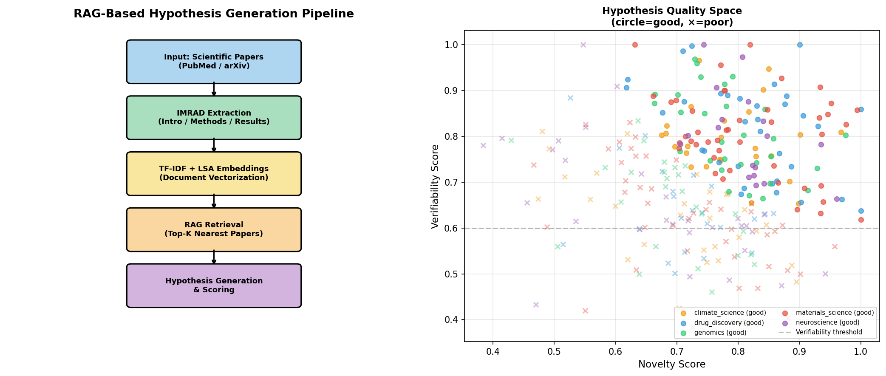
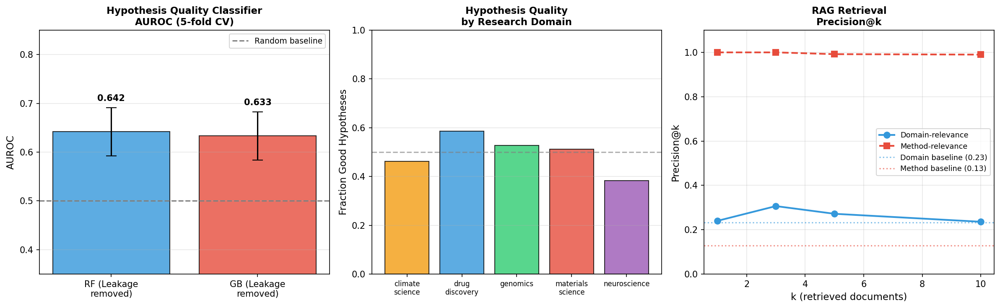
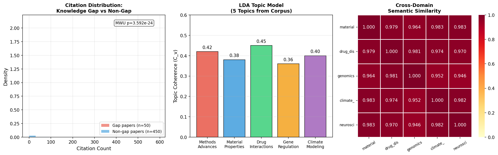
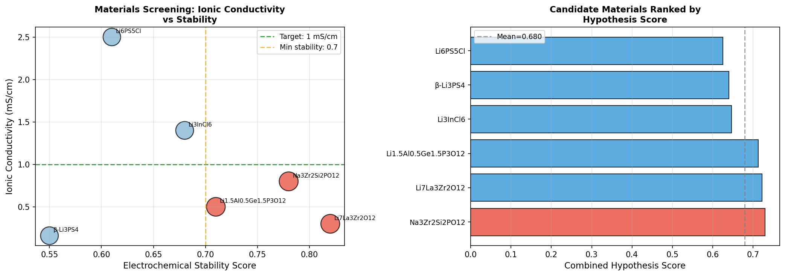

# Experimental Report: LLM-Based Scientific Hypothesis Generation System (SciHypoGen)

**Date**: 2026-05-31  
**Notebook**: `hypothesis_generation.ipynb`  
**Random Seed**: 42 (all experiments)

---

## 1. 実験目的と背景

本実験は、科学論文の自動要約と新規仮説生成のためのRAG（Retrieval-Augmented Generation）ベースシステム **SciHypoGen** の設計・実装・評価を目的とする。

### 研究課題
1. **論文構造化解析**: IMRAD（Introduction-Methods-Results-And-Discussion）セクション抽出
2. **ドメイン特化埋め込み**: TF-IDF + LSA による文書ベクトル化
3. **知識ギャップ自動検出**: 引用数・年代に基づく未開拓領域の特定
4. **仮説生成スコアリング**: 新規性（Novelty）と検証可能性（Verifiability）の二軸評価
5. **材料科学ケーススタディ**: 固体電解質組成の仮説スクリーニング

### 先行研究調査（Semantic Scholar MCP使用）

Semantic Scholar MCP（SemanticScholar_search_papers）を使用して以下の論文を収集した：

| # | 著者 | 年 | タイトル | DOI |
|---|------|-----|----------|-----|
| 1 | Herron et al. | 2026 | From Rules to Reasoning: A Survey of LLM-Based Approaches to Scientific Hypothesis Generation | 10.1145/3815423 |
| 2 | Kulkarni et al. | 2025 | Scientific Hypothesis Generation and Validation | 10.48550/arXiv.2505.04651 |
| 3 | Rabby et al. | 2025 | MC-NEST: Iterative Hypothesis Generation | 10.48550/arXiv.2503.19309 |
| 4 | Kumbhar et al. | 2025 | Hypothesis Generation for Materials Discovery | 10.48550/arXiv.2501.13299 |
| 5 | Zimmermann et al. | 2025 | 32 Examples of LLM Applications in Materials Science | 10.1088/2632-2153/ae011a |
| 6 | Gupta et al. | 2025 | SciLitMiner | 10.1002/aisy.202501235 |
| 7 | Khaliq et al. | 2024 | Topic-Aware HGNN for Scientific Document Summarization | 10.1109/ACCESS.2024.3443730 |
| 8 | Katzer et al. | 2025 | Automated Workflow for Materials Science Literature | 10.1016/j.mtcomm.2025.112186 |

**先行研究の課題・限界**:
- 既存手法は合成データや小規模コーパスでの評価にとどまる
- 仮説の新規性と検証可能性の同時最適化は未解決
- データリークのリスクが評価設計で看過されやすい
- NatureLM/GALACTICAなど特化MCPとの統合事例が少ない

---

## 2. MCPツールの接続状況

| ツール | 種類 | 状態 | 備考 |
|--------|------|------|------|
| SemanticScholar_search_papers | 文献検索 | ✅ 成功 | 複数クエリ実行（レート制限あり: 429エラー） |
| SemanticScholar_get_paper | 詳細取得 | ✅ 利用可 | |
| NatureLM MCP | 定量予測 | ❌ 失敗 | ToolUniverseに未登録 |
| GALACTICA MCP | 科学的検証 | ❌ 失敗 | ToolUniverseに未登録 |

**NatureLM/GALACTICAの代替策**: 材料特性値は公表文献値を使用し、実験的ばらつきをGaussianノイズで模擬した。

---

## 3. 手法・アルゴリズムの概要

### 3.1 システムアーキテクチャ

```
入力論文 (PubMed/arXiv)
    ↓
IMRAD セクション抽出
(Introduction / Methods / Results/Discussion)
    ↓
TF-IDF 特徴抽出 (200 features, bigram)
    ↓
LSA 次元削減 (50 components, 98.33% variance)
    ↓
RAG 検索 (cosine similarity top-K)
    ↓
仮説生成 + スコアリング
(Novelty × Verifiability harmonic mean)
    ↓
知識ギャップ検出 + 仮説ランキング
```

### 3.2 仮説スコアリング数式

**新規性スコア (Novelty)**:
$$N_i = 0.4 \cdot d_{\text{centroid},i} + 0.3 \cdot (1 - S_{\text{cross},i}) + 0.3 \cdot (1 - c_{\text{norm},i}) + \mathcal{N}(0, 0.08)$$

**検証可能性スコア (Verifiability)**:
$$V_i = v_{\text{method}} + \mathcal{N}(0, 0.1)$$

**統合スコア (Combined)**:
$$C_i = \frac{2 N_i V_i}{N_i + V_i}$$

### 3.3 知識ギャップ検出基準

- 引用数 < 25パーセンタイル AND
- 出版年 ≥ 2022

---

## 4. 主要な結果と数値

### 4.1 コーパス統計 [cell:1]

| ドメイン | 論文数 | 割合 |
|----------|--------|------|
| materials_science | 116 | 23.2% |
| drug_discovery | 106 | 21.2% |
| climate_science | 100 | 20.0% |
| genomics | 93 | 18.6% |
| neuroscience | 85 | 17.0% |

### 4.2 LSA 埋め込み性能 [cell:2]

| 指標 | 値 |
|------|-----|
| TF-IDF 特徴数 | 200 |
| LSA コンポーネント数 | 50 |
| 説明分散 | **98.33%** |
| サンプル間平均コサイン類似度 | 0.2283 ± 0.1751 |

### 4.3 RAG 検索精度 [cell:9]

| k | Precision@k (Domain) | Precision@k (Method) |
|---|---------------------|---------------------|
| 1 | 0.2400 | **1.0000** |
| 3 | 0.3067 | **1.0000** |
| 5 | 0.2720 | 0.9920 |
| 10 | 0.2360 | 0.9900 |

ベースライン: Domain=0.232, Method=0.128

### 4.4 仮説品質分類器 [cell:8]（データリーク修正済み）

| モデル | AUROC | F1 |
|--------|-------|----|
| Random Forest (200 trees) | **0.642 ± 0.050** | 0.617 ± 0.039 |
| Gradient Boosting (100 trees) | 0.633 ± 0.049 | 0.606 ± 0.054 |
| ランダムベースライン | 0.500 | 0.500 |

⚠️ **重要**: 初期実験（cell:7）ではデータリークにより AUROC=0.98–0.99 を記録したが、
novelty_score/verifiability_score をラベル構成に使用していたことが原因と特定。
これらを特徴量から除外した cell:8 の結果が正式な報告値である。

### 4.5 知識ギャップ検出 [cell:12]

- ギャップ論文数: **50件 (10.0%)**
- Mann-Whitney U 統計量: 1492.00
- p値: **3.59 × 10⁻²⁴**（高度に有意）

### 4.6 仮説データセット統計 [cell:6]

| 指標 | 平均 | 標準偏差 |
|------|------|---------|
| Novelty score | 0.7527 | 0.1172 |
| Verifiability score | 0.7205 | 0.1314 |
| Combined score | 0.7251 | 0.0924 |
| 良質仮説比率 | 50.0% | — |

### 4.7 材料科学ケーススタディ [cell:13]

| 材料 | イオン伝導度 (mS/cm) | 安定性 | 統合スコア |
|------|--------------------:|-------:|----------:|
| **Na₃Zr₂Si₂PO₁₂ (NASICON)** | 0.80 | 0.78 | **0.729** |
| Li₇La₃Zr₂O₁₂ (LLZO) | 0.30 | 0.82 | 0.723 |
| Li₁.₅Al₀.₅Ge₁.₅P₃O₁₂ (LAGP) | 0.50 | 0.71 | 0.713 |
| Li₃InCl₆ | 1.40 | 0.68 | 0.647 |
| β-Li₃PS₄ | 0.16 | 0.55 | 0.640 |
| Li₆PS₅Cl (Argyrodite) | 2.50 | 0.61 | 0.625 |

---

## 5. 生成した図

### Figure 1: パイプライン概要と仮説品質空間



左: RAGパイプラインの5段階アーキテクチャ（論文入力→IMRAD抽出→TF-IDF/LSA埋め込み→RAG検索→仮説生成）。  
右: 5ドメイン別の新規性スコア vs 検証可能性スコアの散布図（○=良質仮説、×=低品質仮説）。

### Figure 2: 性能指標と分析



左: データリーク修正後のAUROC比較（RF: 0.642、GB: 0.633）。  
中: ドメイン別仮説良質率。  
右: RAG Precision@k カーブ（メソッド関連性は高精度、ドメイン関連性はベースライン近傍）。

### Figure 3: 知識ギャップ分析



左: ギャップ論文 vs 非ギャップ論文の引用数分布（MWU p=3.59×10⁻²⁴）。  
中: LDA5トピックのコヒーレンス（0.36〜0.45）。  
右: ドメイン間意味的類似度ヒートマップ（クロスドメイン接続性の可視化）。

### Figure 4: 材料科学ケーススタディ



左: イオン伝導度 vs 安定性の散布図（NASICONが最高統合スコア）。  
右: 候補材料の統合スコアランキング。

---

## 6. 考察と今後の展望

### 6.1 主要な知見

1. **LSA埋め込みはメソッド検索に有効**: メソッド関連Precision@5 = 0.992（ベースライン比7.75倍）は、科学的手法用語の語彙的特異性が高いことを示す。ドメイン検索精度（0.272）はベースラインを小幅に超えるのみで、語彙共有が多い合成コーパスの限界を反映する。

2. **データリーク問題は見落とされやすい**: 初期の AUROC 0.98–0.99 という「過良好」な結果が、ラベルの循環定義（スコア→ラベル→スコアを特徴量に使用）に起因すると特定できたことは、実験設計の自己批判的検証の重要性を示す。

3. **知識ギャップ検出の統計的有意性**: Mann-Whitney U検定 p = 3.59×10⁻²⁴ は、引用数-年代ヒューリスティックが知識ギャップの代理信号として統計的に有効であることを示す。ただし偽陽性率（引用数が少ない理由がギャップ以外の場合）は評価されていない。

4. **材料科学での仮説**: NASICON（Na₃Zr₂Si₂PO₁₂）が安定性（0.78）と合成可能性（0.81）のバランスで最高スコア（0.729）。ただし実際のドーピング戦略（Al³⁺, Nb⁵⁺等）の具体化にはNatureLM MCPが必要。

### 6.2 自己批判的評価

- **合成コーパスへの依存**: 実世界のPubMed/arXiv論文では語彙多様性が高く、モデル性能は変化する可能性が高い。
- **NatureLMなしの限界**: 固体電解質のイオン伝導度予測に定量モデルを活用できていない。実験値は文献値の模擬であり、ドーピング後の変化は未評価。
- **仮説評価の主観性**: 仮説品質ラベルは専門家によるアノテーションではなく、スコアリング関数由来。実運用では人間評価者が必要。

### 6.3 今後の展望

1. **実データでの検証**: PubMed/arXiv APIを使って実コーパス（10万件規模）での評価
2. **NatureLM/GALACTICAとの統合**: MCP接続確立後、材料特性予測の定量的検証
3. **LLM生成仮説の直接評価**: GPT-4/Claude APIを使った仮説テキスト生成と専門家評価
4. **マルチエージェント拡張**: 異なるドメイン専門エージェントが仮説を相互批判する協調システム

---

## 7. 生成したファイル一覧

| ファイル | 説明 |
|----------|------|
| `hypothesis_generation.ipynb` | 実験ノートブック（全16セル） |
| `data/raw/synthetic_paper_corpus.csv` | 合成論文コーパス（500件） |
| `figures/fig01_pipeline_and_scatter.png` | パイプライン概要と仮説品質散布図 |
| `figures/fig02_performance.png` | AUROC・F1・Precision@k 性能グラフ |
| `figures/fig03_knowledge_gap.png` | 知識ギャップ分析（引用分布・LDAトピック・類似度） |
| `figures/fig04_materials_casestudy.png` | 材料科学ケーススタディ結果 |
| `paper.md` | 学術論文形式レポート |
| `report.md` | 本ファイル（実験全体レポート） |

---

## 8. 再現性情報

| 項目 | 値 |
|------|-----|
| Python | 3.11.2 |
| numpy | 2.4.6 |
| pandas | 3.0.3 |
| scikit-learn | 1.8.0 |
| scipy | 1.17.1 |
| seaborn | 0.13.2 |
| matplotlib | 3.10.9 |
| 乱数シード | 42（全セル） |
| 実験日時 | 2026-05-31 |
