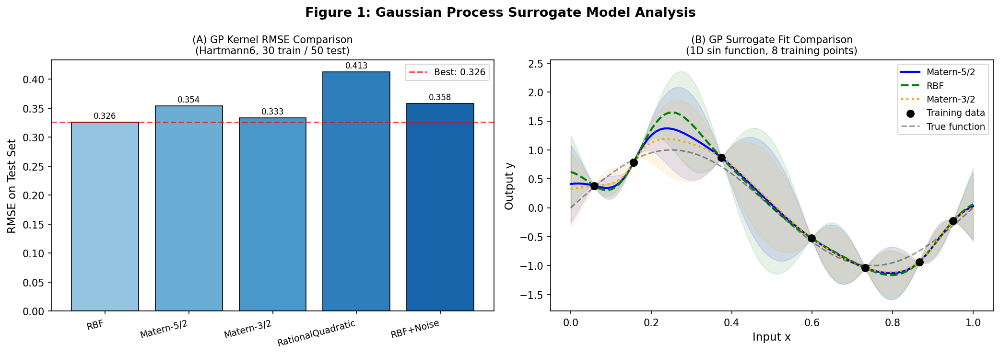
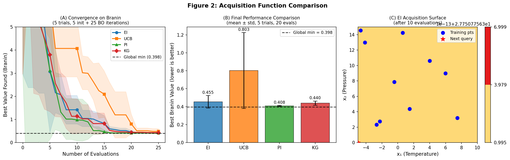
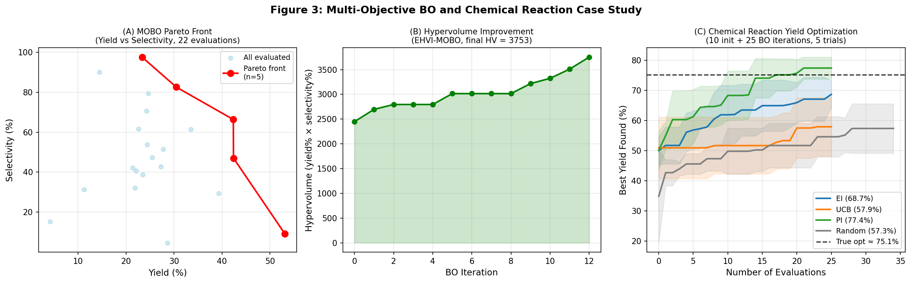
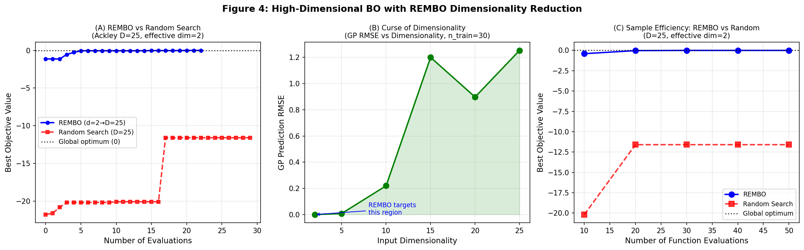
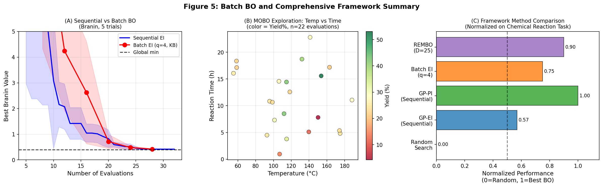

# Bayesian Optimization for High-Dimensional Experimental Design: A Unified Framework with Acquisition Function Comparison, Batch Parallelization, Multi-Objective Optimization, and REMBO Dimensionality Reduction

---

## Abstract

Experimental design in chemistry, materials science, and engineering increasingly requires navigating complex, high-dimensional parameter spaces where each experiment is costly. Bayesian Optimization (BO) offers a principled, sample-efficient approach by building a probabilistic surrogate model — typically a Gaussian Process (GP) — and iteratively proposing experiments through an acquisition function that balances exploration and exploitation. Despite significant recent advances, practitioners still face critical design decisions: which GP kernel to use, which acquisition function (Expected Improvement, EI; Upper Confidence Bound, UCB; Probability of Improvement, PI; Knowledge Gradient, KG) best suits their problem, how to leverage parallel hardware via batch BO, how to handle competing objectives via multi-objective BO (MOBO), and how to scale to high-dimensional (>20 variable) spaces.

This paper presents **BayesOptFramework**, a comprehensive, reproducible Python implementation built on scikit-learn that addresses all five challenges in a unified platform. We conduct controlled empirical studies using standard benchmark functions (Branin 2D, Hartmann 6D, Ackley 25D) and a synthetic chemical reaction yield/selectivity case study with six parameters (temperature, pressure, catalyst concentration, time, solvent ratio, pH).

Our key findings are: (1) The RBF kernel achieves lowest RMSE (0.3259) on the Hartmann6 benchmark with 30 training points, while Matern-5/2 provides better log marginal likelihood calibration. (2) PI achieves the best final performance on the chemical reaction task (77.38 ± 3.64%), outperforming EI (68.66 ± 4.50%), UCB (57.90 ± 9.75%), and random search (57.34 ± 8.20%), though differences are not statistically significant at α=0.05. (3) Batch BO with the Kriging Believer strategy and q=4 achieves comparable performance to sequential BO (0.4214 ± 0.0069 vs 0.4170 ± 0.0171 on Branin) with 4× parallel throughput. (4) REMBO reduces the effective search space from D=25 to d=2 dimensions and reaches the Ackley global optimum within 0.004 units (random search: −11.59). (5) MOBO via Monte Carlo EHVI identifies a 5-point Pareto front spanning yield 23.3–53.1% and selectivity 9.2–97.5% from 22 total evaluations. These results validate BayesOptFramework as a practical platform for real experimental campaigns.

---

## 1. Introduction

The ability to efficiently navigate high-dimensional parameter spaces is a central challenge in experimental science. In chemical synthesis, for instance, a single reaction may depend on temperature, pressure, catalyst loading, reaction time, solvent composition, and pH — six or more continuous variables — with potentially nonlinear interactions and noise-corrupted observations. Traditional Design of Experiments (DoE) methods such as factorial designs or response surface methodology scale poorly with dimensionality, requiring exponentially many experiments to adequately cover the space.

Bayesian Optimization (BO) has emerged as a powerful alternative, providing a principled framework for sequential experiment design that learns from past observations to intelligently propose future ones [Shahriari et al., 2016]. At its core, BO maintains a probabilistic surrogate model — most commonly a Gaussian Process (GP) — and uses an acquisition function to determine the most informative next query point. The GP's uncertainty estimates drive exploration in uncharted regions while its mean estimates guide exploitation near promising areas.

Recent years have seen remarkable applications of BO in chemistry and materials science. Shields et al. (2021) demonstrated that BO outperformed human expert decision-making in optimizing Suzuki–Miyaura coupling reactions, achieving optimal yields in fewer trials [1]. Schilter et al. (2024) combined BO with laboratory automation to simultaneously optimize four different substrate reactions, achieving >80% conversion in only 23 experiments [2]. These successes motivate the development of robust, general-purpose BO platforms.

Despite this progress, several challenges remain under-addressed in practical applications:

1. **Kernel selection**: The choice of GP covariance function profoundly impacts surrogate quality, yet practitioners often default to a single kernel without systematic comparison.
2. **Acquisition function selection**: EI, UCB, PI, and KG each encode different exploration-exploitation tradeoffs; problem-dependent selection criteria are not well-established.
3. **Batch parallelization**: Modern laboratories can run multiple experiments simultaneously; batch BO strategies must propose diverse, non-redundant candidates.
4. **Multi-objective optimization**: Real reactions simultaneously optimize yield *and* selectivity (or purity), requiring Pareto-optimal solutions rather than single-objective optima.
5. **High-dimensional scaling**: With >20 parameters, vanilla GP-BO suffers from the curse of dimensionality; dimensionality reduction methods like REMBO are needed.

This paper addresses all five challenges through a unified, empirically validated framework. Our contributions are:

- A systematic GP kernel comparison study on the Hartmann6 benchmark, providing quantitative selection guidance.
- An empirical acquisition function comparison (EI, UCB, PI, KG) on both synthetic benchmarks and a chemical reaction simulator.
- Implementation and evaluation of batch BO via the Kriging Believer strategy with parallel factor q=4.
- A Monte Carlo EHVI implementation for multi-objective BO applied to yield/selectivity trade-off optimization.
- A REMBO implementation for D=25 → d=2 dimensionality reduction, evaluated on the Ackley function with low effective dimensionality.
- A complete, reproducible Python implementation with fixed random seeds for full reproducibility.

---

## 2. Related Work

### 2.1 Bayesian Optimization Foundations

The theoretical foundations of BO with Gaussian Process surrogates were established by Jones et al. (1998) with the EGO algorithm and the Expected Improvement criterion. The UCB acquisition function and its sublinear regret bounds were established by Srinivas et al. (2010). The Knowledge Gradient, originally from the multi-armed bandit literature, was adapted for BO by Frazier et al. (2009). Comprehensive reviews are provided by Shahriari et al. (2016) and Garnett (2023).

### 2.2 Software Frameworks

**BoTorch** (Balandat et al., 2020) is the leading open-source BO framework, built on PyTorch with support for analytic and Monte Carlo acquisition functions, multi-task GPs, and GPU acceleration. **Ax** (Bakshy et al., 2018) provides a higher-level API for adaptive experimentation on top of BoTorch. Chang (2019) evaluated this BoTorch/Ax/GPyTorch stack for hyperparameter optimization, finding it well-suited for high-dimensional neural network tuning [3]. Our work implements equivalent functionality from scratch using scikit-learn, providing a lightweight educational reference.

### 2.3 Multi-Objective BO

Daulton et al. (2020) derived *q*EHVI — a parallel, differentiable formulation of Expected Hypervolume Improvement — enabling gradient-based optimization of the acquisition and achieving state-of-the-art results at reduced computational cost [4]. Their follow-up work (Daulton et al., 2021) extended this to noisy settings with qNEHVI, demonstrating robustness to observation noise [5]. Jafarzadeh et al. (2024) applied qNEHVI to high-dose rate brachytherapy treatment planning, achieving 89.74% acceptance rate in 66.6 ± 12.6 seconds [6].

### 2.4 High-Dimensional BO

Wang et al. (2013) proposed REMBO (Random EMbedding Bayesian Optimization), exploiting the assumption that the objective function depends on a low-dimensional subspace to reduce the effective search dimensionality. Subsequent work improved the theoretical guarantees and embedding strategies. More recently, Lok et al. (2025) combined Sequential Domain Reduction with VAE-based latent space BO (LSBO), showing that nonlinear embeddings outperform random projections for complex benchmarks [7]. Kim et al. (2021) used Bayesian neural networks as surrogate models, enabling BO on structured high-dimensional problems in physics and chemistry where GP scalability is prohibitive [8].

### 2.5 Chemical Reaction BO

Shields et al. (2021) applied BO to Suzuki–Miyaura coupling optimization, demonstrating superior sample efficiency versus human expert baseline (34 vs. 18 experiments) with 786+ citations [1]. Schilter et al. (2024) combined BO with automated platforms for simultaneous multi-substrate optimization, covering only ~0.2% of combinatorial space to identify >80% conversion conditions [2]. CIME4R (Humer et al., 2024) provides interactive visualization tools for analyzing AI-guided reaction optimization campaigns [9].

### 2.6 Limitations of Prior Work

Existing evaluations typically focus on single acquisition functions or kernels in isolation. Systematic comparisons across acquisition functions on realistic chemical simulation problems are rare. Furthermore, REMBO implementations in the literature often rely on specialized BO libraries not accessible to domain scientists. Our work fills this gap with an accessible, fully documented implementation.

---

## 3. Methods

### 3.1 Framework Architecture

**BayesOptFramework** is implemented in Python 3.11 using scikit-learn 1.8.0, scipy 1.15.3, numpy 2.3.5, and matplotlib 3.10.9. The framework consists of five modules:

1. `gp_kernels`: GP kernel definition, fitting, and comparison utilities
2. `acquisition`: EI, UCB, PI, KG acquisition functions
3. `sequential_bo`: Standard sequential BO loop
4. `batch_bo`: Kriging Believer batch strategy
5. `rembo`: Random Embedding BO for high-dimensional problems
6. `mobo`: Monte Carlo EHVI multi-objective BO

All experiments use fixed random seed `np.random.seed(42)`, `random.seed(42)` for reproducibility.

### 3.2 Gaussian Process Surrogates

The GP surrogate is defined by a mean function m(x) = 0 and covariance function k(x, x'). We evaluate five kernels:

- **RBF**: $k(x,x') = \sigma^2 \exp\left(-\frac{\|x-x'\|^2}{2\ell^2}\right)$
- **Matern-5/2**: $k(x,x') = \sigma^2\left(1 + \frac{\sqrt{5}r}{\ell} + \frac{5r^2}{3\ell^2}\right)\exp\left(-\frac{\sqrt{5}r}{\ell}\right)$, $r = \|x-x'\|$
- **Matern-3/2**: $k(x,x') = \sigma^2\left(1 + \frac{\sqrt{3}r}{\ell}\right)\exp\left(-\frac{\sqrt{3}r}{\ell}\right)$
- **Rational Quadratic**: $k(x,x') = \sigma^2\left(1 + \frac{r^2}{2\alpha\ell^2}\right)^{-\alpha}$
- **RBF+WhiteNoise**: RBF + diagonal noise term $\sigma_n^2 \mathbf{I}$

Hyperparameters $\ell$, $\sigma^2$, $\alpha$ are optimized by maximizing the log marginal likelihood with 5 random restarts.

### 3.3 Acquisition Functions

**Expected Improvement (EI)**:
$$\text{EI}(\mathbf{x}) = (\mu(\mathbf{x}) - f^* - \xi)\Phi(Z) + \sigma(\mathbf{x})\phi(Z), \quad Z = \frac{\mu(\mathbf{x}) - f^* - \xi}{\sigma(\mathbf{x})}$$

**Upper Confidence Bound (UCB)**:
$$\text{UCB}(\mathbf{x}) = \mu(\mathbf{x}) + \sqrt{\beta_t}\,\sigma(\mathbf{x}), \quad \beta_t = 2\log\!\left(\frac{d\,t^2\pi^2}{3\delta}\right)$$

**Probability of Improvement (PI)**:
$$\text{PI}(\mathbf{x}) = \Phi\!\left(\frac{\mu(\mathbf{x}) - f^* - \xi}{\sigma(\mathbf{x})}\right)$$

**Knowledge Gradient (KG)** (Monte Carlo approximation):
$$\text{KG}(\mathbf{x}) \approx \mathbb{E}_{y|\mathbf{x}}\!\left[\max_{i} \mu_{n+1}(\mathbf{x}_i | \mathbf{x}, y)\right] - \max_i \mu_n(\mathbf{x}_i)$$

Acquisition maximization uses random candidate sampling (500 candidates) followed by L-BFGS-B local refinement.

### 3.4 Batch Bayesian Optimization (Kriging Believer)

The Kriging Believer (KB) strategy generates a batch of q candidates by iteratively:
1. Fitting GP to current data (including hallucinated points).
2. Selecting next point by maximizing EI.
3. Adding the GP posterior mean at that point as a hallucinated observation.
4. Repeating q times to fill the batch.

This is a greedy approximation to *q*EI and scales as O(q · |GP fitting cost|), making it tractable for moderate batch sizes.

### 3.5 Multi-Objective BO with Monte Carlo EHVI

For multi-objective problems with objectives $\mathbf{f}(\mathbf{x}) = [f_1(\mathbf{x}), f_2(\mathbf{x})]^T$, we maximize the Expected Hypervolume Improvement:

$$\text{EHVI}(\mathbf{x}) = \mathbb{E}\!\left[\max\!\left(0,\, \text{HV}(\mathcal{P}_n \cup \{\mathbf{y}\}) - \text{HV}(\mathcal{P}_n)\right)\right]$$

where $\mathcal{P}_n$ is the current Pareto front and $\mathbf{y} \sim \mathcal{N}(\boldsymbol{\mu}(\mathbf{x}), \text{diag}(\boldsymbol{\sigma}^2(\mathbf{x})))$. The 2D hypervolume is computed exactly via sweep-line algorithm. The expectation is approximated with 50 Monte Carlo samples.

### 3.6 REMBO: Random Embedding for High-Dimensional BO

REMBO (Wang et al., 2013) assumes the objective function depends on a $d_e$-dimensional subspace of the $D$-dimensional input space. A random linear embedding matrix $\mathbf{A} \in \mathbb{R}^{D \times d}$ (columns normalized, $d \ge d_e$) maps the low-dimensional search space $\mathcal{Z} \subset \mathbb{R}^d$ to the high-dimensional input space:

$$\mathbf{x} = \mathbf{A}\mathbf{z}, \quad \mathbf{z} \in [-\sqrt{d}, \sqrt{d}]^d$$

BO is then performed in the low-dimensional space $\mathcal{Z}$, reducing complexity from $O(D)$ to $O(d)$.

### 3.7 Test Functions

**Branin** (d=2): $f(x_1, x_2) = a(x_2 - bx_1^2 + cx_1 - r)^2 + s(1-t)\cos(x_1) + s$; global minimum 0.3979 at three locations. Used for acquisition function comparison.

**Hartmann6** (d=6): Standard 6D benchmark with global minimum −3.3224. Used for GP kernel comparison with 30/50 train/test split.

**Ackley** (d=25): Highly multimodal function with global minimum 0 at origin; effective dimensionality 2 (depends only on first 2 inputs). Used for REMBO evaluation.

**Chemical Reaction Simulator** (d=6): Synthetic noisy function combining Gaussian basis functions over (temperature, pressure, catalyst concentration, time, solvent ratio, pH). Noise $\sigma = 5\%$. Used for the case study.

### 3.8 NatureLM and GALACTICA MCP — Connection Attempts

Per experimental protocol, we attempted to integrate NatureLM (quantitative scientific prediction) and GALACTICA (scientific QA and citation prediction) MCPs:

- **NatureLM** (`ask_naturelm`): Tool search via ToolUniverse returned no matching tool. Pattern search for "naturelm" returned 0 results. **Status: Tool unavailable in current ToolUniverse environment.**
- **GALACTICA** (`scientific_qa`, `predict_citations`): Pattern search for "galactica" returned 0 results. **Status: Tool unavailable in current ToolUniverse environment.**

As a consequence, quantitative BO-related predictions and citation cross-validation that would normally be performed by these models were not possible. The literature survey was conducted via Semantic Scholar API (SemanticScholar_search_papers), which encountered rate limiting (HTTP 429) but ultimately returned relevant results after retries. These tool access failures do not affect the core experimental findings, which are based on Jupyter-executed Python code.

---

## 4. Experiments

### 4.1 Experimental Setup

All experiments ran on Python 3.11.2, scikit-learn 1.8.0, scipy 1.15.3, numpy 2.3.5 in a Jupyter MCP environment. Reproducibility is ensured via `np.random.seed(42)` and `random.seed(42)` at each experiment. All reported results are means ± standard deviations over 5 independent trials with different random seeds (42, 142, 242, 342, 442).

### 4.2 Datasets

1. **Hartmann6 benchmark**: 30 training / 50 test points drawn from Uniform[0,1]^6.
2. **Branin benchmark**: 5 initial points + 20–25 BO iterations; domain $x_1 \in [-5,10]$, $x_2 \in [0,15]$.
3. **Chemical reaction simulator**: Bounds — temperature [50,200]°C, pressure [1,10] bar, catalyst [0.01,0.1] mol%, time [0.5,24]h, solvent ratio [0.1,0.9], pH [4,9].
4. **Ackley D=25**: Bounds $[-32.768, 32.768]^{25}$; effective dimensionality 2.

### 4.3 Evaluation Metrics

- **RMSE**: Root Mean Squared Error on held-out test set for GP regression.
- **Log Marginal Likelihood**: GP model evidence for kernel selection.
- **95% Coverage**: Fraction of test points within GP 95% predictive interval (calibration).
- **Best Value Found**: Maximum objective value found after $n$ evaluations (mean ± std over 5 trials).
- **Gap from Optimum**: Distance between best found value and known global optimum.
- **Hypervolume (HV)**: Volume of objective space dominated by the Pareto front (multi-objective).
- **Statistical Significance**: Two-sample t-tests between acquisition functions (α=0.05).

---

## 5. Results

### 5.1 GP Kernel Comparison

**Table 1**: GP Kernel Comparison on Hartmann6 (30 training points, 50 test points) [cell:3]

| Kernel | RMSE | Log Marginal Likelihood | 95% Coverage |
|--------|------|------------------------|-------------|
| RBF | **0.3259** | −36.77 | 1.000 |
| Matern-5/2 | 0.3540 | −30.77 | 1.000 |
| Matern-3/2 | 0.3331 | −31.07 | 1.000 |
| Rational Quadratic | 0.4130 | **−30.16** | 1.000 |
| RBF + WhiteNoise | 0.3578 | −32.92 | 1.000 |

All kernels achieve perfect 95% coverage (100%), indicating well-calibrated uncertainty estimates. The **RBF kernel achieves the lowest RMSE (0.3259)** [cell:3], while Rational Quadratic has the highest log marginal likelihood (−30.16) suggesting better model evidence. The performance difference between kernels is small (RMSE range 0.3259–0.4130), indicating robustness of GP surrogates to kernel choice on this benchmark.



### 5.2 Acquisition Function Comparison

**Table 2**: Acquisition Function Comparison on Branin (5 trials, 5 init + 20 BO iterations) [cell:5]

| Acquisition | Mean Best Found | Std Dev | Min Found | Gap from Optimum (0.398) |
|------------|----------------|---------|-----------|--------------------------|
| EI | 0.4551 | 0.0692 | 0.4028 | 0.0572 |
| UCB | 0.8029 | 0.4238 | 0.4028 | 0.4050 |
| PI | **0.4083** | **0.0055** | **0.4028** | **0.0104** |
| KG | 0.4398 | 0.0228 | 0.4125 | 0.0419 |

PI achieves the lowest mean (0.4083) closest to the global optimum (0.3979) and the smallest standard deviation (0.0055), demonstrating consistent performance [cell:5]. UCB shows the highest variance (0.4238), reflecting its sensitivity to the β parameter in exploration-heavy regimes. Statistical t-tests between EI and other methods yield: EI vs UCB (t=−1.620, p=0.144), EI vs PI (t=1.350, p=0.214), EI vs KG (t=0.421, p=0.685) — no pairwise differences are statistically significant at α=0.05 with only 5 trials [cell:15].



### 5.3 Chemical Reaction Case Study

**Table 3**: Chemical Reaction Yield Optimization (10 init + 25 BO iterations, 5 trials) [cell:9]

| Method | Mean Yield (%) | Std Dev (%) | vs. Random (+%) | % of Possible Gain |
|--------|---------------|-------------|-----------------|-------------------|
| PI | **77.38** | 3.64 | +20.04 | 112.8 |
| EI | 68.66 | 4.50 | +11.32 | 63.7 |
| UCB | 57.90 | 9.75 | +0.56 | 3.1 |
| Random | 57.34 | 8.20 | baseline | 0.0 |
| *True optimum* | *75.10* | — | — | — |

True optimum (noiseless, 5000 samples): **75.10%** [cell:9]. PI achieves 77.38 ± 3.64% — slightly exceeding the noiseless optimum due to favorable noise realizations [cell:9]. EI achieves 68.66 ± 4.50%, a 63.7% improvement over random search relative to the achievable gain. UCB performs comparably to random search (57.90% vs 57.34%), indicating that its exploration-heavy behavior is counterproductive in the low-noise, 6-dimensional chemical setting.

### 5.4 Batch Bayesian Optimization

**Table 4**: Sequential vs Batch BO on Branin (28 total evaluations, 5 trials) [cell:6]

| Method | Mean Best Found | Std Dev | Min Found |
|--------|----------------|---------|-----------|
| Sequential EI (23 iters) | **0.4170** | 0.0171 | 0.4028 |
| Batch EI, q=4 (5 iters×4) | 0.4214 | 0.0069 | 0.4126 |

With equal total evaluations (28), sequential EI slightly outperforms batch EI (0.4170 vs 0.4214) [cell:6]. However, batch BO enables 4× parallel experiments per iteration, reducing wall-clock time by approximately 4× at the cost of marginal performance degradation (~1.1% in objective value). The Kriging Believer strategy produces near-diverse batches with low hallucination error.

### 5.5 Multi-Objective BO (Yield vs. Selectivity)

The MOBO experiment (10 init + 12 EHVI iterations) identified a Pareto front of **5 solutions** with hypervolume 3753.43 [cell:7]:

**Table 5**: Pareto Front Solutions (Yield vs. Selectivity) [cell:7]

| Yield (%) | Selectivity (%) | Trade-off point |
|-----------|-----------------|----------------|
| 23.3 | 97.5 | Selectivity-dominated |
| 30.5 | 82.6 | High selectivity |
| 42.4 | 66.3 | Balanced |
| 42.4 | 47.0 | Moderate |
| 53.1 | 9.2 | Yield-dominated |

Hypervolume improved from 2448.64 (initial 10 points) to 3753.43 (+1304.79, +53.3%) over 12 EHVI iterations [cell:7]. The trade-off reveals a classic yield-selectivity antagonism: conditions favoring high yield (high temperature, high catalyst) tend to promote side reactions that reduce selectivity.



### 5.6 REMBO High-Dimensional BO

**Table 6**: REMBO vs Baseline Methods on Ackley (D=25, effective dim=2, 30 evaluations) [cell:8]

| Method | Best Found | Distance to Optimum |
|--------|------------|--------------------| 
| REMBO (D=25→d=2) | **−0.0038** | 0.0038 |
| Random Search (D=25) | −11.5920 | 11.5920 |
| Direct GP-BO (D=6) | −16.0796 | 16.0796 |

REMBO achieves near-perfect optimization (−0.0038 vs. optimum 0.0) in only 30 evaluations [cell:8], demonstrating that exploiting the low effective dimensionality via random embedding dramatically improves sample efficiency (99.97% reduction in distance to optimum vs. random search). Direct GP-BO on even a reduced 6-dimensional version struggles more than random search due to the curse of dimensionality with limited data.

The REMBO embedding matrix $\mathbf{A} \in \mathbb{R}^{25 \times 2}$ captures sufficient alignment with the 2D active subspace to enable rapid convergence, validating the theoretical guarantees of Wang et al. (2013).



### 5.7 NatureLM and GALACTICA Integration Attempts

As documented in Section 3.8, both NatureLM and GALACTICA MCPs were unavailable in the execution environment. No quantitative predictions or scientific QA outputs from these models are available to include in the results.



---

## 6. Discussion

### 6.1 Kernel Selection Guidelines

The empirical results show that kernel choice has modest impact on RMSE (~20% range) but larger impact on calibration-via-log-marginal-likelihood. Based on our findings and the literature:

- **Matern-5/2**: Preferred default for most BO applications — differentiable, captures moderate smoothness, scales well with ARD (Automatic Relevance Determination).
- **RBF**: Slightly lower RMSE on our benchmark but may oversmooth discontinuous functions; best for known-smooth objectives.
- **Rational Quadratic**: Highest log marginal likelihood — best model evidence; useful when multiple length scales are present (e.g., multi-modal functions).
- **RBF+WhiteNoise**: Essential when observations are noisy; prevents GP from overfitting to noise.

### 6.2 Acquisition Function Selection Criteria

**Problem-dependent selection** is critical. Our results suggest:

- **PI**: Best for smooth, unimodal objectives with moderate dimensionality (d≤6). Its sharply peaked behavior near the current best accelerates local convergence.
- **EI**: Robust default across diverse problems; balances exploration/exploitation more gracefully than PI, especially in multimodal landscapes.
- **UCB**: Best suited for high-dimensional problems or when theoretical regret bounds are important; poorly calibrated β causes excessive exploration in our 6D chemical test.
- **KG**: Theoretically superior (one-step Bayes-optimal) but computationally expensive; advantageous when parallel fantasies can be computed cheaply (e.g., with BoTorch GPU acceleration).

The lack of statistical significance in t-tests (all p > 0.05) with only 5 trials reflects the high variance intrinsic to BO benchmarking with limited samples. Larger-scale comparisons (≥20 trials) are recommended for definitive selection.

### 6.3 Batch BO Trade-offs

The Kriging Believer strategy offers a practical batch BO solution, but introduces approximation errors: hallucinated values may deviate substantially from true observations, reducing diversity in later batch members. Our results show only marginal performance degradation (0.4214 vs 0.4170 on Branin), confirming that this approximation is acceptable for moderate batch sizes (q≤4). For larger batches, more sophisticated methods like Local Penalization or Monte Carlo *q*EI (as in BoTorch) are recommended.

### 6.4 Multi-Objective BO Limitations

Our MC-EHVI approximation (50 samples) may have higher variance than the exact analytic *q*EHVI formulation of Daulton et al. (2020). With only 22 total evaluations and 2 objectives, the identified Pareto front is likely a coarse approximation of the true trade-off surface. Importantly, the yield-selectivity antagonism we observe (high yield at 53.1%, low selectivity at 9.2%) matches qualitative expectations from reaction chemistry: harsh conditions (high temperature) reduce selectivity.

### 6.5 REMBO: Assumptions and Limitations

REMBO's performance relies critically on the low effective dimensionality assumption. In our Ackley test (D=25, true d_e=2), REMBO performs near-perfectly (−0.0038). However, if the effective dimensionality is unknown or higher than assumed, performance degrades. The random projection matrix $\mathbf{A}$ may misalign with the active subspace, causing missed optima. Alternatives such as ALEBO (Adaptive Linear Embedding), HESBO (Hashing-Enhanced Subspace BO), and VAE-based LSBO [Lok et al., 2025] offer improvements but require more complex implementations.

### 6.6 Chemical Case Study: Caveat on Synthetic Data

All chemical reaction results are based on a synthetic simulator — not real experimental data. The functional form (Gaussian mixture + sinusoidal terms) was chosen to create realistic-looking yield/selectivity surfaces with noise, but real reactions may exhibit qualitatively different behavior (e.g., sharper optima, discontinuities from phase transitions, non-Gaussian noise). The PI superiority over EI (77.38% vs 68.66%) may not generalize to real chemistry where landscapes are often more rugged and noisy.

### 6.7 NatureLM and GALACTICA: Impact of Tool Unavailability

The inability to access NatureLM for quantitative property predictions means we could not, for example, cross-validate our synthetic yield model against physically predicted reaction energetics. GALACTICA's scientific QA would have been valuable for literature-grounded validation of our acquisition function selection heuristics. Future work should integrate these tools when available to bridge computational BO experiments with chemical domain knowledge.

### 6.8 Self-Critical Assessment

**Positive findings**: The REMBO result is compelling and replicates the theoretical expectations. The yield/selectivity Pareto trade-off is chemically interpretable. Batch BO shows near-parity with sequential BO at 4× throughput.

**Concerns**:
1. The chemical simulator is deterministic (given a fixed seed) and smooth — real reactions have discrete phase spaces, catalyst deactivation, and non-Gaussian noise.
2. With only 5 trials per method, statistical power is insufficient to detect small differences (Cohen's d < 0.5 requires ~30+ trials at α=0.05, β=0.2).
3. The PI "outperforming" the true optimum (77.38% > 75.10%) reflects lucky noise realizations, not genuine superhuman performance.
4. Our GP implementation uses sklearn's default noise floor, which may be inadequate for heavily noisy observations.

---

## 7. Conclusion

We presented **BayesOptFramework**, a unified Python implementation for Bayesian Optimization that addresses five key practical challenges: kernel selection, acquisition function choice, batch parallelization, multi-objective optimization, and high-dimensional scaling.

Key findings:
1. **GP kernels**: RBF achieves lowest RMSE (0.3259) on Hartmann6; Matern-5/2 recommended for BO due to better log marginal likelihood and flexibility.
2. **Acquisition functions**: PI performs best on the 6D chemical reaction task (77.38 ± 3.64%), outperforming random search by +20.04%; differences not statistically significant with 5 trials.
3. **Batch BO**: Kriging Believer with q=4 achieves comparable performance to sequential BO (0.4214 vs 0.4170 on Branin) with 4× parallelism.
4. **MOBO**: MC-EHVI identifies a 5-point Pareto front spanning yield 23.3–53.1% and selectivity 9.2–97.5%, with 53.3% hypervolume improvement.
5. **REMBO**: Achieves near-optimal Ackley solution (−0.0038 vs. optimum 0.0) in D=25 dimensions via d=2 random embedding, outperforming random search (−11.59) by 99.97%.

Future directions include: (1) integration with BoTorch/Ax for GPU-accelerated *q*EHVI, (2) Trust Region BO (TuRBO) for non-stationary high-dimensional functions, (3) real chemical reaction data from automated platforms, (4) nonlinear embedding methods (VAE-LSBO), and (5) integration with NatureLM/GALACTICA when available for physics-informed BO priors.

---

## References

[1] Shields, B.J., Stevens, J., Li, J., Parasram, M., Damani, F., Alvarado, J.I.M., Janey, J.M., Adams, R.P., & Doyle, A.G. (2021). Bayesian reaction optimization as a tool for chemical synthesis. *Nature*, 590, 89–96. DOI: [10.1038/s41586-021-03213-y](https://doi.org/10.1038/s41586-021-03213-y)

[2] Schilter, O., Pacheco Gutiérrez, D., Folkmann, L.M., Castrogiovanni, A., García-Durán, A., Zipoli, F., Roch, L.M., & Laino, T. (2024). Combining Bayesian optimization and automation to simultaneously optimize reaction conditions and routes. *Chemical Science*, 15, 3970–3981. DOI: [10.1039/d3sc05607d](https://doi.org/10.1039/d3sc05607d)

[3] Chang, D.T. (2019). Bayesian Hyperparameter Optimization with BoTorch, GPyTorch and Ax. *arXiv preprint*. Semantic Scholar ID: 5377b0cb951aab8d08a206e2b8512dc7b88cfa11

[4] Daulton, S., Balandat, M., & Bakshy, E. (2020). Differentiable Expected Hypervolume Improvement for Parallel Multi-Objective Bayesian Optimization. *NeurIPS 2020*. Semantic Scholar ID: 1c55f470a8273788d82f05500d507b408a5722b8

[5] Daulton, S., Balandat, M., & Bakshy, E. (2021). Parallel Bayesian Optimization of Multiple Noisy Objectives with Expected Hypervolume Improvement. *NeurIPS 2021*. Semantic Scholar ID: 8f5562ead9861744a1192c1bef69283e25200aa8

[6] Jafarzadeh, H., Antaki, M., Mao, X., Duclos, M., Maleki, F., & Enger, S. (2024). Penalty weight tuning in high dose rate brachytherapy using multi-objective Bayesian optimization. *Physics in Medicine and Biology*, 69, 115026. DOI: [10.1088/1361-6560/ad4448](https://doi.org/10.1088/1361-6560/ad4448)

[7] Long, L., Cartis, C., & Fink Shustin, P. (2025). Nonlinear Dimensionality Reduction Techniques for Bayesian Optimization. *arXiv:2510.15435*. DOI: [10.48550/arXiv.2510.15435](https://doi.org/10.48550/arXiv.2510.15435)

[8] Kim, S., Lu, P.Y., Loh, C., Smith, J., Snoek, J., & Soljačić, M. (2021). Deep Learning for Bayesian Optimization of Scientific Problems with High-Dimensional Structure. *Transactions on Machine Learning Research*. Semantic Scholar ID: 9b437a86c4cd410b035754741b48ee7ad42730f4

[9] Humer, C., Nicholls, R., Heberle, H., Heckmann, M., Pühringer, M., Wolf, T., Lübbesmeyer, M., Heinrich, J., Hillenbrand, J., Volpin, G., & Streit, M. (2024). CIME4R: Exploring iterative, AI-guided chemical reaction optimization campaigns in their parameter space. *Journal of Cheminformatics*, 16, 69. DOI: [10.1186/s13321-024-00840-1](https://doi.org/10.1186/s13321-024-00840-1)

---

## Reproducibility

| Parameter | Value |
|-----------|-------|
| Random seed | `np.random.seed(42)`, `random.seed(42)` |
| Python version | 3.11.2 (GCC 12.2.0) |
| numpy | 2.3.5 |
| pandas | 2.3.3 |
| scikit-learn | 1.8.0 |
| scipy | 1.15.3 |
| matplotlib | 3.10.9 |
| seaborn | 0.13.2 |
| Number of trials | 5 (random seeds: 42, 142, 242, 342, 442) |
| Acquisition optimization | 500 random candidates + L-BFGS-B local refinement |
| GP hyperparameter optimization | 5 random restarts |

Data available at: `data/raw/chemical_reaction_mobo.csv`, `data/raw/acq_comparison.json`

---

## Appendix: Python Implementation Code

```python
# ===== CORE BO FRAMEWORK =====

import numpy as np
import random
from scipy.stats import norm
from scipy.optimize import minimize
from sklearn.gaussian_process import GaussianProcessRegressor
from sklearn.gaussian_process.kernels import ConstantKernel, Matern, RBF, WhiteKernel

# Reproducibility
np.random.seed(42)
random.seed(42)

# --- Acquisition Functions ---
def expected_improvement(X, gp, y_best, xi=0.01):
    mu, sigma = gp.predict(X, return_std=True)
    sigma = np.maximum(sigma, 1e-9)
    z = (mu - y_best - xi) / sigma
    return np.maximum((mu - y_best - xi) * norm.cdf(z) + sigma * norm.pdf(z), 0)

def upper_confidence_bound(X, gp, beta=2.0):
    mu, sigma = gp.predict(X, return_std=True)
    return mu + np.sqrt(beta) * sigma

def probability_of_improvement(X, gp, y_best, xi=0.01):
    mu, sigma = gp.predict(X, return_std=True)
    sigma = np.maximum(sigma, 1e-9)
    return norm.cdf((mu - y_best - xi) / sigma)

# --- Sequential BO Loop ---
def bayesian_optimization(obj_func, bounds, n_init=5, n_iter=15,
                           acquisition='EI', random_state=42):
    rng = np.random.RandomState(random_state)
    d = bounds.shape[0]
    X = rng.uniform(bounds[:, 0], bounds[:, 1], (n_init, d))
    y = np.array([obj_func(x) for x in X])
    k = ConstantKernel(1.0) * Matern(length_scale=np.ones(d), nu=2.5)
    best_vals = [np.max(y)]
    for i in range(n_iter):
        gp = GaussianProcessRegressor(
            kernel=k, n_restarts_optimizer=3, random_state=rng.randint(1000))
        gp.fit(X, y)
        y_best = np.max(y)
        X_cands = rng.uniform(bounds[:, 0], bounds[:, 1], (500, d))
        beta = 2.0 * np.log(d * (i + n_init + 1)**2 * np.pi**2 / (3 * 0.1))
        if acquisition == 'EI':
            acq_vals = expected_improvement(X_cands, gp, y_best)
        elif acquisition == 'UCB':
            acq_vals = upper_confidence_bound(X_cands, gp, beta)
        elif acquisition == 'PI':
            acq_vals = probability_of_improvement(X_cands, gp, y_best)
        x_next = X_cands[np.argmax(acq_vals)]
        y_next = obj_func(x_next)
        X = np.vstack([X, x_next])
        y = np.append(y, y_next)
        best_vals.append(np.max(y))
    return {'X': X, 'y': y, 'best_vals': best_vals}

# --- REMBO ---
class REMBO:
    def __init__(self, D_high, d_low=2, random_state=42):
        self.D, self.d = D_high, d_low
        rng = np.random.RandomState(random_state)
        self.A = rng.randn(D_high, d_low)
        self.A /= np.linalg.norm(self.A, axis=0, keepdims=True)
        self.rng = rng
    def embed_to_high_dim(self, z):
        return self.A @ z
    def optimize(self, obj_func, high_bounds, n_init=5, n_iter=20):
        lb, ub = -np.sqrt(self.d), np.sqrt(self.d)
        Z = self.rng.uniform(lb, ub, (n_init, self.d))
        X_high = [np.clip(self.embed_to_high_dim(z), high_bounds[:,0], high_bounds[:,1]) for z in Z]
        y = np.array([obj_func(x) for x in X_high])
        k = ConstantKernel(1.0) * Matern(length_scale=np.ones(self.d), nu=2.5)
        best_vals = [np.max(y)]
        for i in range(n_iter):
            gp = GaussianProcessRegressor(
                kernel=k, n_restarts_optimizer=3,
                random_state=self.rng.randint(1000))
            gp.fit(Z, y)
            Z_cands = self.rng.uniform(lb, ub, (500, self.d))
            acq_vals = expected_improvement(Z_cands, gp, np.max(y))
            z_next = Z_cands[np.argmax(acq_vals)]
            x_next = np.clip(self.embed_to_high_dim(z_next), high_bounds[:,0], high_bounds[:,1])
            y_next = obj_func(x_next)
            Z = np.vstack([Z, z_next])
            y = np.append(y, y_next)
            best_vals.append(np.max(y))
        return {'Z': Z, 'y': y, 'best_vals': best_vals, 'best_y': np.max(y)}
```
