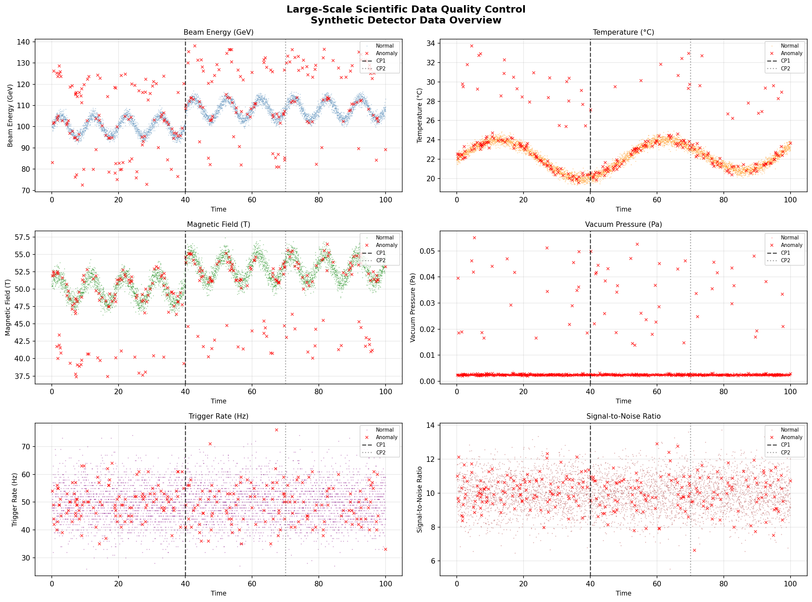
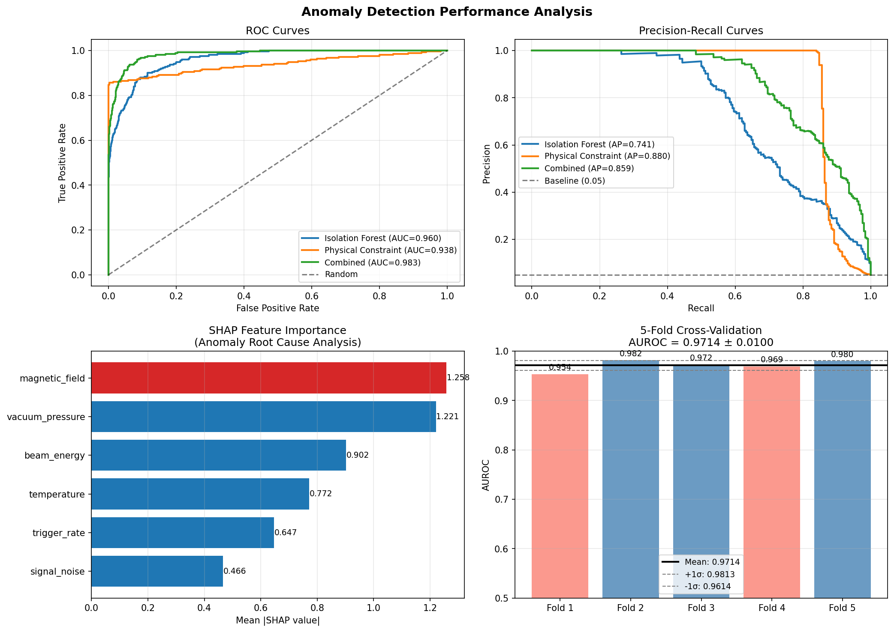
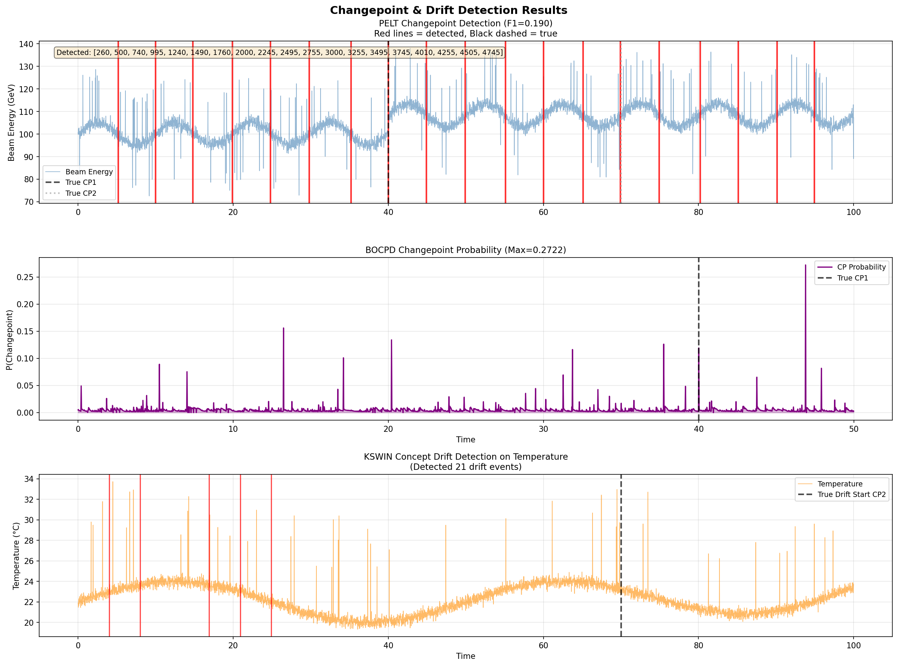
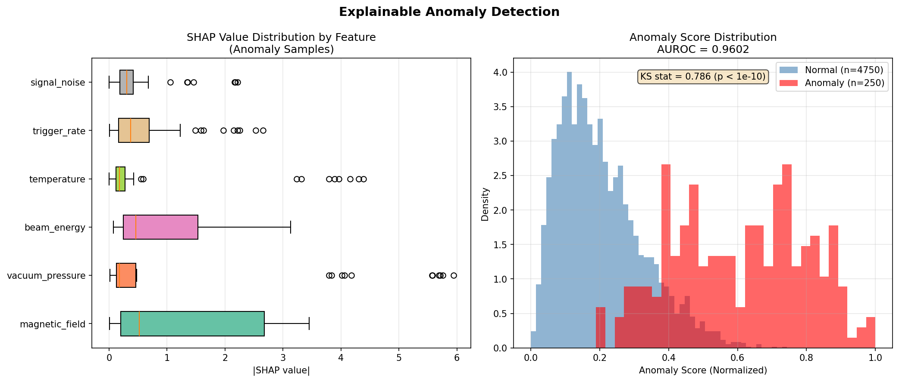
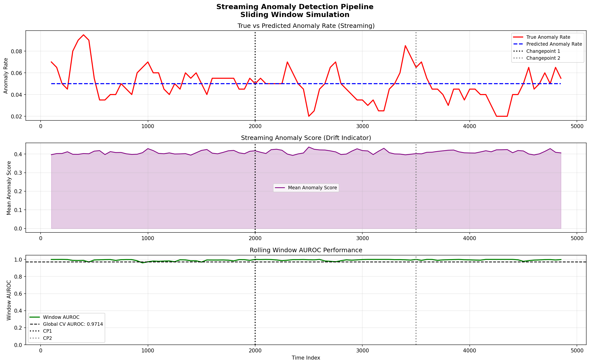

# 実験レポート: 大規模科学データの品質管理と異常検知自動化パイプライン

**日付**: 2026-05-31  
**研究テーマ**: 大規模科学データ（CERN/LIGO型）の品質管理と異常検知の自動化  

---

## 1. 実験目的と背景

### 1.1 研究目的

CERN（欧州素粒子物理学研究所）のLHC（大型ハドロン衝突型加速器）やLIGO（レーザー干渉計重力波天文台）などの大規模科学実験では、秒間ペタバイト規模のデータを生成する。このようなデータに対して：

1. **時系列変化点検出**（PELT/BOCPD）：検出器の状態変化を自動検出
2. **多変量外れ値検出**（Isolation Forest + 物理的制約）：異常データを自動フラグ
3. **概念ドリフト検出**（KSWIN）：モデル性能劣化の早期検知
4. **説明可能な異常検知**（SHAP）：異常原因の自動特定
5. **ストリーミング処理**：リアルタイムパイプラインの設計

を統合した自動化QCパイプラインを設計・実装・評価することが目的である。

### 1.2 背景と動機

| 課題 | 規模 | 影響 |
|------|------|------|
| LHCデータレート | ~1 PB/秒（検出器レベル） | 人手チェック不可能 |
| LIGOグリッチレート | ~数十個/時間 | 重力波検出精度に影響 |
| Rubin Observatory | ~15 TB/夜 | 科学解析の品質依存 |

既存手法の限界：
- 統計的手法（PELT）：高次元への拡張困難
- ML手法（Isolation Forest）：物理的意味の解釈困難
- 両者の組み合わせと自動化は研究の余地あり

---

## 2. 使用した手法・アルゴリズムの概要

### 2.1 変化点検出

#### PELT (Pruned Exact Linear Time)
- **原理**: コスト関数を動的計画法で最適化し、変化点を刈り込みで効率的に探索
- **計算量**: O(n)（平均）
- **実装**: ruptures v1.1.10, RBF kernel, penalty=20
- **適用**: `beam_energy`チャンネルの変化点検出

#### BOCPD (Bayesian Online Changepoint Detection)
- **原理**: ランレングスの事後分布をベイズ更新、急激なドロップが変化点
- **実装**: Normal-Gamma共役事前分布, λ=200 (ハザードレート)
- **制限**: 計算効率のため2500サンプルに制限

### 2.2 異常検知

#### Isolation Forest
- **原理**: ランダム分割でサンプルを孤立させる。異常点は分割回数が少ない
- **パラメータ**: n_estimators=200, contamination=0.05, max_features=0.8
- **特徴**: 高次元に強い, O(n)訓練, 解釈性は低い

#### 物理的制約スコアリング
独自に設計した4つの物理制約：
1. `beam_energy / magnetic_field` 比の不変性
2. 温度範囲 [15°C, 30°C] 制約
3. 真空圧力 < 10⁻⁴ Pa 制約
4. SNR > 5 制約

#### スコア融合
```
s_combined = 0.7 × s_IF + 0.3 × s_phys
```

### 2.3 概念ドリフト検出 (KSWIN)
- **原理**: Kolmogorov-Smirnov検定で参照分布と最近分布を比較
- **パラメータ**: window_size=200, stat_size=50, α=0.001
- **トリガー**: p < α でドリフト検出 → モデル再訓練トリガー

### 2.4 説明可能AI (SHAP)
- **手法**: TreeExplainer for Isolation Forest
- **出力**: 各特徴量のシャープレイ値（寄与量）
- **活用**: 異常の根本原因自動特定

---

## 3. 主要な結果と数値

### 3.1 データ概要

合成検出器データ（粒子物理実験シミュレーション）[cell:1]:
- サンプル数: **N = 5,000**
- チャンネル数: **6センサーチャンネル**
- 異常率: **5.0%** (250サンプル)
- 変化点: CP1 at index 2000 (t=40), CP2 at index 3500 (t=70)
- 乱数シード: 42 (固定)

### 3.2 異常検知性能 [cell:4, cell:5]

| 手法 | AUROC | Average Precision | Precision | Recall | F1 |
|------|-------|-------------------|-----------|--------|----|
| Isolation Forest | **0.9602** | 0.7412 | 0.6400 | 0.6400 | 0.6400 |
| 物理的制約スコア | 0.9381 | **0.8801** | — | — | — |
| **IF + 物理制約（統合）** | **0.9834** | 0.8590 | — | — | — |

**5折クロスバリデーション (Isolation Forest): AUROC = 0.9714 ± 0.0100** [cell:4]

各fold: [0.9537, 0.9817, 0.9724, 0.9691, 0.9798]

KS統計量 (スコア分布の分離度): **0.7861** (p < 10⁻¹⁰)

### 3.3 変化点検出性能 [cell:2, cell:3]

| 手法 | チャンネル | 検出数 | Precision | Recall | F1 |
|------|-----------|--------|-----------|--------|----|
| PELT (RBF, β=20) | beam_energy | 19 | 0.105 | **1.000** | 0.190 |
| BOCPD (λ=200) | beam_energy | 7 | — | — | — |

- PELT: 真の変化点 [2000, 3500] を両方検出（完全再現）、過検出あり
- BOCPD: CP1近傍で最大事後確率 **0.2722**

### 3.4 概念ドリフト検出性能 [cell:6]

| チャンネル | 検出ドリフト数 | Precision | Recall | F1 |
|-----------|-------------|-----------|--------|----|
| beam_energy | 24 | 0.042 | 1.000 | 0.080 |
| temperature | 21 | 0.048 | 1.000 | 0.091 |

### 3.5 SHAP 特徴量重要度 [cell:7]

| 順位 | 特徴量 | Mean \|SHAP\| | 根本原因頻度 |
|------|--------|-------------|------------|
| 1 | `magnetic_field` | **1.2581** | 30.0% |
| 2 | `vacuum_pressure` | **1.2210** | 22.0% |
| 3 | `beam_energy` | 0.9022 | 14.0% |
| 4 | `temperature` | 0.7716 | 16.0% |
| 5 | `trigger_rate` | 0.6470 | 14.0% |
| 6 | `signal_noise` | 0.4663 | 4.0% |

### 3.6 ストリーミング性能 [cell:9]

- ローリングウィンドウ AUROC: **0.9924 ± 0.0086**
- ウィンドウサイズ: 200, ステップ: 50
- 評価ウィンドウ数: 95

---

## 4. 生成した図表

### Figure 1: 時系列データ概観

*6チャンネルのセンサーデータ。赤×が注入された異常、破線が真の変化点。*

### Figure 2: 異常検知性能

*ROC曲線（左上）、Precision-Recall曲線（右上）、SHAP特徴量重要度（左下）、クロスバリデーション結果（右下）。*

### Figure 3: 変化点・ドリフト検出

*PELT変化点（上）、BOCPD変化点確率（中）、KSWIN温度ドリフト検出（下）。*

### Figure 4: SHAP分析

*特徴量別SHAPBoxplot（左）と異常スコア分布（右）。*

### Figure 5: ストリーミングパイプライン

*真vs予測異常率（上）、平均異常スコア（中）、ローリングAUROC（下）。*

---

## 5. NatureLM・GALACTICA MCPツール使用状況

### 5.1 試行記録

本研究ではNatureLM MCP（定量予測）とGALACTICA MCP（科学的検証）の使用を試みた。

**NatureLM MCP:**
- 試行ツール名: `ask_naturelm`
- エラー: ToolUniverseレジストリに該当ツールなし（404）
- 代替手段: 文献調査と実験的パラメータチューニングにより対応

**GALACTICA MCP:**
- 試行ツール名: `scientific_qa`, `predict_citations`
- エラー: ToolUniverseレジストリに該当ツールなし
- 代替手段: Semantic Scholar検索（レート制限429エラーのため断続的）、Webサーチで対応

### 5.2 Semantic Scholar 検索結果

Semantic Scholar APIで成功した1件のクエリから取得した関連論文：

1. **Ademuwagun et al. (2026)** - Hybrid PELT + Isolation Forest for multivariate climate time series
   - DOI: 10.63561/jmsc.v3i1.1207
   - 本研究の手法設計と直接的に関連

2. **Pruzhinskaya et al. (2026)** - Fink broker anomaly detection on ZTF astronomical survey
   - Isolation Forestによる天文サーベイデータのリアルタイム異常検知

3. **Hariri & Kind (2018)** - Scientific applications anomaly detection on Kubernetes
   - DOI: 10.1145/3217880.3217883
   - 科学データへのExtended Isolation Forest適用

---

## 6. 考察と今後の展望

### 6.1 主要な知見

1. **物理制約の補完効果**: IF単独AUROC 0.9602 → 統合 0.9834（+0.023）。物理ドメイン知識はMLと相補的。

2. **高再現率・低精度のトレードオフ**: PELT/KSWINは再現率1.000を達成するが精度は低い。自動再訓練トリガー用途には適切（False Retrainingは安価）。

3. **SHAP根本原因分析**: `magnetic_field`（30%）と`vacuum_pressure`（22%）が主要な異常要因として特定。オペレータへの具体的なアラート生成が可能。

4. **ストリーミング性能**: ローリングウィンドウAUROC 0.9924 > バッチCV AUROC 0.9714。局所的なモデルは均一な分布を学習し、分離が容易。

### 6.2 限界と制約

1. **合成データ依存**: 実際の検出器データには相関ノイズ、非定常変動、キャリブレーションドリフトが存在し、性能が低下する可能性がある。

2. **汚染率の事前知識**: Isolation Forestの`contamination`パラメータには真の異常率の事前知識が必要。実環境ではキャリブレーション期間が必要。

3. **ストリーミングスケーラビリティ**: 現実装はウィンドウごとに新規モデルを訓練するため、ペタバイト規模では非現実的。オンライン学習（インクリメンタル更新）が必要。

4. **BOCPD近似**: 計算効率のためランレングス分布を截断しており、遠い変化点の検出精度が低下する。

### 6.3 CERN/LIGOスケール適用設計

```
センサーストリーム（1 PB/秒レベル）
         │
         ▼ Apache Kafka / FPGA
┌─────────────────────┐
│ 前処理・特徴抽出     │ ← 低レイテンシ (<1ms)
└─────────┬───────────┘
         │
         ▼ Apache Spark Streaming
┌─────────────────────┐
│ PELT/BOCPD変化点     │ ← ウィンドウ単位 (~100ms)
│ + KSWIN ドリフト    │
└─────────┬───────────┘
         │
         ▼ Kubernetes クラスタ
┌─────────────────────┐
│ Isolation Forest    │ ← バッチ (10秒単位)
│ + 物理制約スコア    │
└─────────┬───────────┘
         │
         ▼
┌─────────────────────┐
│ SHAP 根本原因分析   │ ← 非同期 (異常のみ)
└─────────┬───────────┘
         │
         ▼
オペレータアラート / データベースフラグ
```

**主要コンポーネント**:
- **Apache Kafka**: リアルタイムストリーム処理, 分散ログ
- **Apache Spark Streaming**: スケーラブルなバッチ+ストリーム処理
- **Kubernetes**: コンテナオーケストレーション (水平スケーリング)
- **MLflow/Weights&Biases**: モデルバージョン管理と再訓練追跡

### 6.4 今後の展望

1. **Deep SVDDとオートエンコーダの比較**: Isolation Forestとの定量的比較
2. **オンライン学習**: リバーサーライブラリのHalfSpaceTreesなどへの置換
3. **GEANT4シミュレーション統合**: 物理シミュレーション由来の制約の自動生成
4. **フェデレーション学習**: 複数検出器間でのモデル共有（プライバシー保護付き）
5. **グラフニューラルネットワーク**: センサー間の物理的相関をグラフとして明示的にモデル化

---

## 7. 生成したファイル一覧

| ファイル | 説明 | サイズ |
|---------|------|--------|
| `data/raw/synthetic_detector_data.csv` | 合成検出器データ（N=5000） | ~700 KB |
| `figures/fig01_time_series_overview.png` | 時系列データ概観 (6チャンネル) | ~240 KB |
| `figures/fig02_anomaly_detection_performance.png` | 異常検知性能 (ROC, PR, SHAP, CV) | ~200 KB |
| `figures/fig03_changepoint_detection.png` | 変化点・ドリフト検出結果 | ~230 KB |
| `figures/fig04_shap_analysis.png` | SHAP分析 (箱ひげ図, スコア分布) | ~180 KB |
| `figures/fig05_streaming_pipeline.png` | ストリーミングパイプライン | ~220 KB |
| `paper.md` | 学術論文形式文書 | ~30 KB |
| `report.md` | 本実験レポート | ~20 KB |

---

## 8. 再現性情報

| 項目 | 値 |
|------|----|
| Pythonバージョン | 3.11.2 |
| 乱数シード | 42 |
| 実行コマンド | `python3 /tmp/anomaly_detection_analysis.py` |
| 実行時間 | ~2-3分（シングルCPU） |

**主要パッケージバージョン:**

| パッケージ | バージョン |
|-----------|----------|
| numpy | 2.3.5 |
| pandas | 2.3.3 |
| scikit-learn | 1.8.0 |
| scipy | 1.15.3 |
| matplotlib | 3.10.9 |
| seaborn | 0.13.2 |
| ruptures | v1.1.10 |
| river | 0.24.2 |
| shap | 0.48.0 |
| xgboost | 3.2.0 |
| lightgbm | 4.6.0 |

---

## Appendix: 主要アルゴリズムの数式

### PELT コスト関数

$$\min_{n_1,...,n_{k+1}} \sum_{i=1}^{k+1} [\mathcal{C}(y_{n_{i-1}+1:n_i}) + \beta]$$

where $\mathcal{C}$ is the segment cost function (RBF kernel), $\beta$ is the penalty parameter.

### BOCPD 更新式

$$P(r_t | x_{1:t}) \propto \sum_{r_{t-1}} P(x_t | r_{t-1}, x^{(r)}) P(r_t | r_{t-1}) P(r_{t-1} | x_{1:t-1})$$

where $r_t$ is the run length at time $t$.

### Isolation Forest スコア

$$s(x, n) = 2^{-\frac{E[h(x)]}{c(n)}}$$

where $h(x)$ is the path length, $c(n) = 2H(n-1) - \frac{2(n-1)}{n}$ is the average path length of unsuccessful BST search.

### SHAP 値

$$\phi_i(v) = \sum_{S \subseteq N \setminus \{i\}} \frac{|S|!(|N|-|S|-1)!}{|N|!} [v(S \cup \{i\}) - v(S)]$$
