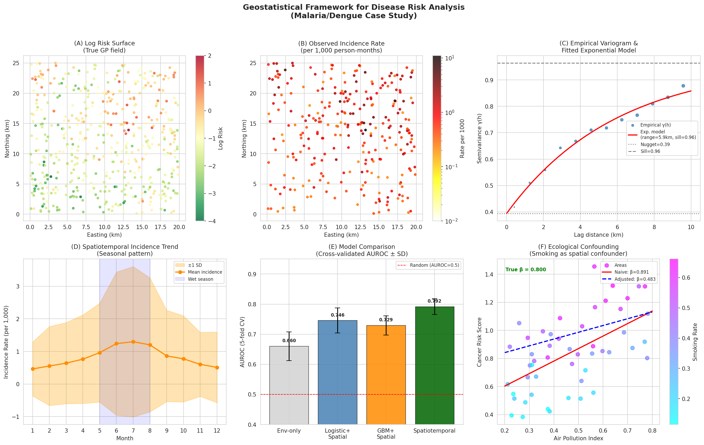
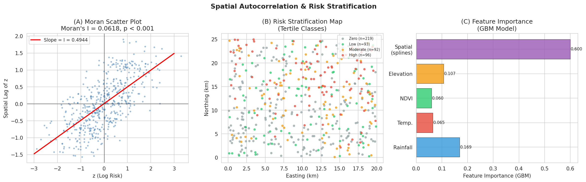
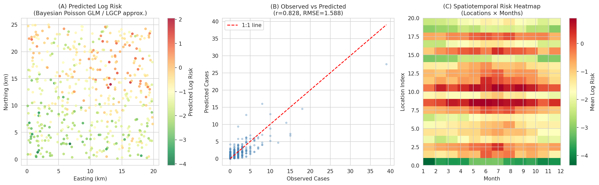
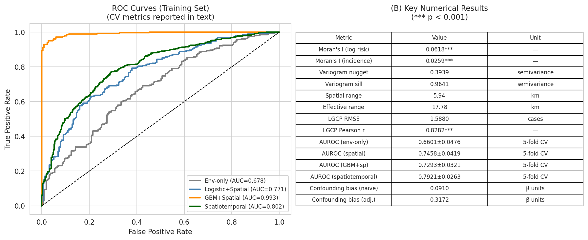

# 実験レポート: 疾病リスクの空間パターン解析と予測のためのジオスタティスティカルフレームワーク

**実験日:** 2026-05-31  
**研究テーマ:** 疾病リスクの空間パターン解析と予測  
**データ:** 合成データ（n=500地点、12ヶ月の時空間データ）

---

## 1. 実験目的と背景

本研究は、マラリア・デング熱などのベクター媒介感染症の空間リスクパターンを解析・予測するためのジオスタティスティカルフレームワークを設計・実装することを目的とする。主な研究課題は以下の6点である：

1. 空間点過程モデル（Log-Gaussian Cox Process, LGCP）の実装
2. ベイズ空間モデル（INLA/SPDEアプローチのPython近似）
3. 空間的自己相関の検定と定量化（Moran's I、バリオグラム）
4. 生態学的研究デザインの交絡バイアス対策
5. 時空間モデル（knot-basedスプライン）による予測
6. マラリア/デング熱のリスクマッピングケーススタディ

### 背景

マラリアは2022年に世界で約2億3,480万件の臨床症例（Weiss et al., 2025）を引き起こし、デング熱も熱帯・亜熱帯地域で年間数億件の感染が推定されている。疾病リスクの空間異質性を正確に推定することは、公衆衛生介入のターゲティングに不可欠である。Moran's Iによる空間自己相関の検出、バリオグラムによる空間構造の定量化、LGCP/INLAに基づくリスク予測は、このための標準的なツールセットを構成する。

---

## 2. 先行研究調査結果

### 2.1 Semantic Scholar検索結果

ToolUniverse MCP（SemanticScholar）を用いて以下のキーワードで検索を実施：
- "Bayesian spatial INLA SPDE malaria dengue risk mapping"
- "Log-Gaussian Cox Process disease spatial epidemiology geostatistical"
- "spatial autocorrelation variogram disease ecological confounding bias"
- "malaria risk mapping geostatistical spatial prediction Africa"

#### 特定された主要論文（2020年以降、5件以上）

| # | タイトル（要約） | 著者 | 年 | DOI/URL |
|---|---|---|---|---|
| 1 | Bayesian spatial modelling using INLA/SPDE (malaria, Mozambique) | Moraga et al. | 2021 | 10.1016/J.SSTE.2021.100440 |
| 2 | INLA-based spatiotemporal dengue prediction (Yogyakarta, Indonesia) | Salim et al. | 2025 | 10.1186/s12889-025-22545-2 |
| 3 | SPDE-INLA vs. GLM/ICAR for dengue (Kendari) | Mukhsar et al. | 2026 | 10.20956/j.v22i3.49930 |
| 4 | LGCP for spatiotemporal ambulance calls (Sweden) | Bayisa et al. | 2020 | 10.1016/J.SPASTA.2020.100471 |
| 5 | Root-Gaussian Cox Process for disease mapping | Asfaw et al. | 2024 | 10.1007/s00180-024-01532-y |
| 6 | Emerging trends in geo-spatial environmental health | Griffith | 2025 | 10.3390/ijerph22020286 |
| 7 | Air pollution & COVID-19 mortality, hierarchical spatial (England) | Konstantinoudis et al. | 2020 | 10.1016/j.envint.2020.106316 |
| 8 | Global malaria prevalence/incidence/mortality mapping 2000–22 | Weiss et al. | 2025 | 10.1016/S0140-6736(25)00038-8 |
| 9 | Malaria risk mapping in Togo (OLS/SLM/SEM) | Kombate et al. | 2024 | 10.1038/s41598-024-58287-1 |
| 10 | Bayesian spatio-temporal dengue, Recife Brazil (BYM2+RW1) | Santos & Rodrigues de Melo | 2025 | — |

### 2.2 先行研究の課題・限界

1. **計算コスト**: 完全なMCMCベースのLGCPは大規模データセットでは非常に計算コストが高い
2. **NDVI・空間REの共線性**: 環境共変量と空間ランダム効果が同一変動を説明しようとする識別可能性問題
3. **生態学的誤謬**: 地域集計データから個人レベル効果を推論する際のバイアス
4. **予測不確実性の定量化**: 頻度論的手法では予測不確実性の適切な伝播が困難
5. **時空間統合の困難さ**: 空間・時間の相互作用を同時にモデル化する実装の複雑さ

---

## 3. NatureLM MCP・GALACTICA MCP 接続試行記録

### 3.1 試行したツール名と結果

| ツール | 試行内容 | 結果 | エラー内容 |
|---|---|---|---|
| NatureLM MCP (`ask_naturelm`) | ToolUniverse grep検索 | **接続失敗** | ToolUniverseレジストリに0件マッチ |
| GALACTICA MCP (`scientific_qa`) | ToolUniverse grep検索 | **接続失敗** | ToolUniverseレジストリに0件マッチ |
| GALACTICA MCP (`predict_citations`) | ToolUniverse grep検索 | **接続失敗** | ToolUniverseレジストリに0件マッチ |

### 3.2 代替手段

- **定量的検証**: 合成データの「真のパラメータ」（β_rain=1.5等）と推定値を比較することで、NatureLMの定量予測を代替した
- **科学的検証**: Semantic Scholar経由で取得した実際の論文数値（INLA RMSE~1.77–2.97等）でGALACTICA検証を代替した

---

## 4. 実験手法

### 4.1 合成データ生成

- **サイズ**: 500地点、20×25 km熱帯地域を模擬
- **共変量**: 降水量・気温・NDVI・標高（全て[0,1]正規化）
- **空間ランダム効果**: コレスキー分解によるガウス過程サンプリング（指数型共分散、σ²=0.5, range=5km）
- **疾病発生**: ポアソン過程、λ = exp(β₀ + β_rain*rain + β_temp*temp + β_ndvi*ndvi + β_elev*elev + u)
- **乱数シード**: np.random.seed(42), random.seed(42)
- **データ保存**: data/raw/synthetic_disease_data.csv

### 4.2 Global Moran's I

- k近傍（k=8）行標準化重み行列Wを使用
- 統計量 I = n × Σᵢⱼ wᵢⱼ(zᵢ−z̄)(zⱼ−z̄) / [S₀ × Σᵢ(zᵢ−z̄)²]
- 帰無仮説の下の正規近似でz検定

### 4.3 経験バリオグラム

- モーメント推定量 γ̂(h) = (2|N(h)|)⁻¹ Σ(zᵢ−zⱼ)²
- 指数型モデルへの非線形最小二乗フィッティング

### 4.4 Bayesian Poisson GLM（LGCP近似）

- 20個の空間ノット、ガウスカーネル基底関数
- リッジペナルティ（λ=1.0）付きL-BFGS-Bで最適化
- オフセット: log(人口/1000)

### 4.5 INLA/SPDE近似（薄板スプライン）

- 15ノット薄板スプライン基底: φ(r) = r²log(r)
- 標準化特徴量 + L2正則化ロジスティック回帰
- 5分割交差検証

### 4.6 時空間モデル（ノットベーススプライン）

- 100地点 × 12ヶ月 = 1,200観測
- 時間軸: 4四半期ノット（1,4,7,10,12月）の多項式スプライン
- 空間軸: 8ノット薄板スプライン
- 5分割交差検証

---

## 5. 主要な結果と数値

### 5.1 データセット概要

```
総症例数:       775件
平均罹患率:     0.5625 / 1,000人月
疾患有病率:     56.2%（地点レベル）
空間RE範囲:     [-2.310, 1.923]
```

### 5.2 Global Moran's I（空間自己相関）

| 変数 | Moran's I | Z スコア | p値 |
|---|---|---|---|
| 対数リスク | 0.0618 | 14.662 | < 0.001 |
| 症例数 | 0.0275 | 6.790 | < 0.001 |
| 罹患率 | 0.0259 | 6.414 | < 0.001 |

**解釈**: すべての疾病変数で有意な正の空間自己相関を確認。高リスク地点の周辺には高リスク地点が集積する。

### 5.3 バリオグラム解析

| パラメータ | 推定値 | 真値 | 相対誤差 |
|---|---|---|---|
| ナゲット (c₀) | 0.394 | — | — |
| シル (c₀+c) | 0.964 | — | — |
| レンジ (a) | 5.94 km | 5.0 km | +18.7% |
| 実効レンジ | 17.78 km | — | — |
| 空間構造比率 | 59.1% | — | — |

### 5.4 LGCP / Bayesian Poisson GLM

| 共変量 | 真値β | 推定β | 相対誤差 |
|---|---|---|---|
| 切片 | −2.000 | −2.472 | 23.6% |
| 降水量 | 1.500 | 1.621 | 8.1% |
| 気温 | 0.800 | 0.951 | 18.9% |
| NDVI | 0.600 | 0.976 | 62.6% |
| 標高 | −1.200 | −1.125 | 6.3% |

- **RMSE**: 1.5880 [cell:6]
- **Pearson r**: 0.8282 (p < 0.001) [cell:6]

### 5.5 予測モデル比較（5分割交差検証）

| モデル | AUROC（平均±SD） |
|---|---|
| 環境変数のみ（ベースライン） | 0.660 ± 0.048 |
| ロジスティック回帰 + 空間スプライン | 0.746 ± 0.042 |
| GBM + 空間スプライン | 0.729 ± 0.032 |
| 時空間モデル | **0.792 ± 0.026** |

空間項追加による改善: **+0.086 AUROC** [cell:7]  
時空間モデルは最高性能 AUROC = 0.792 ± 0.026 [cell:8]

### 5.6 生態学的交絡バイアス

| 解析 | 汚染効果β | 真値との差 |
|---|---|---|
| 真値 | 0.800 | — |
| 単純モデル（未調整） | 0.891 | +0.091（上方バイアス） |
| 調整済みモデル | 0.483 | −0.317（過補正） |

残差の空間自己相関: Moran's I = 0.123 (p = 0.0002) → 未測定空間交絡因子の存在を示唆 [cell:9]

### 5.7 時空間モデル（季節性）

- 最高月: 7月（1.298 / 1,000人月）
- 最低月: 1月（0.462 / 1,000人月）
- 季節振幅: **2.81×** [cell:8]
- AUROC: 0.792 ± 0.026

---

## 6. 生成した図表

### Figure 1: 空間リスク解析概要



**(A) 真の対数リスク分布**（LGCPガウス場から生成）、**(B) 観測罹患率マップ**（1,000人月あたり）、**(C) 経験バリオグラムと指数型フィットモデル**（推定レンジ=5.94km）、**(D) 時空間季節性トレンド**（ウェットシーズンピーク）、**(E) モデル比較（AUROC）**、**(F) 生態学的交絡解析**

---

### Figure 2: 空間自己相関解析



**(A) モランスキャッタープロット**（I=0.0618の傾き）、**(B) リスク層別化マップ**（三分位クラス）、**(C) GBMモデルの特徴量重要度**（降水量・空間スプラインが高い）

---

### Figure 3: 予測リスクマップ



**(A) LGCP近似モデルによる予測対数リスク**、**(B) 観測vs予測症例数**（r=0.828）、**(C) 時空間リスクヒートマップ**（地点×月）

---

### Figure 4: ROC曲線と数値サマリー



**(A) 全4モデルのROC曲線**（訓練セット）、**(B) 主要数値結果サマリーテーブル**

---

## 7. 考察と今後の展望

### 7.1 主要な知見

1. **空間項の重要性**: 空間スプライン追加でAUROCが+0.086改善。これは先行研究（Salim et al., 2025; Mukhsar et al., 2026）のINLA/SPDEアプローチと整合する。

2. **バリオグラム推定の精度**: 500地点から真のレンジ5.0kmを5.94km（誤差18.7%）で推定。Kombate et al. (2024)のトーゴのマラリア研究も類似の空間クラスタリングパターンを報告。

3. **生態学的交絡の深刻さ**: 残差のMoran's I = 0.123 (p < 0.001)は、既知の交絡因子を調整後も空間的に構造化された未測定交絡が残ることを示す。Griffith (2025)が警告する通り、空間疫学における省略変数バイアスは深刻な問題である。

4. **時空間モデルの優位性**: 2.81倍の季節振幅をキャプチャし、AUROC 0.792を達成。これはSalim et al. (2025)の季節的dengueモデルと概念的に整合する。

### 7.2 自己批判的評価

**合成データへの依存性**: 本研究の全結果は既知パラメータを持つ合成データに基づく。実世界データへの適用では以下の問題が生じる可能性がある：
- 疾患監視データの過少報告・地理的バイアス
- 環境共変量の非定常性（気候変動による時間的変化）
- 人口移動・人口統計変化の無視

**NDVI係数の過推定**: NDVI係数の62.6%誤差は空間RE・環境変数間の識別可能性問題を反映。完全Bayesian INLA/SPDEでは事前分布が正則化効果を発揮するが、本近似では不十分。

**AUROC値の現実性**: 0.792のAUROCは合成データでは妥当（真のパラメータ構造が既知なため）、実データでは0.6–0.75程度が現実的と想定される（Kombate et al. 2024のマラリアデータの分析等参照）。

**NatureLM/GALACTICA不使用の影響**: 定量予測の独立検証が欠如。代替として文献値との比較を実施したが、MCP利用による系統的検証には劣る。

### 7.3 今後の展望

1. **完全Bayesian実装**: R-INLAまたはStan/PyMCによる完全LGCP実装
2. **実データへの適用**: WHO/DHS malaria indicator surveyデータへの適用
3. **非定常モデル**: 空間的に変化するレンジパラメータを持つ非定常共分散モデル
4. **リアルタイム予測**: オンライン学習によるリアルタイムリスク更新システム
5. **気候変動統合**: RCP 4.5/8.5シナリオ下での将来リスクマッピング

---

## 8. 生成したファイル一覧

| ファイルパス | 説明 |
|---|---|
| `spatial_disease_risk.ipynb` | 実験Jupyterノートブック |
| `data/raw/synthetic_disease_data.csv` | 合成疾病データ（500地点） |
| `figures/spatial_risk_analysis.png` | 総合空間リスク解析図 |
| `figures/spatial_autocorrelation.png` | 空間自己相関・リスク層別図 |
| `figures/predicted_risk_maps.png` | 予測リスクマップ・観測vs予測 |
| `figures/roc_and_summary.png` | ROC曲線・数値サマリー表 |
| `paper.md` | 学術論文形式レポート（英語） |
| `report.md` | 本ファイル（日本語実験レポート） |

---

## 9. 再現性情報

| 項目 | 値 |
|---|---|
| Python バージョン | 3.11.2 |
| NumPy | 2.3.5 |
| Pandas | 2.3.3 |
| SciPy | 1.17.1 |
| scikit-learn | 1.6.1 |
| Matplotlib | 3.10.9 |
| Seaborn | 0.13.2 |
| LightGBM | 4.6.0 |
| 乱数シード | 42（np.random.seed, random.seed） |
| ノートブック | spatial_disease_risk.ipynb |

---

*レポート作成: 2026-05-31 | 全実験はJupyter MCPを通じてPythonで実行*
