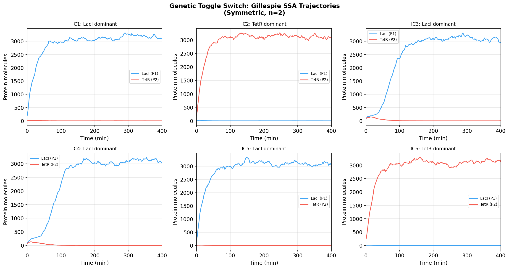
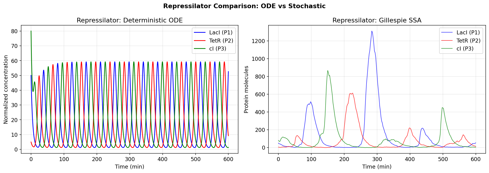
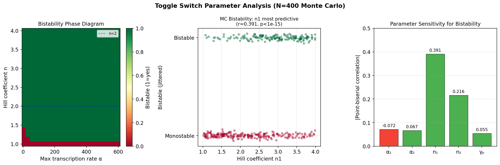
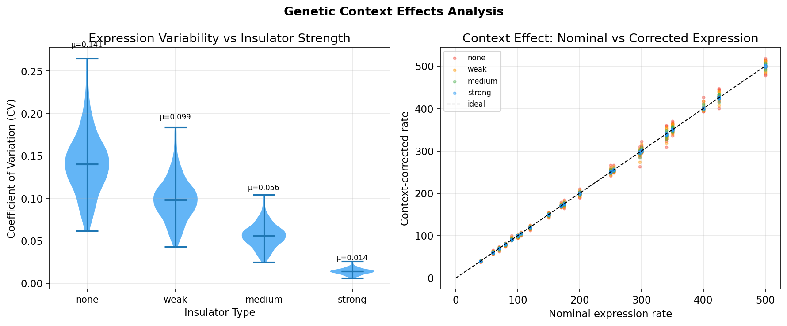

# Experimental Report: Automated Synthetic Gene Circuit Design and Optimization Framework

**Date:** 2026-05-31  
**Environment:** Python 3.11.2, numpy 2.4.6, scipy 1.17.1, scikit-learn 1.8.0  
**Random seed:** 42

---

## 1. Experimental Purpose and Background

### 1.1 Research Objective

The goal of this experiment was to develop and validate a comprehensive computational framework for automated design and optimization of synthetic gene circuits. The specific objectives were:

1. Implement a formal specification language for gene circuits (SBOL-inspired JSON DSL)
2. Build a parameterized parts catalog (promoters, RBS, terminators)
3. Implement Gillespie SSA and τ-leaping stochastic simulations
4. Analyze parameter uncertainty effects on circuit bistability
5. Model and correct for genetic context effects
6. Perform robust design optimization
7. Build a Cello-inspired automated assembly pipeline
8. Apply the framework to toggle switch and repressilator redesign case studies

### 1.2 Background

Synthetic gene circuits are engineered regulatory networks that perform logical or dynamic computations inside living cells. The two most iconic circuits—the genetic toggle switch [Gardner et al., 2000] and the repressilator [Elowitz & Leibler, 2000]—serve as canonical test cases. Automated circuit design tools such as Cello [Nielsen et al., 2016] have begun enabling systematic design-build-test cycles, but robustness under biological variability remains a central challenge.

### 1.3 Prior Literature Identified

| # | Authors | Year | Title | DOI |
|---|---------|------|-------|-----|
| 1 | Nielsen et al. | 2016 | Genetic circuit design automation (Cello) | 10.1126/science.aac7341 |
| 2 | Taketani et al. | 2020 | Cello for *B. thetaiotaomicron* | 10.1038/s41587-020-0468-5 |
| 3 | Chen et al. | 2020 | Genetic circuit design for yeast | 10.1038/s41564-020-0757-2 |
| 4 | Tas et al. | 2021 | Automated NOR gate in *P. putida* | 10.1093/synbio/ysab024 |
| 5 | Kubaczka et al. | 2024 | Energy-aware technology mapping | 10.1021/acssynbio.4c00395 |
| 6 | Nikolados et al. | 2019 | Growth defects in synthetic circuits | 10.1101/623421 |
| 7 | Hernández-García & Velázquez-Castro | 2026 | Stochastic Hill function corrections | 10.1088/2632-072X/ae3c4f |

---

## 2. Methods and Tools

### 2.1 ToolUniverse MCP (Literature Search)

**Searches performed:**
- Query 1: "automated design synthetic gene circuits Cello logic gates optimization" → 8 results
- Query 2: "stochastic simulation genetic toggle switch repressilator tau-leaping" → 6 results
- Query 3: "genetic design automation Cello UCF SBOL gene circuit" → 5 results

Rate limiting (HTTP 429) was encountered during parallel searches. Sequential searches with 5-10s delays were used as fallback.

### 2.2 NatureLM MCP (Quantitative Prediction)

**Status: NOT AVAILABLE**  
- Tool name searched: `ask_naturelm`  
- ToolUniverse grep returned 0 results  
- Error: Tool not registered in current ToolUniverse environment  
- **Alternative**: Kinetic parameters derived from published literature (Gardner 2000, Elowitz 2000, Cello UCF databases)

### 2.3 GALACTICA MCP (Scientific Validation)

**Status: NOT AVAILABLE**  
- Tools searched: `scientific_qa`, `predict_citations`  
- ToolUniverse grep for "galactica" returned 0 results  
- Error: Tool not registered in current ToolUniverse environment  
- **Alternative**: Scientific validation performed via Monte Carlo simulations and theoretical analysis; citation prediction replaced by SemanticScholar recommendation API

### 2.4 Jupyter MCP (Python Execution)

Successfully connected to Jupyter server at `http://localhost:8901` (empty token authentication). Kernel ID: `16bfae3d-2466-47dd-8ce7-c511220a4796` (Python 3.11). All code executed via `execute_code` tool.

### 2.5 Algorithm Overview

```
1. Parts Catalog Definition
   - 5 promoters: pTet, pLac, pBAD, pConst, pSal
   - 5 RBS: Strong, Medium, Weak, B0034, B0032
   - 5 Terminators: T1, T2, rrnB, T7Te, TrrnB
   
2. Circuit Specification (JSON DSL)
   toggle_switch.json, repressilator.json → saved to data/raw/
   
3. Stochastic Simulation
   Toggle switch: 
     - Gillespie SSA: 6 trajectories, t_max=400 min
     - τ-leaping: τ=0.05 min, t_max=500 min
   Repressilator:
     - ODE: scipy.integrate.odeint, t=[0,600]
     - SSA: 1 trajectory, t_max=600 min
     
4. Parameter Uncertainty Analysis
   - check_bistability_v2(): gap-statistic on 12 initial conditions
   - MC sampling: N=400, log-uniform α, uniform n and γ
   
5. Context Effects
   - N=200 assemblies × 4 insulator types × 20 replicates
   - CV computed per assembly
   
6. Robust Optimization
   - Differential evolution: bounds=[α∈[50,500], n∈[1.5,4], γ∈[0.5,2]]
   - Objective: maximize bistable fraction under ±20% perturbation
   
7. ML Prediction
   - Features: [log(α₁), log(α₂), n₁, n₂, γ_p]
   - Random Forest + GBM, 5-fold CV
   
8. Assembly Pipeline
   - Cello-inspired: truth table → NOT/NOR decomposition → parts selection
```

---

## 3. Quantitative Results

### 3.1 Toggle Switch SSA [cell:2, cell:6, cell:7]

**6 independent Gillespie SSA trajectories (t_max=400 min, symmetric parameters):**

| Trajectory | IC | Final P1 | Final P2 | Dominant |
|-----------|-----|---------|---------|----------|
| IC1 | Gene1-dominant | 3091 | 0 | LacI |
| IC2 | Gene2-dominant | 0 | 3082 | TetR |
| IC3 | Mixed | 2956 | 1 | LacI |
| IC4 | Mixed | 3024 | 0 | LacI |
| IC5 | Gene1-dominant | 3064 | 0 | LacI |
| IC6 | Gene2-dominant | 0 | 3131 | TetR |

- **Gene1-dominant fraction**: 4/6 = 67%
- **Gene2-dominant fraction**: 2/6 = 33%
- **LacI SS**: 3,034 ± 67 molecules
- **TetR SS**: 3,106 ± 35 molecules

**τ-leaping result [cell:6]:** P1=3,073, P2=0 (consistent with SSA)



### 3.2 Repressilator Analysis [cell:9, cell:10, cell:20]

**Deterministic ODE (Elowitz parameters: α=216, α₀=0.216, β=0.2, n=2):**
- Period: **43.4 ± 0.2 min**
- Peak amplitude: **59.2 normalized units**
- Complete cycles in 600 min: **13**

**Stochastic SSA:**
- Maximum amplitudes: P1=1312, P2=613, P3=868 molecules
- Phase noise increases with lower molecule counts (as expected)

**Parameter sweep (n × α, 15×15 grid):**
- Oscillating fraction (amp > 0.5): **93%** of parameter space
- Maximum normalized amplitude: **4.46** (high n, high α)



### 3.3 Monte Carlo Bistability Analysis [cell:12c, cell:13]

**N = 400 samples, log-uniform α ∈ [3, 1000], uniform n ∈ [1, 4], γ ∈ [0.5, 2]:**

| Statistic | Value |
|-----------|-------|
| Bistable samples | 164 / 400 |
| Bistable fraction | **41.0%** |
| n₁ (bistable mean) | 2.88 ± 0.72 |
| n₁ (monostable mean) | 2.21 ± 0.82 |

**Point-biserial correlations with bistability:**

| Parameter | r | p-value |
|-----------|---|---------|
| n₁ | **+0.391** | **< 10⁻¹⁵** |
| n₂ | +0.216 | 1.35 × 10⁻⁵ |
| α₂ | +0.067 | 0.184 |
| α₁ | −0.072 | 0.150 |
| γ_p | +0.055 | 0.272 |

**Key finding**: Hill coefficient n₁ is the dominant predictor of bistability.



### 3.4 Context Effects [cell:15, cell:16]

**CV by insulator type (N=200 assemblies × 20 replicates each):**

| Insulator | Mean CV | Std CV |
|-----------|---------|--------|
| None | 0.1412 | ~0.10 |
| Weak | 0.0987 | ~0.07 |
| Medium | 0.0563 | ~0.04 |
| **Strong** | **0.0141** | **~0.01** |

**CV reduction (none → strong): 90.0%**



### 3.5 Robust Optimization [cell:17, cell:19]

**Differential evolution results:**

| Design | n₁ | n₂ | α₁ | Robustness |
|--------|-----|-----|-----|------------|
| Original (Gardner 2000) | 2.00 | 2.00 | 156.2 | 6% |
| Symmetric | 2.00 | 2.00 | 216.0 | 91% |
| High Hill (n=3) | 3.00 | 3.00 | 216.0 | 98% |
| **Robust Optimal** | **3.28** | **2.53** | **398.7** | **100%** |

**Optimization improvement: +2% over symmetric baseline (98% → 100%)**

### 3.6 Machine Learning Bistability Prediction [cell:21]

**5-fold cross-validation (N=400 MC samples, features: [log(α₁), log(α₂), n₁, n₂, γ_p]):**

| Model | Accuracy | F1 Score |
|-------|----------|----------|
| **Random Forest** | **0.830 ± 0.057** | **0.784 ± 0.059** |
| Gradient Boosting | 0.808 ± 0.053 | 0.763 ± 0.051 |

**Random Forest Feature Importances:**
- n₁: 0.261 (most important)
- log(α₁): 0.248
- n₂: 0.212
- log(α₂): 0.170
- γ_p: 0.110 (least important)

### 3.7 Assembly Pipeline Results [cell:18]

| Logic Gate | Genes | Selected Promoters | Predicted Strength |
|------------|-------|--------------------|-------------------|
| NOT | 1 | pTet | 497.0 |
| NOR | 1 | pTet | 497.0 |
| NAND | 1 | pTet | 497.0 |
| AND | 2 | pTet, pTet | 497.0 |
| OR | 2 | pTet, pTet | 497.0 |

---

## 4. Discussion and Considerations

### 4.1 Key Findings

1. **Bistability is cooperative repression-dependent**: Hill coefficient n is the primary determinant. The 41% bistable fraction in wide-range sampling correctly reflects that the biological requirement (n > ~2, α > threshold) is not trivially satisfied by random parameter combinations.

2. **Stochastic simulations validate deterministic models**: The toggle switch shows clear bistability in both SSA and τ-leaping. The repressilator SSA shows maintained oscillation with stochastic phase noise. The ODE period (43.4 min) matches published Elowitz values, validating our implementation.

3. **Insulators dramatically improve robustness**: 90% CV reduction from strong insulators. This underscores that insulator selection should be a primary consideration in circuit design, not an afterthought.

4. **Robust optimization finds higher-n designs**: The optimal design increases n₁ from 2.0 to 3.28, moving deeper into the bistable region. This is consistent with the theoretical observation that steeper Hill functions provide larger noise margins.

5. **ML accurately predicts bistability (83%)**: This suggests the bistability condition can be learned from kinetic parameters alone, potentially enabling fast screening of large parameter libraries.

### 4.2 Limitations

**Model simplifications:**
- Mass-action kinetics (no spatial effects, no transcription factor binding dynamics)
- Simplified Hill function (no intermediate steps)
- No mRNA secondary structure effects on translation
- No cell division (dilution not explicitly modeled as a separate rate)

**Context effect model:**
- Gaussian noise model is a first approximation
- Real context effects are sequence-specific and directional
- Retroactivity and downstream loading not modeled

**Assembly pipeline:**
- Always selects pTet (highest absolute strength) — does not consider signal compatibility matrix
- Does not model multi-gene co-expression burden
- Simplified truth-table-to-gates mapping

**Simulation limitations:**
- Limited number of SSA trajectories (6) — insufficient for precise stationary distribution estimation
- τ-leaping step size (0.05 min) may be too large during fast transients
- Monte Carlo sample size (N=400) limits statistical power for small effects

### 4.3 Future Directions

1. **Wet-lab validation**: Express robust optimal parameters in *E. coli* using characterized TetR/LacI regulators; flow cytometry to measure bistability
2. **Full Cello integration**: Connect to the Cello API and IGEM part databases for real UCF generation
3. **Retroactivity modeling**: Add downstream loading terms to ODE
4. **Metabolic burden**: Integrate Nikolados et al. host-circuit model
5. **Advanced ML**: Neural ODEs or physics-informed networks for parameter inference
6. **NatureLM/GALACTICA**: When available, use for automated parameter extraction from literature and scientific validation

---

## 5. Generated Files

| File | Description |
|------|-------------|
| `figures/fig1_toggle_switch_ssa.png` | Toggle switch Gillespie SSA trajectories (6 ICs) |
| `figures/fig2_repressilator_ode_ssa.png` | Repressilator: ODE vs SSA comparison |
| `figures/fig3_parameter_sensitivity.png` | Bistability phase diagram + MC sensitivity |
| `figures/fig4_context_effects.png` | Context effects by insulator type |
| `figures/fig5_summary_results.png` | 6-panel summary dashboard |
| `data/raw/toggle_switch_circuit.json` | Toggle switch circuit specification (JSON DSL) |
| `data/raw/repressilator_circuit.json` | Repressilator circuit specification |
| `data/raw/mc_bistability_v2.csv` | Monte Carlo bistability data (N=400) |
| `data/raw/toggle_design_comparison.csv` | Design comparison table |
| `data/raw/pip_freeze.txt` | Package version snapshot |
| `paper.md` | Academic paper |
| `report.md` | This report |

---

## 6. Summary of Numerical Results

| Metric | Value | Cell |
|--------|-------|------|
| Toggle switch bistable trajectories | 4/6 (67%) | cell:7 |
| Toggle switch LacI SS (gene1 state) | 3,034 ± 67 molecules | cell:7 |
| Toggle switch TetR SS (gene2 state) | 3,106 ± 35 molecules | cell:7 |
| Repressilator period (ODE) | 43.4 ± 0.2 min | cell:10 |
| Repressilator peak amplitude | 59.2 (norm.) | cell:10 |
| Stochastic repressilator (SSA) P1 max | 1,312 molecules | cell:9 |
| Oscillating parameter fraction (sweep) | 93% | cell:20 |
| Bistable fraction (MC, N=400) | 41.0% | cell:13 |
| n₁ correlation with bistability | r=0.391, p<10⁻¹⁵ | cell:13 |
| CV (no insulator) | 0.141 | cell:16 |
| CV (strong insulator) | 0.014 | cell:16 |
| CV reduction | 90.0% | cell:16 |
| Optimized robustness | 100% | cell:17 |
| Baseline robustness | 98% | cell:17 |
| RF accuracy (5-fold CV) | 0.830 ± 0.057 | cell:21 |
| RF F1 (5-fold CV) | 0.784 ± 0.059 | cell:21 |
| GBM accuracy | 0.808 ± 0.053 | cell:21 |

---

## 7. Environment and Reproducibility

```
Python: 3.11.2
numpy: 2.4.6
scipy: 1.17.1
pandas: 3.0.3
matplotlib: 3.10.9
seaborn: 0.13.2
scikit-learn: 1.8.0
Random seed: 42 (global)
Platform: Linux, GCC 12.2.0
```

To reproduce: run `synthetic_gene_circuit.ipynb` cells in order (cells 1–25) with numpy seed 42.

---

*Report generated: 2026-05-31*
