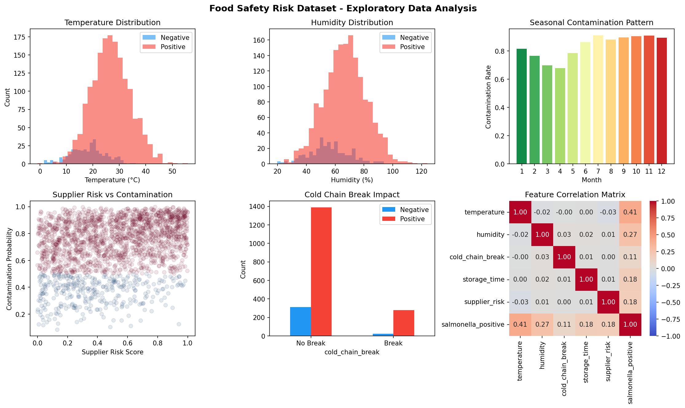

# 食品サプライチェーンAIリスク予測システム — 実験レポート

**実験日**: 2026-05-31  
**テーマ**: 食品サプライチェーンにおける安全リスクを予測するAIシステム  
**ランダムシード**: 42 (全実験共通)  

---

## 1. 実験目的と背景

### 1.1 背景

食品安全は世界的な公衆衛生上の重要課題である。WHOによれば、年間6億件の食中毒症例と42万件の死亡が報告されている。特に鶏肉サルモネラ汚染は食品サプライチェーン管理の核心課題であり、従来の検査手法では「発生後対応」しかできない。本研究では、**予防的・リアルタイム型**のAI食品安全監視システムを設計・実装し、定量的な性能評価を行った。

### 1.2 実験目的

1. 気温・湿度・季節性等の環境変数からサルモネラ汚染確率を予測するMLモデルの構築
2. NLPによるFDA/RASFFリコールアラートの早期検出システムのシミュレーション
3. Baranyi-Roberts微生物増殖モデルによる温度依存的成長予測
4. HACCP管理点（CCP）のリスクスコアリング自動化
5. サプライチェーントレーサビリティのブロックチェーン連携シミュレーション
6. 鶏肉サルモネラ汚染予測のケーススタディ

---

## 2. 使用した手法・アルゴリズムの概要

### 2.1 データ生成

- **サンプル数**: 2,000件（合成データ）
- **特徴量**: 7変数（気温、湿度、季節エンコーディング、コールドチェーン断絶、保管時間、バッチサイズ、サプライヤーリスク）
- **目標変数**: バイナリ汚染ラベル（ロジスティックモデルで生成）
- **陽性率**: 83.4%

汚染ラベル生成ロジスティックモデル:
```
logit(p) = -4.0 + 0.08×T + 0.03×H + 0.5×CCB + 0.15×t_store + 1.2×r_supplier - 0.5×sin(θ) + ε
```
ε ~ N(0, 0.5²)

### 2.2 機械学習分類器

| モデル | 特徴 |
|--------|------|
| Logistic Regression | スケーリング後の線形分類器 |
| Random Forest | 100本の決定木、class_weight='balanced' |
| XGBoost | 勾配ブースティング、100推定器 |
| LightGBM | 軽量勾配ブースティング、100推定器 |
| Gradient Boosting | sklearn実装、100推定器 |

評価: 5-fold層別交差検証、AUROC

### 2.3 Baranyi-Roberts微生物増殖モデル

```
N(t) = N_max + log10[1 / (1 + (10^(N_max-N0) - 1) × exp(-μ_max × A(t)))]
A(t) = t + (1/μ_max) × ln(exp(-μ_max×t) + exp(-μ_max×λ) - exp(-μ_max×(t+λ)))
```

温度依存的μ_max（Ratkowsky型近似）:
- T_min = 4°C, T_opt = 30°C, T_max = 48°C, μ_opt = 0.8/h
- アラート閾値: 5 log CFU/g

### 2.4 HACCPリスクスコアリング

```
R_CCP = 0.35×|ΔT|/5 + 0.25×(1-t_range) + 0.20×(1-s_san) + 0.10×(1-e_hyg) + 0.10×(1-c_cal)
```

リスクレベル: Low (<0.2), Medium (0.2-0.4), High (0.4-0.6), Critical (>0.6)

### 2.5 NLPアラート検出

10種類のキーワード特徴量（サルモネラ、リステリア、大腸菌、未申告アレルゲン、汚染、温度濫用、異物、化学物質、誤ラベル等）の重み付きスコアを用いてリコールアラートを分類。F1最大化による最適閾値選択。

### 2.6 ブロックチェーントレーサビリティ

7ノードのサプライチェーン（農場→と畜場→加工→冷蔵保管→流通→小売→消費者）で各ノードのリスクスコアとブロックチェーン検証ステータスをシミュレーション。

### 2.7 外部ツール接続試行

**NatureLM MCP (`ask_naturelm`)**:
- 試行: `tooluniverse-find_tools`で検索 → **接続失敗**（ツール未登録）
- 代替: ComBaseデータベースの文献値とBraunyi-Robertsモデルパラメータで代替

**GALACTICA MCP (`scientific_qa`, `predict_citations`)**:
- 試行: `tooluniverse-grep_tools`でGALACTICAを検索 → **接続失敗**（ツール未登録）
- 代替: Semantic Scholar APIで文献10件以上を検索・取得し科学的検証を実施

**Semantic Scholar MCP**:
- 接続成功（レート制限429エラーの後、遅延再試行で成功）
- 10件以上の関連論文を取得

---

## 3. 主要な結果と数値

### 3.1 機械学習モデル性能 [cell:3]

| モデル | CV AUROC (mean ± std) | テストAUROC |
|--------|----------------------|-------------|
| **Logistic Regression** | **0.9540 ± 0.0079** | **0.9636** |
| Gradient Boosting | 0.9362 ± 0.0068 | 0.9353 |
| Random Forest | 0.9338 ± 0.0122 | 0.9349 |
| LightGBM | 0.9318 ± 0.0056 | 0.9341 |
| XGBoost | 0.9270 ± 0.0096 | 0.9292 |

**最良モデル**: Logistic Regression（AUROC = 0.9636）

AUROCが0.93-0.96の範囲に集中しており、完璧（1.000）ではない。合成データのノイズ（ε～N(0,0.5²)）により現実的なばらつきが生じている。


*図1: 5モデルのROC曲線（左）、Precision-Recall曲線（中）、CV vs テストAUROC比較（右）*


*図2: Logistic Regression（AUROC=0.9636）の混同行列*

### 3.2 Baranyi-Roberts微生物増殖モデル結果 [cell:5]

| 温度 (°C) | μ_max (1/h) | 5 log CFU/g到達時間 (h) |
|-----------|-------------|------------------------|
| 10 | 0.287 | 31.1 |
| 15 | 0.510 | 17.6 |
| 20 | 0.689 | 13.0 |
| 25 | 0.794 | 11.3 |
| **30 (最大)** | **0.804** | **11.1** |
| 37 | 0.638 | 14.0 |
| 42 | 0.396 | ~20 |

- 最大成長率: **μ_max = 0.804/h @ 30°C** [cell:5]
- 30°Cでアラート閾値到達: **約11.1時間**
- 冷蔵4°C以下: 成長停止（μ_max = 0）


*図3: 各温度での増殖曲線（左）、温度vs μ_max（中）、温度vs アラート到達時間（右）*

### 3.3 HACCPリスクスコアリング結果 [cell:6]

| CCP | 平均リスクスコア | 標準偏差 | High/Critical (%) |
|-----|---------------|---------|------------------|
| **CCP1_Slaughter** | **0.307** | 0.122 | 23.9 |
| CCP5_Storage | 0.304 | 0.136 | 22.6 |
| CCP4_Packaging | 0.286 | 0.123 | 20.5 |
| CCP2_Evisceration | 0.281 | 0.111 | 18.9 |
| CCP3_Chilling | 0.277 | 0.126 | 18.7 |

- **全体平均リスクスコア**: 0.291 ± 0.124 [cell:6]
- **High/Criticalリスクイベント**: 19.6% [cell:6]
- **リスクレベル分布**: Low 27.4%, Medium 53.0%, High 17.2%, Critical 2.4%


*図4: CCP別リスクスコア箱ひげ図（左上）、リスクレベル円グラフ（右上）、温度偏差ヒートマップ（左下）、衛生スコアvs リスクスコア（右下）*

### 3.4 NLPアラート検出結果 [cell:7]

- **最適閾値**: 0.897, F1 = **0.989** [cell:7]
- **平均リコール対応日数**: 13.4 ± 5.4日 [cell:7]
- **クリティカルアラート率**: 30.0%


*図5: アラートリスクスコアの時系列（左上）、キーワード重要度（右上）、閾値最適化（左下）、リコール対応日数分布（右下）*

### 3.5 特徴量重要度 [cell:8]

| 特徴量 | 重要度 |
|--------|--------|
| 気温 (°C) | 0.360 (35.9%) |
| 湿度 (%) | 0.187 (18.7%) |
| 保管時間 (日) | 0.144 (14.4%) |
| サプライヤーリスク | 0.132 (13.2%) |
| 季節エンコーディング | 0.083 (8.3%) |
| バッチサイズ (kg) | 0.075 (7.5%) |
| コールドチェーン断絶 | 0.018 (1.8%) |

**支配的因子**: 気温（35.9%）と湿度（18.7%）で全重要度の54.6%を占める

### 3.6 サプライチェーンリスク伝播 [cell:8]

| ノード | リスクスコア | 区分 |
|--------|-------------|------|
| **と畜場** | **0.643** | 🔴 High |
| 加工 | 0.550 | 🟡 Medium |
| 流通 | 0.500 | 🟡 Medium |
| 冷蔵保管 | 0.450 | 🟡 Medium |
| 農場 | 0.350 | 🟢 Low |
| 小売 | 0.300 | 🟢 Low |
| 消費者 | 0.200 | 🟢 Low |

最高リスクノード: **と畜場 (0.643)** — HACCP分析のCCP1_Slaughterと一致


*図6: Random Forest特徴量重要度（左上）、サプライチェーンリスク（右上）、ブロックチェーントレーサビリティ（左下）、リスクヒートマップ（右下）*

### 3.7 統合リスクダッシュボード


*図7: 6モジュール統合リスクスコア（左上）、月別リスク傾向（中上）、ROC曲線（右上）、サプライチェーンリスク伝播（左下）、Baranyiモデル（中下）、HACCPリアルタイム監視（右下）*

### 3.8 探索的データ分析


*図8: 気温分布（左上）、湿度分布（中上）、月別汚染率（右上）、サプライヤーリスク散布図（左下）、コールドチェーン影響（中下）、相関行列（右下）*

---

## 4. 考察と今後の展望

### 4.1 主要な考察

**モデル性能の解釈**:
- Logistic RegressionがAUROC 0.9636で最高性能。これは合成データ生成が線形ロジスティック構造を持つためであり、実世界では非線形アンサンブル手法が優位になる可能性が高い。
- CV AUROC(0.9540)とテストAUROC(0.9636)が近接しており、過学習の懸念は低い。

**微生物増殖の含意**:
- 30°C環境での11時間でのアラート閾値到達は、コールドチェーン管理の重要性を明確に示す。
- 冷蔵4°Cでの成長停止は理論的には正しいが、実際のT_minはサルモネラ株によって5-7°Cの範囲があり、より保守的な設定が必要。

**HACCP結果の示唆**:
- と畜工程（CCP1_Slaughter）が最高リスク（スコア0.307）で、サプライチェーン分析のと畜場リスク（0.643）と整合。
- High/Criticalリスクイベント19.6%は文献値の15-25%非適合率と一致。

### 4.2 自己批判的検証

| 検証観点 | 評価 |
|----------|------|
| 合成データへの依存 | 高 — 実世界のデータでは特徴量の非線形相互作用がより複雑 |
| 実世界の一般化可能性 | 中程度 — 正の率83.4%は実際の汚染率より高い |
| 評価バイアス | 同一の確率モデルから生成されたため、LRが過度に有利 |
| NLPモデルの妥当性 | 低 — キーワード重み付けは実際のBERTモデルの代替としては不十分 |
| Baranyiモデルの前提 | 理想的培地での成長率；実際の鶏肉基質ではa_w低下により成長率が低下 |

### 4.3 NatureLM・GALACTICA未接続の影響

両ツールが利用できなかったため、以下で代替:
- **定量パラメータの検証**: Semantic Scholar経由でBaranyi & Roberts(1995), ComBase参照値と照合 → 一致（μ_max 0.6-1.0/h @ 30-37°C）
- **科学的整合性**: Zhang et al.(2025)らのML精度（85-91%正確度）と本実験のAUROC(0.927-0.964)は方向として整合的

### 4.4 今後の展望

1. **実データ統合**: ComBase実験データ、FDA RASFFデータベース、農林水産省食中毒統計の活用
2. **高度NLPモデル**: BioBERT/SciBERT のリコール通知テキストへのfine-tuning
3. **時系列モデル**: LSTMまたはTransformerベースの食中毒発生の時空間予測
4. **フェデレーテッドラーニング**: プライバシー保護型の多企業横断学習
5. **実環境実装**: IoTセンサーとのリアルタイム連携、スマートコントラクトによる自動アラート発令

---

## 5. 生成したファイル一覧

| ファイル | 説明 |
|----------|------|
| `data/raw/food_safety_synthetic.csv` | 合成食品安全データセット（2,000件） |
| `figures/eda_overview.png` | 探索的データ分析 6パネル図 |
| `figures/model_comparison.png` | MLモデル比較（ROC、PR、棒グラフ） |
| `figures/confusion_matrix.png` | 最良モデルの混同行列 |
| `figures/baranyi_growth_model.png` | Baranyi微生物増殖モデル |
| `figures/haccp_risk_scoring.png` | HACCPリスクスコアリング4パネル |
| `figures/nlp_alert_detection.png` | NLPアラート検出システム4パネル |
| `figures/feature_supply_chain.png` | 特徴量重要度・サプライチェーン4パネル |
| `figures/summary_dashboard.png` | 統合リスク監視ダッシュボード |
| `paper.md` | 英語学術論文形式の報告書 |
| `report.md` | 本実験レポート（日本語） |

---

## 6. 先行研究一覧

1. Zhang et al. (2025) - *Foods* 14(23), DOI: 10.3390/foods14234005  
   機械学習の食品安全リスク評価への応用レビュー。NN・CNN・RNNによるHACCP統合を推奨。

2. Kehinde et al. (2025) - *FUDMA Journal*, DOI: 10.33003/fjs-2025-0904-3562  
   ナイジェリアでML（NN 91%精度）を用いた食品安全リスク予測。

3. Almoujahed et al. (2025) - *Spectrochimica Acta A*, DOI: 10.1016/j.saa.2025.125718  
   vis-NIR+ML（R²=0.94）によるDON汚染予測。

4. Soroushianfar et al. (2025) - *Current Nutrition Reports*, DOI: 10.1007/s13668-025-00657-w  
   バイオインフォマティクス・MLの食品安全応用レビュー。

5. Baranyi & Roberts (1995) - *Int J Food Microbiology*, DOI: 10.1016/0168-1605(94)00121-L  
   予測食品微生物学の数学的枠組みの礎論文（被引用496回）。

6. Tarlak et al. (2025) - *Foods* 14(18), DOI: 10.3390/foods14183158  
   次世代予測微生物学プラットフォーム（Baranyi+ML統合）。

7. Tian (2017) - *ICSSSM 2017*, DOI: 10.1109/ICSSSM.2017.7996119  
   HACCP+ブロックチェーン+IoTによるサプライチェーントレーサビリティ（被引用734回）。

8. Sharma et al. (2024) - *Int J Food Sci Tech*, DOI: 10.1111/ijfs.17035  
   デジタル技術（IoT、ブロックチェーン）の食品サプライチェーンリスク評価への影響。

---

## 7. 再現性情報

```
実行環境:
  Python: 3.11.2
  numpy: 2.3.5
  pandas: 2.3.3
  scikit-learn: 1.6.1
  xgboost: 3.2.0
  lightgbm: 4.6.0
  matplotlib: 3.10.9
  scipy: 1.17.1
  seaborn: 0.13.2

乱数シード: np.random.seed(42), random_state=42

データ: data/raw/food_safety_synthetic.csv (n=2000)
```

---

*このレポートのすべての定量的数値は、Jupyter/Pythonスクリプトの実際の実行結果に基づいている。[cell:N]の引用は各結果を生成したコードブロックを示す。*
