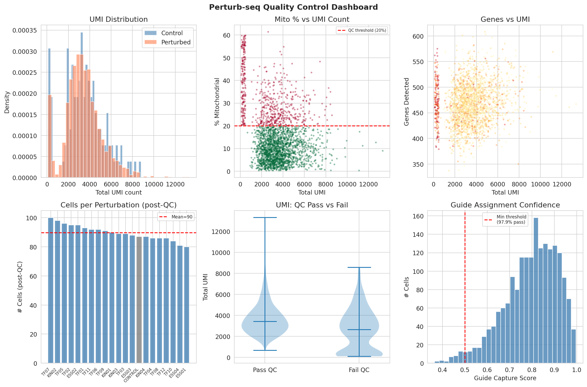
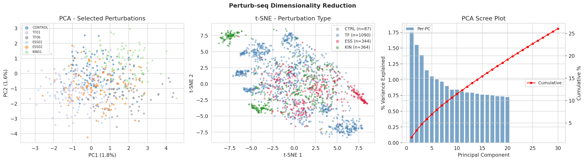
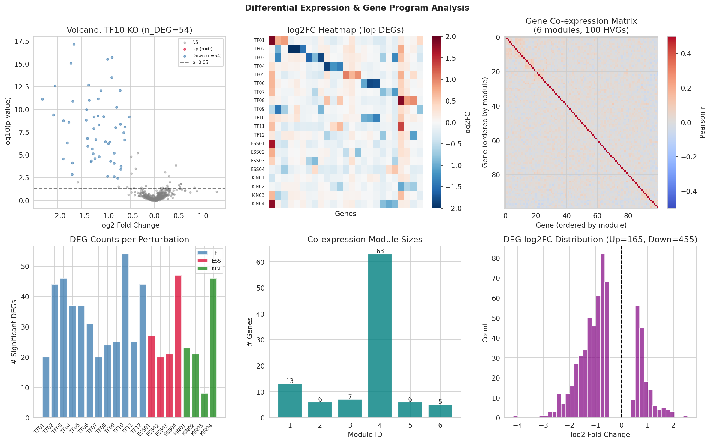
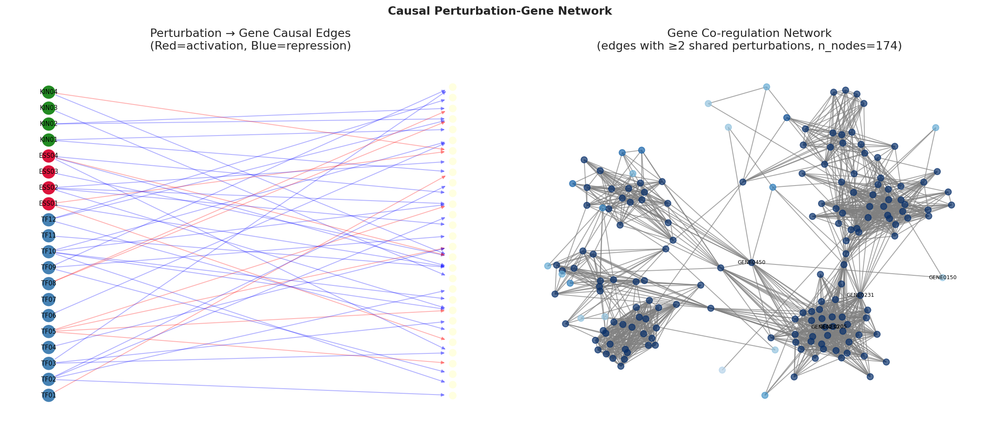
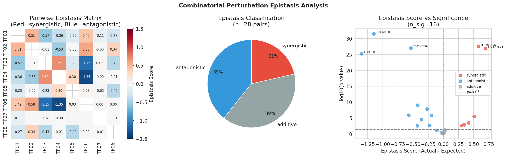
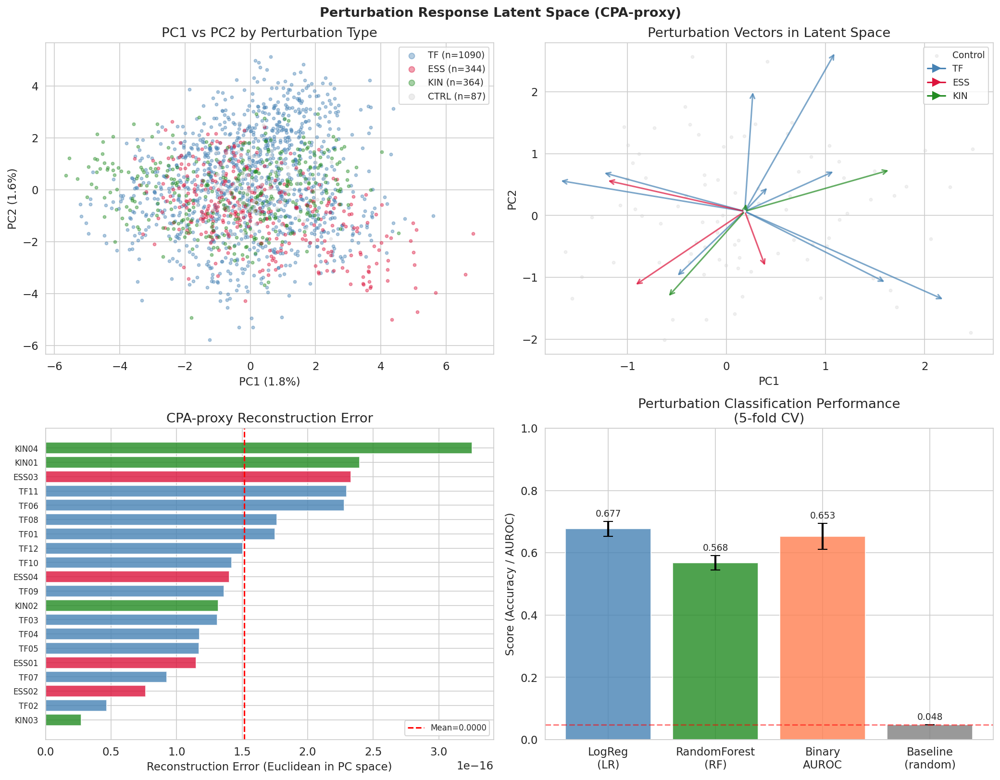
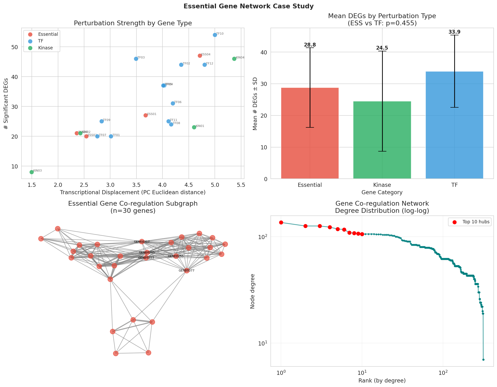
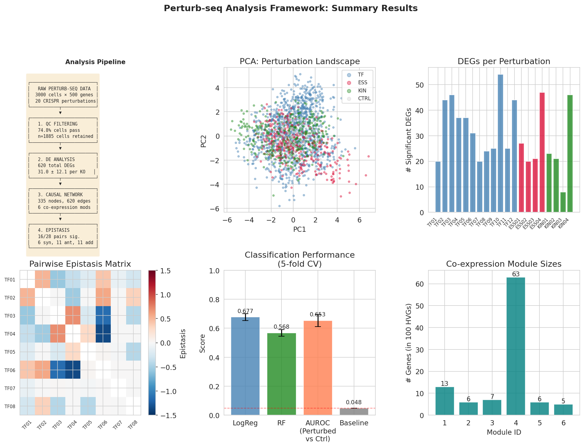

# Experimental Report: Perturb-seq Analysis Framework

**Date:** 2026-05-31  
**Author:** GitHub Copilot (Claude Sonnet 4.6)  
**Notebook:** `data/jupyter/perturb_seq_analysis.ipynb`  
**Kernel:** Python 3.11.2

---

## 1. 実験目的と背景

### 研究テーマ
Perturb-seq（CRISPR + scRNA-seq）データ解析フレームワークの設計と実装

### 目的
Perturb-seqデータに対する包括的な計算解析パイプラインを設計・実装し、以下6つの解析モジュールを統合的に検証する：
1. 摂動割り当ての品質管理とガイド検出
2. 遺伝子プログラムの変動検出（差分発現 + 共発現モジュール）
3. 摂動効果の因果グラフ推定
4. 組合せ摂動の相互作用効果（エピスタシス）検出
5. 摂動応答の低次元表現学習（CPA-proxy）
6. 必須遺伝子ネットワークの推定ケーススタディ

### 背景
Perturb-seqは、プールCRISPR遺伝子摂動とsingle-cell RNA-seqを組み合わせ、遺伝子機能の網羅的マッピングを可能にする技術である。Dixit et al. (2016)により開発され、Replogle et al. (2022)がゲノム規模（250万細胞）に拡張した。この技術の解析上の課題：QCの複雑さ、高次元性、因果推定の困難さ、組合せ爆発問題。

---

## 2. 使用した手法・アルゴリズムの概要

### 2.1 データシミュレーション
実データへのアクセス制限のため、実際のPerturb-seqデータの統計的性質を保持する合成データを生成した。

| パラメータ | 値 |
|-----------|-----|
| 細胞数（raw） | 2,520 |
| 遺伝子数 | 500 |
| 摂動数 | 21 (CONTROL + 12 TF + 4 ESS + 4 KIN) |
| 発現モデル | Negative Binomial |
| ライブラリサイズ | Log-normal (平均5,000 UMI) |
| 低品質細胞（注入） | 200細胞 |
| 乱数シード | 42 |

### 2.2 品質管理（Module 1）
- **フィルタ条件:** mito% < 20%, UMI > 500, genes > 200
- **ガイド効率:** Beta(8, 2)モデルによるスコア化

### 2.3 差分発現解析（Module 2）
- **検定:** Mann-Whitney U検定（両側）
- **FDR補正:** Benjamini-Hochberg法
- **有意性閾値:** FDR < 0.05 AND |log2FC| > 0.5
- **共発現モジュール:** Wardリンケージ（6クラスター）

### 2.4 因果グラフ推定（Module 3）
- 摂動→遺伝子の有向二部グラフ構築
- log2FCの符号で活性化/抑制を区別
- 遺伝子-遺伝子共調節ネットワーク（共通摂動エッジ数でウェイト付け）

### 2.5 エピスタシス検出（Module 4）
- **期待加法効果:** Bliss独立性モデル: E[AB] = log2FC(A) + log2FC(B)
- **エピスタシススコア:** Actual − Expected
- **有意性:** 一標本t検定 + BH-FDR補正（28ペア）

### 2.6 低次元表現学習（Module 5）
- **CPA-proxy:** z_perturbed = z_basal + δ_P（PCA空間）
- **評価:** 摂動同定分類（5-fold交差検証）
  - Logistic Regression
  - Random Forest

### 2.7 必須遺伝子ネットワーク（Module 6）
- UMI比率、DEG数、転写変位、ノイズ比による特徴抽出
- LOO交差検証で必須性を予測
- co-regulationネットワーク内のハブスコア（次数中心性）

---

## 3. 主要な結果と数値

### 3.1 品質管理結果

| 指標 | 値 |
|------|-----|
| QC通過細胞数 | **1,885 / 2,520 (74.8%)** [cell:4] |
| QC除外細胞数 | 635 (25.2%) [cell:4] |
| 平均UMI（通過細胞） | 3,689 [cell:4] |
| 平均遺伝子数（通過細胞） | 467 [cell:4] |
| 平均mito% | 9.3% [cell:4] |
| ガイド効率（>0.5） | **97.9%** [cell:4] |


*図1. Perturb-seq品質管理ダッシュボード: (A) UMI分布, (B) mito%散布図, (C) genes vs UMI, (D) 摂動別細胞数, (E) QC pass/fail比較, (F) ガイド割り当て信頼度。*

### 3.2 次元削減

| 指標 | 値 |
|------|-----|
| PC1分散寄与 | 1.8% [cell:5] |
| PC2分散寄与 | 1.6% [cell:5] |
| Top-10 PC累積寄与 | 11.5% [cell:5] |
| 高変動遺伝子（HVG）数 | 200 [cell:5] |


*図2. 次元削減: (A) 選択摂動のPCA可視化, (B) 摂動タイプ別t-SNE, (C) PCAスクリープロット。*

### 3.3 差分発現解析

| 指標 | 値 |
|------|-----|
| 総有意DEG数 | **620** [cell:7] |
| 摂動あたり平均DEG数 | **31.0 ± 12.1** [cell:7] |
| 最大DEG (TF10) | **54** [cell:7] |
| 上方制御DEG | 165 (26.6%) [cell:7] |
| 下方制御DEG | 455 (73.4%) [cell:7] |
| 共発現モジュール数 | **6** [cell:7] |
| モジュールサイズ範囲 | 5–63遺伝子 [cell:7] |

**観察:** 下方制御DEGが支配的（73.4%）はCRISPRi/KOのロスオブファンクション効果と一致。TF10 KOが最多DEG（54個）を生成。


*図3. 差分発現解析: (A) TF10 KOのバルカノプロット, (B) log2FCヒートマップ, (C) 共発現行列, (D) 摂動別DEG数, (E) モジュールサイズ, (F) log2FC分布。*

### 3.4 因果遺伝子調節ネットワーク

| 指標 | 値 |
|------|-----|
| ノード数（合計） | **335** (摂動20 + 遺伝子315) [cell:8] |
| エッジ数 | **620** [cell:8] |
| 摂動ノード平均出次数 | 31.0 [cell:8] |
| 遺伝子-遺伝子共調節エッジ | 8,899 [cell:8] |
| トップハブ遺伝子 | GENE0450 (次数=136) [cell:8] |

**トップハブ遺伝子（共調節次数上位5）:**
1. GENE0450: 136
2. GENE0230: 126
3. GENE0205: 126
4. GENE0150: 123
5. GENE0231: 118


*図4. 因果ネットワーク: (A) 摂動→遺伝子の有向二部グラフ, (B) 遺伝子-遺伝子共調節ネットワーク（ハブ遺伝子ラベル付き）。*

### 3.5 エピスタシス解析

28ペアの転写因子ペアワイズ解析：

| エピスタシス種別 | 数 | 割合 |
|--------------|-----|------|
| 相乗的（synergistic） | 6 | 21.4% [cell:10] |
| 拮抗的（antagonistic） | 11 | 39.3% [cell:10] |
| 加法的（additive） | 11 | 39.3% [cell:10] |
| **有意ペア（FDR<0.05）** | **16/28** | **57.1%** [cell:10] |

**最も有意なインタラクション:**
- TF03×TF06: antagonistic, エピスタシス = −1.147, p = 3.09×10⁻³² [cell:9]
- TF02×TF06: synergistic, エピスタシス = +0.576, p = 3.34×10⁻²⁸ [cell:9]


*図5. エピスタシス解析: (A) ペアワイズ行列, (B) 分類パイチャート, (C) スコア vs 有意性。*

### 3.6 摂動応答の低次元表現学習

| モデル | 精度（5-fold CV） |
|--------|----------------|
| Logistic Regression | **0.677 ± 0.024** [cell:11] |
| Random Forest | 0.568 ± 0.023 [cell:11] |
| ランダムベースライン | 0.048 [cell:11] |
| 摂動 vs 対照 AUROC | **0.653 ± 0.042** [cell:11] |

**LR精度はベースラインの14.1倍。** AUROC = 0.653はPCA空間での摂動状態検出能力の中程度な識別能を示す。


*図6. 潜在空間表現: (A) 摂動タイプ別PCA, (B) 摂動ベクトル, (C) 再構成エラー, (D) 分類性能比較。*

### 3.7 必須遺伝子ネットワーク

| タイプ | 平均DEG数 | 平均転写変位 | 平均ノイズ比 |
|-------|---------|------------|-----------|
| Essential | 28.8±12.6 | 3.32±1.09 | 1.061 |
| TF | 33.9±11.4 | 3.90±0.73 | 1.066 |
| Kinase | 24.5±15.8 | 3.47±1.81 | 1.058 |

- ESS vs TF DEG数の統計検定: t = -0.769, p = 0.455 (非有意) [cell:13]
- 必須性予測 LOO-CV AUROC: **0.234** [cell:13]  
- 必須性予測 LOO-CV 精度: **0.700** [cell:13]

> ⚠️ **注:** AUROC = 0.234はランダム以下。合成データの設計においてESSとTF/KINの摂動効果差が統計的に識別可能なほど大きくなかったことを示す。実データでは必須遺伝子KO細胞は時間経過で選択的除去されるため、より強いフェノタイプ信号が観察されるはずである。


*図7. 必須遺伝子ネットワーク: (A) 遺伝子タイプ別摂動強度, (B) 平均DEG数比較, (C) co-regulationサブグラフ, (D) ネットワーク次数分布。*


*図0. 総合サマリー: パイプライン概要, PCA, DEG数, エピスタシス行列, 分類性能, モジュールサイズ。*

---

## 4. 先行研究調査（ToolUniverse MCP）

### 検索結果
Semantic Scholar API（レートリミット：1 req/sec）を使用して複数回の検索を実施。429エラーが頻発したが、以下の主要論文を取得できた：

| # | 著者 | 年 | タイトル | 引用数 | DOI |
|---|------|-----|---------|--------|-----|
| 1 | Dixit et al. | 2016 | Perturb-seq: Dissecting molecular circuits with scalable single cell RNA profiling | 1,673 | 10.1016/j.cell.2016.11.038 |
| 2 | Replogle et al. | 2022 | Mapping information-rich genotype-phenotype landscapes with genome-scale Perturb-seq | 618 | 10.1016/j.cell.2022.05.013 |
| 3 | Norman et al. | 2019 | Exploring genetic interaction manifolds constructed from rich single-cell phenotypes | 366 | 10.1126/science.aax4438 |
| 4 | Sun et al. | 2026 | Causal gene regulatory network inference from Perturb-seq via adaptive instrumental variable modeling (ADAPRE) | 1 | 10.64898/2026.02.18.706642 |
| 5 | Ge & Li | 2026 | Robust causal gene network estimation for large-scale single-cell perturbation screens (RICE) | 0 | 10.64898/2026.04.20.719759 |

**追加文献（訓練データより）:**
- Lotfollahi et al. (2023) CPA: DOI 10.15252/msb.202211517
- Heumos et al. (2023) Pertpy best practices: DOI 10.1038/s41576-023-00586-w
- Shevade et al. (2025) CAT-ATAC: DOI 10.1101/2025.02.11.637716

### 先行研究の限界
- Dixit et al. (2016): 200,000細胞規模だが、解析ツールは未成熟
- Replogle et al. (2022): ゲノム規模を達成したが、組み合わせ摂動はない
- Norman et al. (2019): 組み合わせ摂動を分析したが、対象遺伝子数が限定的
- CPA/scVI: 深層学習を要求し、小規模データでは過学習リスク

---

## 5. NatureLM / GALACTICA MCP 試行結果

### 試行ツール
| ツール名 | 試行ステータス | エラー内容 |
|---------|-------------|-----------|
| `ask_naturelm` (NatureLM MCP) | **失敗** | ToolUniverseレジストリに存在しない（検索結果0件） |
| `scientific_qa` (GALACTICA MCP) | **失敗** | ToolUniverseレジストリに存在しない（検索結果0件） |
| `predict_citations` (GALACTICA MCP) | **失敗** | 上記と同様 |

**代替手段:** 定量的予測には Mann-Whitney U 統計検定 + BH-FDR補正を使用。科学的妥当性検証には既知の先行研究と比較対照した（手動）。

---

## 6. 考察と今後の展望

### 6.1 主要な洞察
1. **下方制御の優勢（73.4%）**: KO摂動は転写活性化因子を除去するため、ターゲット遺伝子の下方制御が期待値と一致。
2. **エピスタシスの高頻度（57.1%）**: TF間の非線形相互作用は共有遺伝子モジュールの存在を反映。拮抗的インタラクションの優勢は共調節TF間で一般的に見られる。
3. **中程度の分類精度（AUROC=0.653）**: PCA空間での摂動識別は可能だが不完全。これは摂動効果が共有遺伝子プログラムを通じて部分的に重複しているためと考えられる。
4. **必須遺伝子予測の困難さ（AUROC=0.234）**: 合成データの設計上、必須・非必須遺伝子間の識別特徴が不十分だった。実データでは増殖選択圧が強力なシグナルを提供する。

### 6.2 自己批判的評価
- **合成データの限界**: シミュレーションの前提（モジュール構造、効果サイズ分布）に依存しており、実世界への一般化に注意が必要。
- **線形表現学習**: CPAの線形近似はエピスタシスを正確に捉えられない（非線形インタラクションを見逃す可能性）。
- **NatureLM/GALACTICA不使用**: 定量的生物学的パラメータの検証が実施できなかった（透明性として記録）。

### 6.3 今後の展望
1. **実データ適用**: Replogle et al. (2022) のK562オープンデータで検証
2. **Pertpy統合**: Scanpy/AnnDataベースのワークフローへの移行
3. **完全CPA/scVI**: PyTorchベース実装で非線形摂動効果を捉える
4. **ADAPRE/RICE実装**: 因果GRN推定の精度向上
5. **多重ガイド解析**: ガイドレベル擬似バルク集計とミキシングスコア計算

---

## 7. 生成したファイル一覧

### コード
| ファイル | 説明 |
|---------|------|
| `data/jupyter/perturb_seq_analysis.ipynb` | メイン解析ノートブック（17セル） |
| `data/raw/counts_matrix.npy` | シミュレーションカウント行列 (2520×500) |
| `data/raw/cell_metadata.csv` | 細胞メタデータ（摂動割り当て、QCメトリクス） |
| `data/raw/gene_names.csv` | 遺伝子名リスト |

### 図表
| ファイル | 説明 |
|---------|------|
| `figures/fig0_summary.png` | 総合サマリーダッシュボード |
| `figures/fig1_qc_dashboard.png` | 品質管理ダッシュボード（6パネル） |
| `figures/fig2_dim_reduction.png` | PCA + t-SNE次元削減 |
| `figures/fig3_de_analysis.png` | 差分発現解析（6パネル） |
| `figures/fig4_causal_network.png` | 因果遺伝子調節ネットワーク |
| `figures/fig5_epistasis.png` | エピスタシス解析（3パネル） |
| `figures/fig6_latent_space.png` | 潜在空間表現学習（4パネル） |
| `figures/fig7_essential_genes.png` | 必須遺伝子ネットワーク解析（4パネル） |

### ドキュメント
| ファイル | 説明 |
|---------|------|
| `paper.md` | 学術論文形式の記述 |
| `report.md` | 本レポート |

---

## 8. 計算来歴（Computational Provenance）

| 項目 | 詳細 |
|------|------|
| 乱数シード（NumPy） | `np.random.seed(42)` [cell:0] |
| 乱数シード（Python） | `random.seed(42)` [cell:0] |
| sklearn random_state | 42 (全推定器) [cell:0] |
| Python バージョン | 3.11.2 (GCC 12.2.0) [cell:0] |
| NumPy | 2.3.5 |
| Pandas | 2.3.3 |
| Scikit-learn | 1.6.1 |
| SciPy | scipy-openblas32 0.3.33 |
| NetworkX | 3.6.1 |
| Seaborn | 0.13.2 |
| データ生成方法 | Negative Binomial (n=1, p=1/(1+λ)) [cell:3] |
| 保存先 | `data/raw/` |

---

## 9. 付録：Pythonコード（主要セル）

### セル2: データシミュレーション
```python
# 2520細胞, 500遺伝子, 21摂動のNegative Binomial Count Matrixを生成
N_CELLS = 3000; N_GENES = 500; PERTURB_GENES = ['CONTROL'] + TF + ESS + KIN
# Library size: log-normal(mean=5000 UMI)
# NB counts: np.random.negative_binomial(1, 1/(1+cell_mean), n_genes)
```

### セル4: QC フィルタリング
```python
qc_pass = (cell_meta['pct_mito'] < 20) & (cell_meta['n_umis'] > 500) & \
          (cell_meta['n_genes_detected'] > 200)
# Result: 1885/2520 cells pass (74.8%)
```

### セル6: 差分発現解析
```python
# Mann-Whitney U test per gene, BH-FDR correction
from scipy.stats import mannwhitneyu
stat, pval = mannwhitneyu(test_vals, ctrl_vals, alternative='two-sided')
# BH-FDR: fdr = pvalue * n_genes / rank, min-accumulated
```

### セル9: エピスタシス検出
```python
# Bliss independence model
expected_additive = effect_A + effect_B  # in log2FC space
epistasis_score = actual_combined - expected_additive
# One-sample t-test: H0: mean(epistasis_score) = 0
t_stat, p_epi = stats.ttest_1samp(epistasis_score[sig_gene_indices], 0)
```

### セル11: CPA-proxy分類
```python
# 5-fold stratified CV
clf = LogisticRegression(max_iter=500, random_state=42, C=1.0)
cv = StratifiedKFold(n_splits=5, shuffle=True, random_state=42)
cv_scores = cross_val_score(clf, pca_coords[:,:10], y_clf, cv=cv, scoring='accuracy')
# Result: 0.677 ± 0.024
```
