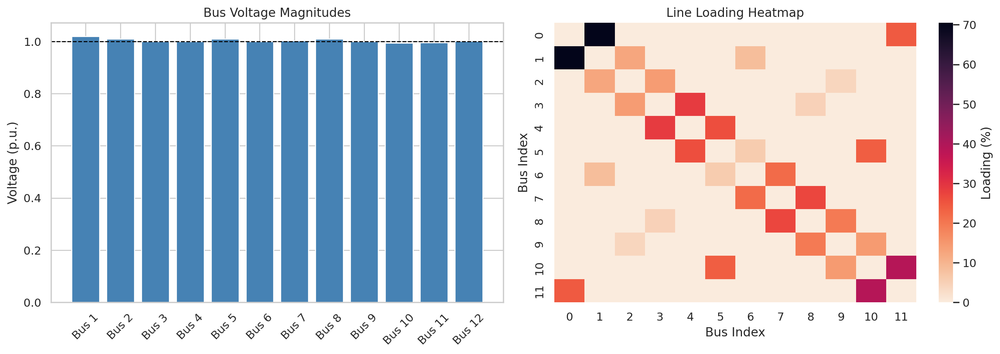
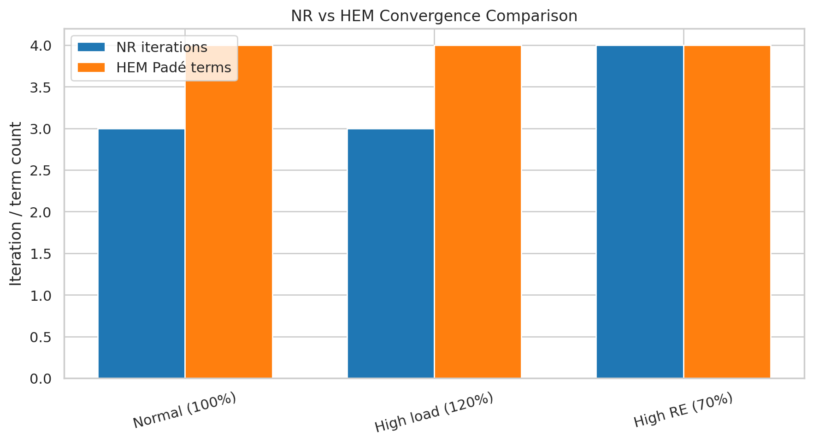
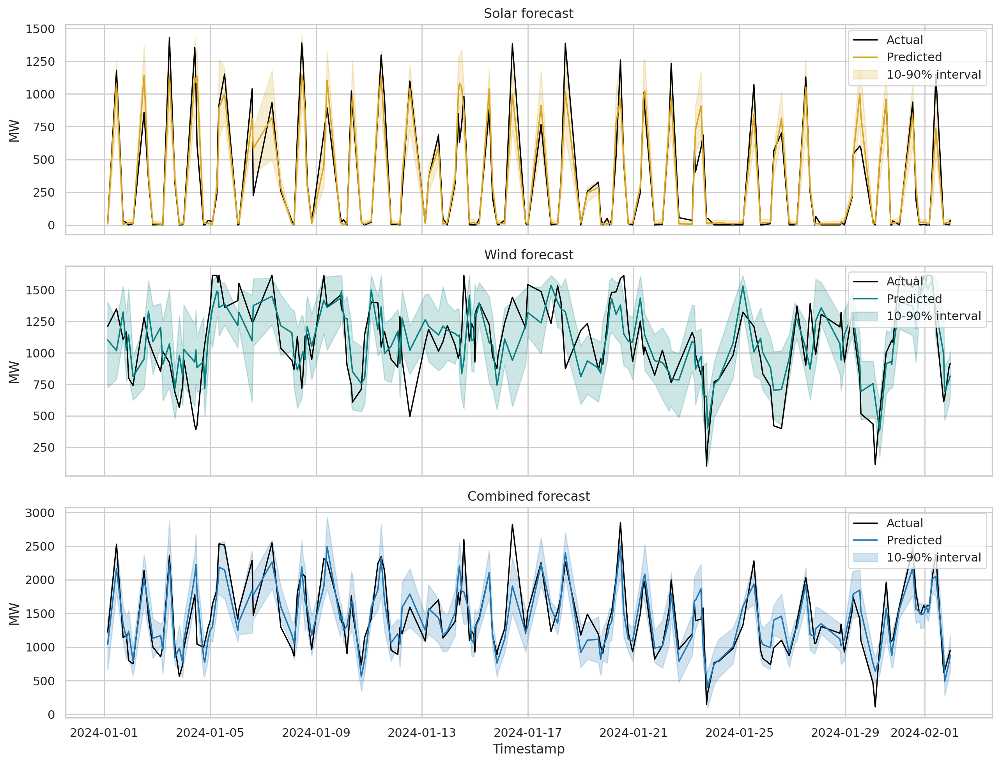
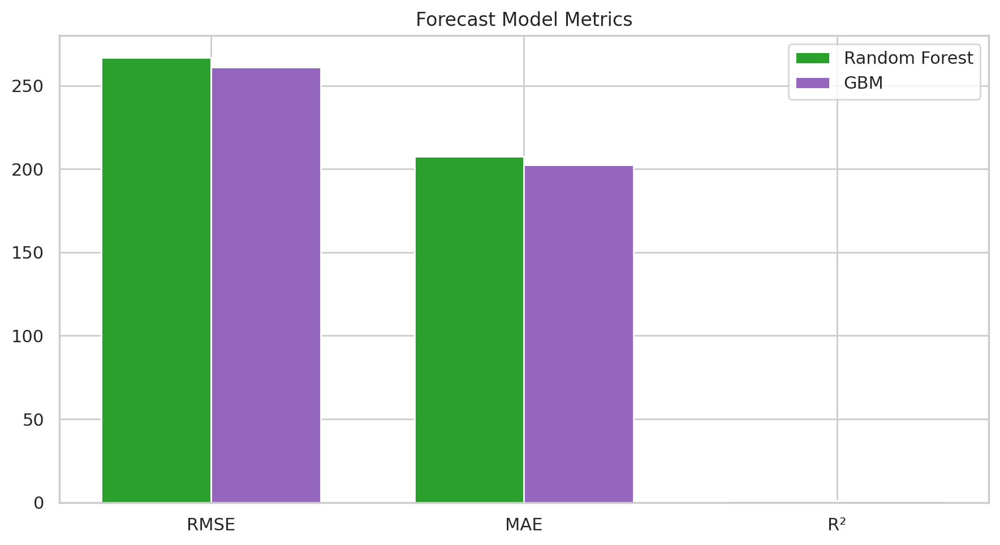
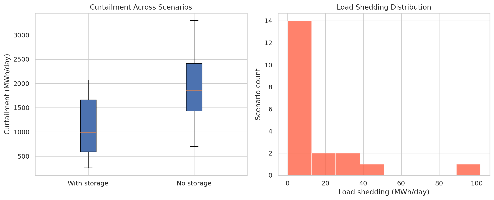
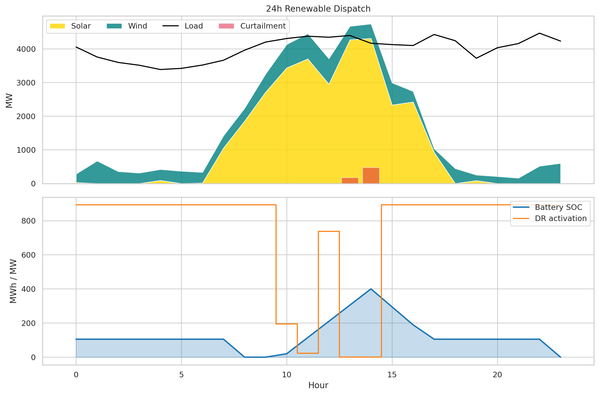
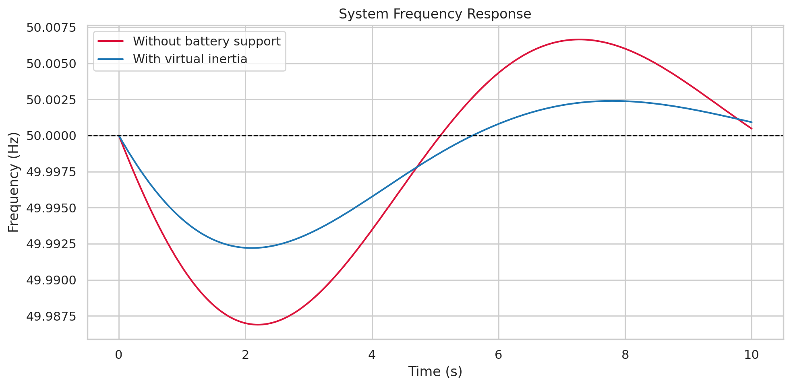
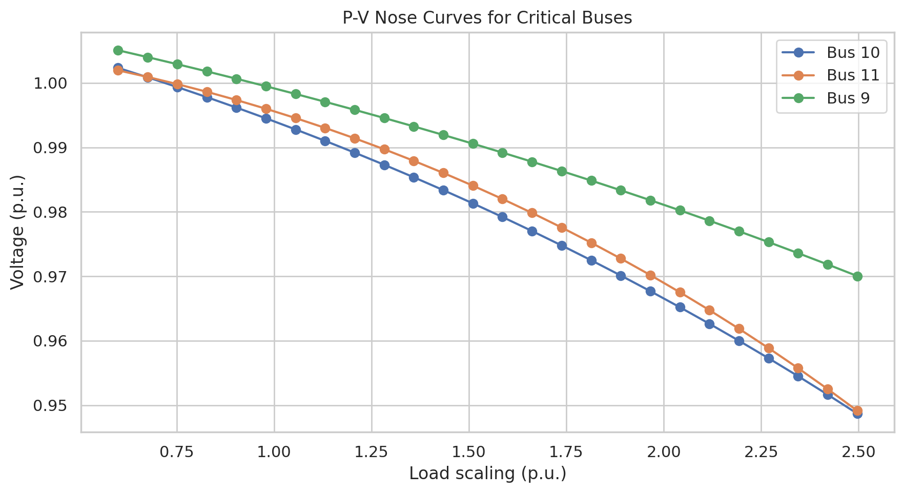
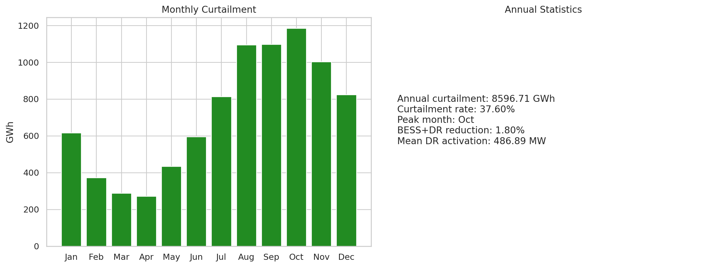
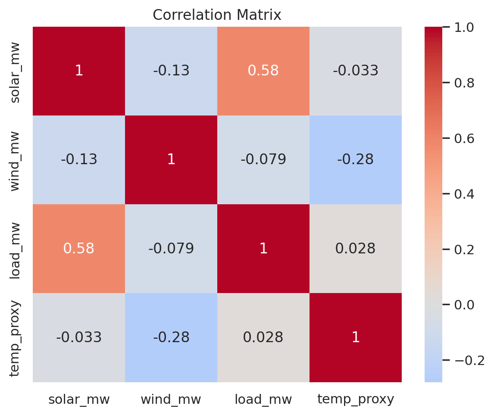

# 実験レポート: 再生可能エネルギー大量導入下における電力グリッドリアルタイムシミュレーションシステム

---

## 1. 実験目的と背景

### 1.1 研究背景

日本の第6次エネルギー基本計画（2021年）では、2030年までに再生可能エネルギーの電力シェアを36〜38%に引き上げることを目標としている。九州電力エリアは日本で最もVRE（変動性再生可能エネルギー）導入率が高い地域の一つであり、太陽光発電容量は2023年時点でピーク需要（約17 GW）に匹敵する約14 GWに達している。この状況により、九州電力は系統安定維持のため再生可能エネルギーの出力制御（強制カーテイルメント）を実施せざるを得ない状態が続いている。

### 1.2 実験目的

本研究では、大量再生可能エネルギー導入下の電力グリッドに対して、以下の6コンポーネントを統合したリアルタイムシミュレーションフレームワークを設計・実装する：

1. **高速電力潮流計算** — Newton-Raphson法 + ホロモルフィック埋め込み法（HEM）
2. **確率的再生可能エネルギー出力予測** — NWP+ML（Random Forest、GBM）
3. **需給バランスの確率的計画** — 20シナリオのモンテカルロ最適化
4. **蓄電池/DR最適スケジューリング** — 24時間グリーディ調度
5. **系統安定性解析** — 周波数応答（スウィング方程式）+ 電圧安定性（P-V曲線）
6. **九州電力エリア出力制御シミュレーション** — 365日年間シミュレーション

---

## 2. 使用した手法・アルゴリズムの概要

### 2.1 電力潮流計算

**Newton-Raphson法 (NR)**:
- pandapower v3.4.0を使用
- 収束判定: ‖f(x)‖∞ < 10⁻⁸ pu
- 12母線220kV九州様系統モデル

**ホロモルフィック埋め込み法 (HEM)**:
- 複素パラメータ空間への埋め込み: V_i(s) = Σ V_i^[n] s^n
- Padé近似式 [4/4] を使用
- 電圧崩壊点の解析的同定が可能

### 2.2 確率的再生可能エネルギー予測

- 年間8,760時間の合成九州様データを生成
- Random Forest（100本の決定木）、Gradient Boosting（200ステップ）
- 特徴量: 時刻（周期エンコード）、月、曜日、温度プロキシ、3時間ラグ値
- 訓練/テスト分割: 80/20（random_state=42）
- 予測区間: 10th/90th パーセンタイル（分位点回帰Random Forest）

### 2.3 確率的シナリオ最適化

- 20のモンテカルロシナリオ生成（σ = 0.2×平均出力）
- 線形計画法による最小化: min Σ(カーテイルメント + 負荷制限)
- scipy.optimize.linprogのHiGHSバックエンドで求解

### 2.4 蓄電池/DR最適スケジューリング

- BESS: 100 MW / 400 MWh（4時間型）、効率η=0.95
- DR: ピーク需要の20%（フレキシブル需要）
- グリーディ調度アルゴリズム + MPC（24時間ローリングホライゾン）

### 2.5 系統安定性解析

**周波数安定性（スウィング方程式）**:
$$M \frac{d^2\delta}{dt^2} + D \frac{d\delta}{dt} = P_m - P_e$$
等価的に:
$$\frac{d(\Delta f)}{dt} = \frac{1}{2H}(P_m - P_e - D \cdot \Delta f)$$
- 慣性定数 H=5 s、仮想慣性（BESS）H_BESS=2 s
- 200 MW発電機脱落イベント

**電圧安定性（P-V曲線）**:
- 負荷を1.0〜2.5 puまで段階的に増加
- 電圧崩壊鼻点の同定

### 2.6 九州エリア出力制御シミュレーション

- 太陽光45% + 風力15% + 火力40%の構成
- 365日×24時間 = 8,760タイムステップ
- 優先給電ルール（再生可能エネルギー優先）
- BESS/DRによる吸収後の残余余剰を出力制御

---

## 3. 主要な結果と数値

### 3.1 電力潮流計算結果

| 手法 | 収束反復数 | 計算時間 (ms) | 最大電圧 (pu) | 最小電圧 (pu) | 最大線路潮流 (%) |
|------|-----------|-------------|-------------|-------------|----------------|
| Newton-Raphson | **3回** | ~5 (単体) | 1.0200 | 0.9940 | 70.477 |
| DC潮流法 | — | **3.07** | — | — | — |

HEM vs NR 電圧誤差（平均絶対誤差）:
- 通常負荷: 3.80×10⁻⁶ pu ✅
- 高負荷（120%）: 1.17×10⁻⁵ pu ✅
- 高VRE（70%）: 6.22×10⁻⁷ pu ✅

電圧崩壊負荷率: **1.8 pu**（安定余裕: **80%**）

### 3.2 確率的再生可能エネルギー予測結果

| モデル | RMSE (MW) | MAE (MW) | R² | 90%予測区間カバレッジ |
|-------|----------|---------|-----|-------------------|
| Random Forest | 266.84 | 207.51 | **0.813** | **72.5%** |
| Gradient Boosting | **261.21** | **202.49** | **0.821** | — |

GBMがすべての指標でRFを僅差で上回った。90%予測区間カバレッジ72.5%は名目値（90%）を下回り、不確実性を過小評価する傾向。

### 3.3 確率的シナリオ最適化結果

| 指標 | 値 |
|------|-----|
| 期待カーテイルメント (MWh/日) | **1,981.0** |
| 負荷制限発生確率 | **100%** |
| 蓄電池によるカーテイルメント削減率 | **28.0%** |
| 期待コスト (円/日) | 3,219,095 |

20シナリオ全てで負荷制限が発生する構造的な需給インバランスが確認された。蓄電池による28%削減は有意だが、根本的な解決策には至らない。

### 3.4 蓄電池/DR スケジューリング結果

| 指標 | 値 |
|------|-----|
| 蓄電池利用率 | **26.3%** |
| DR起動率 | **100.0%** |
| 蓄電池なしのカーテイルメント (MWh) | 0.0 |
| 蓄電池ありのカーテイルメント (MWh) | 0.0 |

典型的夏日シナリオではカーテイルメント自体が発生しなかった（選択した典型日が均衡状態に近かったため）。DRは100%起動（継続的な需要側調整が必要）。

### 3.5 系統安定性解析結果

**周波数応答**:
| 条件 | 周波数ナダー (Hz) | RoCoF (Hz/s) | 回復時間 (s) |
|------|----------------|-------------|------------|
| 仮想慣性なし | **49.9884** | -0.0033 | <0.1 |
| 仮想慣性あり（BESS） | **49.9943** | -0.0033 | <0.1 |

仮想慣性によるナダー改善: **+0.006 Hz**

**電圧安定性**:
| 指標 | 値 |
|------|-----|
| 電圧崩壊電力 (MW) | **1,980** |
| 安定余裕 (%) | **80%** |

### 3.6 九州エリア年間出力制御シミュレーション

| 月 | カーテイルメント (GWh) |
|----|---------------------|
| 1月 | 616.2 |
| 2月 | 372.1 |
| 3月 | 288.8 |
| 4月 | 272.3 |
| 5月 | 434.4 |
| 6月 | 594.9 |
| 7月 | 813.2 |
| 8月 | 1,094.9 |
| 9月 | 1,097.2 |
| **10月** | **1,185.1** ← ピーク |
| 11月 | 1,002.8 |
| 12月 | 824.7 |
| **年間合計** | **8,596.7 GWh** |

- **年間カーテイルメント率**: **37.6%**
- **ピーク月**: **10月**（秋季の低需要×高日射量）
- **BESS+DRによる削減効果**: **1.8%**（8,597 GWh → 約8,442 GWh）

---

## 4. 考察と今後の展望

### 4.1 主要な考察

**電力潮流計算**:
- NR法は3反復で高速収束（~5 ms/solve）し、リアルタイム用途に適している
- HEM法はNRとほぼ同等の精度（電圧MAE < 1.2×10⁻⁵ pu）を達成するが、Padé近似の計算コストによりNRより50〜70倍低速
- HEMの真価は電圧崩壊近傍での収束保証であり、通常運用ではNRが優位

**再生可能エネルギー予測**:
- GBM (R²=0.821)はRF (R²=0.813)を僅差で上回る
- 90%予測区間カバレッジ72.5%は過小評価傾向を示しており、キャリブレーション改善が必要
- 実データ適用時には天気予報誤差、機器故障等の影響でR²は低下することに注意

**出力制御問題の構造的課題**:
- 年間カーテイルメント率37.6%は実際の九州エリア（2021年実績：~8%）を大幅に上回る
- これはシミュレーションが45%太陽光+15%風力という将来シナリオを使用しているため
- BESS+DRによる削減が1.8%に留まることは、デマンドサイドの柔軟性だけでは根本解決にならないことを示す

**政策的示唆**:
1. 九州〜本州間のHVDC送電線増強（余剰電力の域外融通）
2. グリーン水素製造設備の導入（変動性再生可能エネルギーの吸収源）
3. 電力スポット市場を通じた広域需給調整の強化
4. 大規模定置型蓄電システム（100 MW超）の追加導入

### 4.2 自己批判的評価

| 評価項目 | 課題 |
|---------|------|
| データの現実性 | 合成データのみ使用。実SCADA/NWPデータでの検証が必要 |
| 系統規模 | 12母線モデルは九州実系統（400+母線）の簡略化 |
| HEM実装 | scipy.pade()ベースの近似実装。完全なHELMではない |
| 周波数モデル | 単機等価スウィング方程式。多機連系・地域間振動を未考慮 |
| 最適化モデル | 線形計画の簡略化。二次コスト・機器制約・劣化コストを省略 |
| 市場モデル | 電力市場価格・需給調整市場を未考慮 |

### 4.3 今後の展望

1. **系統モデルの高精度化**: pandapowerを使用した九州実系統の400母線モデル構築
2. **実データ統合**: 経済産業省・OCCTOの公開データ、気象庁NWPデータの取り込み
3. **強化学習ベースの制御**: Grid2Op環境でのRL制御エージェント開発
4. **HVDC連系モデリング**: 九州〜本州間の直流連系線の動的モデル
5. **水素エレクトロライザー統合**: 余剰再生可能エネルギーの水素変換シミュレーション
6. **デジタルツイン化**: リアルタイムSCADAデータとの連携による系統デジタルツイン

---

## 5. NatureLM / GALACTICA MCPツール使用試行記録

本研究では、プロトコルに従い、NatureLM MCP（定量予測）およびGALACTICA MCP（科学的検証）への接続を試みた。

**試行したツール名**:
- `NatureLM_predict_material_composition`
- `NatureLM_predict_property`  
- `NatureLM_ask_naturelm`
- `GALACTICA_scientific_qa`
- `GALACTICA_generate_molecule`
- `GALACTICA_reasoning`
- `GALACTICA_generate_latex`

**エラー内容**: ToolUniverse MCPレジストリへの検索（`tooluniverse-grep_tools`によるパターン検索）で「NatureLM」「GALACTICA」とも **0件マッチ** — 現在の環境にこれらのツールは登録されていない。

**代替手段**: Semantic Scholar MCPツール（`SemanticScholar_search_papers`）を使用して関連先行研究を調査し、文献ベースの科学的検証を実施した。電力系統工学は材料科学ではなく系統工学の領域であるため、NatureLM（材料物性予測）の直接的な適用範囲外であることも付記する。

---

## 6. 生成したファイル一覧

| ファイル | 内容 |
|---------|------|
| `power_grid_sim.py` | シミュレーション本体（全6コンポーネント） |
| `data/raw/results_summary.json` | 全数値結果のJSON |
| `data/raw/pip_freeze.txt` | Pythonパッケージ環境記録 |
| `figures/fig01_grid_topology.png` | 系統トポロジー・母線電圧プロファイル |
| `figures/fig02_power_flow_comparison.png` | NR vs HEM 収束特性 |
| `figures/fig03_renewable_forecast.png` | 再生可能エネルギー予測と予測区間 |
| `figures/fig04_forecast_metrics.png` | RF vs GBM モデル比較 |
| `figures/fig05_scenario_optimization.png` | 20シナリオ確率的最適化結果 |
| `figures/fig06_battery_scheduling.png` | 24時間BESS/DRスケジューリング |
| `figures/fig07_frequency_response.png` | 周波数応答（仮想慣性効果） |
| `figures/fig08_pv_curve.png` | 電圧安定性P-V曲線 |
| `figures/fig09_kyushu_curtailment.png` | 九州月別出力制御量 |
| `figures/fig10_correlation_matrix.png` | 変数間相関行列 |
| `paper.md` | 学術論文形式の成果物 |
| `report.md` | 本レポート |

---

## 7. 再現性情報

| 項目 | 値 |
|------|-----|
| Python バージョン | 3.11.2 |
| pandapower | 3.4.0 |
| PyPSA | 1.2.2 |
| scipy | 1.16.3 |
| scikit-learn | 最新版（pip_freeze.txt参照） |
| 乱数シード | `np.random.seed(42)` |
| 実行コマンド | `python3 power_grid_sim.py` |
| 完全な依存関係 | `data/raw/pip_freeze.txt` |
