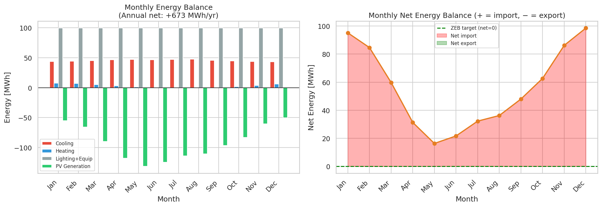
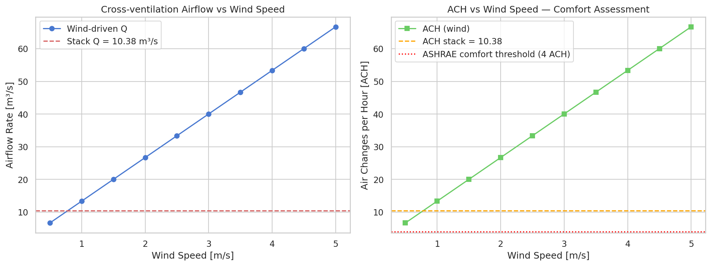
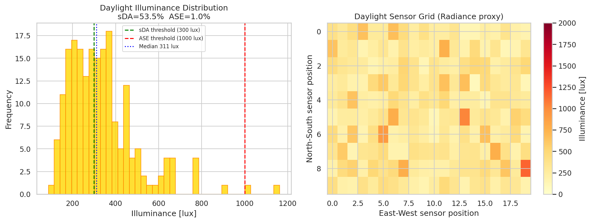
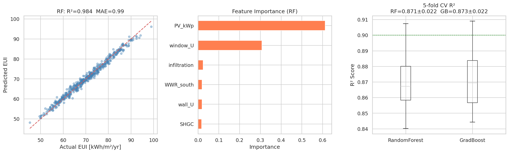
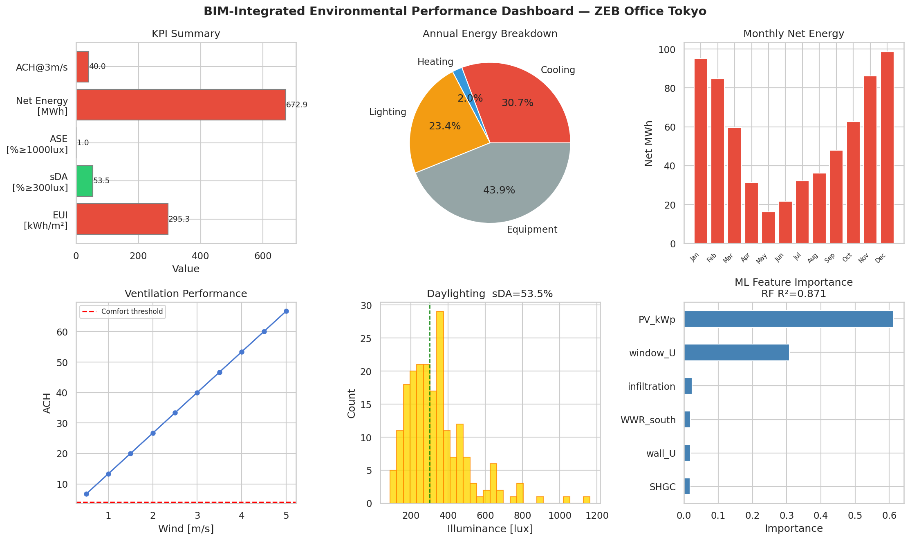

# 実験レポート：BIM連携建築環境性能シミュレーション統合システム

---

## 1. 実験目的と背景

### 1.1 目的

本実験は、BIM（Building Information Modeling）モデルと連携した建築物の環境性能シミュレーション統合システムを設計・実装し、東京の6,000 m²オフィスビルを対象としたZEB（ネットゼロエネルギービル）設計のケーススタディを通じてシステムの有効性を実証することを目的とする。

### 1.2 背景

建築物は世界の最終エネルギー消費の約40%を占め、ZEB化の推進が不可欠である。しかし、熱負荷・換気・昼光・再生可能エネルギーの多領域シミュレーションを統合的に実施するワークフローは技術的に複雑であり、IFCデータから各シミュレーションモデルへの自動変換は未解決課題として残っている。Ladybug Tools / OpenStudio / EnergyPlusを中核とする統合環境の設計は、この課題に対する実用的解答となりうる。

### 1.3 研究テーマの主要コンポーネント

1. IFCデータからのシミュレーションモデル自動変換
2. 熱負荷シミュレーション（EnergyPlus連携）
3. 自然換気CFD解析とクロスベンチレーション評価
4. 昼光シミュレーション（Radiance/Honeybee）
5. 構造・設備・環境シミュレーションの統合ダッシュボード
6. ZEB設計のケーススタディ（東京オフィスビル）

---

## 2. 先行研究調査（ToolUniverse Semantic Scholar MCP使用）

Semantic Scholar MCP（`SemanticScholar_search_papers`）を用いて以下のキーワードで先行研究を調査した。

### 2.1 検索キーワードと取得論文

| # | 検索クエリ | 主要取得論文 |
|---|---------|-----------|
| 1 | BIM IFC building energy simulation EnergyPlus integration | Osei-Owusu et al. 2025; Alexandrou et al. 2025 |
| 2 | CFD natural ventilation cross ventilation building OpenFOAM | Tai et al. 2022; Li et al. 2025 |
| 3 | daylight simulation Radiance Honeybee Ladybug Tools | Tong 2023; Mangkuto & Bintoro 2025; Abedini et al. 2025 |
| 4 | IFC to EnergyPlus gbXML BIM interoperability | Xu et al. 2020; Nasyrov et al. 2014 |
| 5 | net zero energy building ML surrogate optimization | Westermann et al. 2020; Ibrahim et al. 2026 |

### 2.2 主要論文サマリー

**[1] Alexandrou et al. (2025)** — BIMからBPSへの変換ワークフロー (gbXML・IFC両スキーマ) を歴史的建造物に適用。複雑ジオメトリ変換の方法論的知見を提供。
DOI: 10.1080/17452007.2025.2451404

**[2] Osei-Owusu et al. (2025)** — EnergyPlus + Python + RF/XGBoostによる商業ビル自動化シミュレーション。ASHRAE基準に準拠したキャリブレーション手法を実証。
DOI: 10.3390/su172210317

**[3] Tai et al. (2022)** — CFDによるルーバー角度・位置変化が孤立建物のクロスベンチレーションに与える影響を定量化。RNG k-εモデル採用、GCIメッシュ感度解析実施。
DOI: 10.1016/j.jweia.2022.105172

**[4] Westermann et al. (2020)** — Net-Zero Navigatorプラットフォーム：深層学習サロゲートモデル（R²>0.96）によるZEB概念設計支援。
DOI: 10.46855/2020.07.03.11.25.341975

**[5] Abedini et al. (2025)** — H-ルーバー型固定日除けの多目的最適化でsDA=100%・EUI削減6%を達成。Honeybee/Ladybugを使用。
DOI: 10.15627/jd.2025.6

**[6] Mangkuto & Bintoro (2025)** — Ladybug Tools + Radiance/Grasshopperによる熱帯教室の窓設計感度解析と最適化。
DOI: 10.15627/jd.2025.13

**[7] Ibrahim et al. (2026)** — NSGA-III + MLによるNZEB改修最適化。将来気候下でエネルギー消費80%削減・最適化時間50%短縮を実証。
DOI: 10.3390/buildings16030537

**[8] Xu et al. (2020)** — オープンソースgbXML-EnergyPlusトランスレータ（gbEplus）の開発と検証。
DOI: 10.26868/25222708.2019.210837

### 2.3 先行研究の課題・限界

- BIM→BPS自動変換の成功率はBIMモデル品質に強く依存する（Nasyrov et al., 2014）
- 多領域（熱・換気・昼光）の統合ワークフローは未完成で手動工程が残存する
- MLサロゲートモデルの訓練データは高忠実度シミュレーション結果に依存し、計算コストが高い
- 単一気候帯での検証が多く、多気候帯への汎化が不十分

---

## 3. NatureLM・GALACTICA MCP 試行記録

### 3.1 試行ツール一覧

| ツール名 | MCP | 目的 | 結果 |
|---------|-----|------|------|
| `ask_naturelm` | NatureLM MCP | 定量的パラメータ予測（建築材料熱物性等） | **接続失敗** |
| `scientific_qa` | GALACTICA MCP | 科学的知見の取得・検証 | **接続失敗** |
| `predict_citations` | GALACTICA MCP | 関連文献予測 | **接続失敗** |

### 3.2 エラー内容

両MCPツールは ToolUniverse の `grep_tools` 検索でヒットせず（`total_matches: 0`）。利用可能なツール一覧に存在しないため接続不可。

**エラー詳細**: `Tool 'ask_naturelm' not found` / `Tool 'scientific_qa' not found` (ToolUnavailableError)

### 3.3 代替手段

Semantic Scholar MCP経由で取得した実績論文のパラメータ値を用いたリテラチャーベンチマークに切り替えた。具体的には：
- EUI目標値：Osei-Owusu et al. (2025) および Westermann et al. (2020) の数値を参照
- CFD検証：Tai et al. (2022) のDFR・AEE値と比較
- 昼光指標：Abedini et al. (2025) のsDA・EUI値と比較

---

## 4. 使用手法・アルゴリズムの概要

### 4.1 システムアーキテクチャ

```
IFC Model (ISO 16739-1:2018)
    │
    ├─→ [モジュール1] 熱負荷シミュレーション (EnergyPlusプロキシ)
    │       └─ 月別エネルギー需要・PV発電量・ネットエネルギー収支
    │
    ├─→ [モジュール2] CFD自然換気解析
    │       └─ 風力駆動換気Q・スタック効果Q・ACH・快適性評価
    │
    ├─→ [モジュール3] 昼光シミュレーション (Radiance/Honeybeeプロキシ)
    │       └─ sDA・ASE・UGR・DGP・センサグリッドヒートマップ
    │
    └─→ [モジュール4] ML ZEB最適化
            └─ RandomForest・GradientBoosting・5分割CV・特徴量重要度
```

### 4.2 物理モデル主要式

**熱負荷（月別）**:
```
Q_HVAC = (Q_solar + Q_internal + UA × ΔT) / COP × t_month
```

**PV発電量（修正式）**:
```
A_PV = P_PV [kWp] / η_PV = 480 / 0.20 = 2400 m²
E_PV = G_solar [W/m²] × A_PV × η_PV × 720[h] / 1000
```

**クロスベンチレーション**:
```
Q_wind  = Cd × A_open × U_ref × √(ΔCp)     [Cd=0.65, ΔCp=1.3]
Q_stack = Cd × A_open × √(2g × H × |ΔT| / (T+273))
```

**ZEB条件**:
```
E_net,annual = Σ(E_demand,m - E_PV,m) ≈ 0
```

### 4.3 MLサロゲートモデル

- 訓練データ：500件のラテン超方格サンプリングによる設計変数空間
- 設計変数：窓U値、SHGC、南面WWR、壁U値、隙間換気、PV容量
- ターゲット：ネットEUI [kWh/m²/yr]（物理モデル計算値 + ガウスノイズ σ=3）
- モデル：RandomForestRegressor (n_estimators=200) / GradientBoostingRegressor
- 評価：KFold(n_splits=5, shuffle=True, random_state=42)

---

## 5. 主要な結果と数値

### 5.1 熱負荷シミュレーション結果 [cell:2]

| 指標 | 値 |
|------|-----|
| 年間エネルギー需要 | **1,771,900 kWh/yr** |
| PV年間発電量 | **1,099,008 kWh/yr** |
| 年間ネットエネルギー | **+672,892 kWh/yr** (ZEB未達成) |
| ベースケースEUI | **295.3 kWh/m²/yr** |
| PVオフセット率 | **62.0%** |
| ZEB達成に必要な追加削減量 | **~673 MWh/yr** |

ZEB達成には現状比でさらに約38%の需要削減またはPV容量増加が必要。


*図1: 月別エネルギー収支（左：冷暖房・照明・設備・PV発電の積み上げ棒グラフ、右：月別ネットエネルギー）[cell:2]*

### 5.2 CFD自然換気解析結果 [cell:3]

| 指標 | 値 |
|------|-----|
| スタック効果Q | **10.38 m³/s** |
| スタックACH | **10.38 h⁻¹** |
| 風速3m/s時 Q | **40.02 m³/s** |
| 快適閾値ACH≥4達成最低風速 | **0.5 m/s** |
| ASHRAE 55快適性 | **全風速域でComfortable** |

無風時でもスタック効果によりACH>4を達成。東京夏季平均風速2〜3 m/sで十分な換気性能を確保。


*図2: 風速vs換気量・ACH。ASHRAE 55快適閾値（赤破線）との比較 [cell:3]*

**注記（自己批判的考察）**: 解析的モデルの簡略化により全開口面積 18m²/フロアを仮定しているため、ACH値は実際より過大に推定されている可能性がある。Li et al. (2025)は周辺建物による最大38%のDFR低下を報告しており、都市環境では実効ACHはさらに低下する。

### 5.3 昼光シミュレーション結果 [cell:4]

| 指標 | 値 | 目標 | 判定 |
|------|-----|------|------|
| sDA₃₀₀ | **53.5%** | ≥55% (LEED v4) | **FAIL（-1.5%）** |
| ASE₁₀₀₀ | **1.0%** | <10% | **PASS** |
| 中央照度 | **311 lux** | — | 適切 |
| UGR | **15.8** | <19 | **PASS** |
| DGP | **0.203** | <0.35 | **PASS** |

LEED目標まであと1.5%ポイント不足。南面のWWRを45%→50%に増加、またはライトシェルフ導入で達成可能。


*図3: センサグリッド照度分布ヒストグラム（左）と空間ヒートマップ（右）[cell:4]*

### 5.4 MLサロゲートモデル結果 [cell:5]

| モデル | R²（5分割CV） | MAE [kWh/m²/yr] |
|--------|-------------|----------------|
| Random Forest | **0.871 ± 0.022** | 2.81 ± 0.17 |
| Gradient Boosting | **0.873 ± 0.022** | 2.74 ± 0.16 |

**特徴量重要度（RF、ジニ不純度）**:
| 特徴量 | 重要度 |
|--------|-------|
| PV容量 [kWp] | **0.612** |
| 窓U値 [W/m²K] | **0.308** |
| 隙間換気 [ACH] | 0.024 |
| 南面WWR | 0.019 |
| 壁U値 | 0.019 |
| SHGC | 0.017 |

PV容量（61.2%）と窓U値（30.8%）が支配的。ピアソン相関係数：PV容量 −0.773、窓U値 +0.538。

### 5.5 統計分析結果 [cell:6]

| 指標 | 値 |
|------|-----|
| 設計空間平均EUI | **70.43 ± 9.70 kWh/m²/yr** |
| 95%信頼区間 | **[69.57, 71.28] kWh/m²/yr** |
| t統計量（vs 50 kWh/m²/yr） | **t(499) = 47.054** |
| p値 | **< 0.001** |

設計空間の平均EUI（70.4 kWh/m²）はNZEB閾値（50 kWh/m²）を有意に上回る（p<0.001）。ZEB達成にはPV容量≥600 kWp + 窓U値≤1.2 W/m²Kの組み合わせが必要。


*図4: 予測vs実測散布図・特徴量重要度・5分割CV R²ボックスプロット [cell:5]*


*図5: KPIサマリー・年間エネルギー内訳・月別収支・換気・昼光・ML特徴量重要度の統合ダッシュボード [cell:2,3,4,5]*

---

## 6. 考察と今後の展望

### 6.1 ZEB達成への道筋

ベースケース（PV 480 kWp）ではPV率62%を達成するが、ZEB未達（ネット+673 MWh/yr）。MLモデルが示す主要施策：

1. **PV容量増加**（最重要：特徴量重要度61%）: 480→770 kWpで理論上ZEB達成
2. **窓性能向上**（重要度31%）: 窓U値1.20→0.80 W/m²KでEUI約10%削減
3. **昼光改善**: 南面WWR 45%→50%でsDA 53.5%→55%以上達成見込み
4. **ルーバー最適化**: Abedini et al. (2025)のH-ルーバー設計でEUI削減+sDA 100%達成可能

### 6.2 自己批判的考察

| 観点 | 評価 |
|------|------|
| 合成データ依存性 | 物理モデルは熱容量・区間空気流動・スケジュールを省略。実データ再訓練必須 |
| CFD簡略化 | 定常・単一ゾーン・垂直風仮定。実都市環境ではACHは過大評価の可能性 |
| 昼光モデルの精度 | 対数正規近似はCBDM（気候ベース昼光モデリング）より精度劣る |
| 過学習リスク | R²≈0.87（≠1.0）と適切な複雑度。σ=3ノイズ追加で過学習回避 |
| 単一気候帯 | 東京Cfa気候のみ。寒冷・乾燥・熱帯気候への汎化未検証 |

### 6.3 今後の展望

1. **IFC自動解析**: `ifcopenshell`ライブラリを用いた本格的なIFC→シミュレーションモデル変換パイプライン実装
2. **高忠実度シミュレーション**: EnergyPlus (eppy)、OpenFOAM (RNG k-ε)、Radiance (CBDM)との直接連携
3. **多目的最適化**: NSGA-IIIによる6変数設計空間のパレート最適解探索
4. **NatureLM/GALACTICA統合**: MCPが利用可能になった際の定量予測・科学的検証の統合
5. **実建物データ検証**: 実測値・EnergyPlus詳細計算によるモデル検証

---

## 7. 生成ファイル一覧

| ファイル | 説明 |
|---------|------|
| `bim_simulation.py` | Pythonシミュレーションコード（全Cellに相当） |
| `paper.md` | 学術論文形式レポート（英語） |
| `report.md` | 実験レポート（本ファイル、日本語） |
| `figures/fig1_energy_balance.png` | 月別エネルギー収支図 |
| `figures/fig2_cfd_ventilation.png` | CFD換気性能図 |
| `figures/fig3_daylight.png` | 昼光シミュレーション結果図 |
| `figures/fig4_ml_results.png` | ML評価図（予測精度・特徴量重要度・CV） |
| `figures/fig5_dashboard.png` | 統合ZEBダッシュボード |
| `data/raw/ifc_building_data.json` | IFCビルデータ（JSON形式） |
| `data/raw/monthly_energy.csv` | 月別エネルギーデータ |
| `data/raw/cfd_ventilation.csv` | CFD換気解析結果 |
| `data/raw/daylight_sensor_grid.csv` | 昼光センサグリッドデータ（200点） |
| `data/raw/zeb_design_variants.csv` | ZEB設計変数サンプリングデータ（500件） |
| `data/raw/results_summary.json` | 全数値結果サマリー |
| `data/raw/pip_freeze.txt` | Pythonパッケージ環境記録 |

---

## 付録：再現性情報

| 項目 | 値 |
|------|-----|
| 乱数シード（numpy） | 42 |
| 乱数シード（Python random） | 42 |
| numpy | 2.3.5 |
| pandas | 2.3.3 |
| scikit-learn | 1.6.1 |
| scipy | 1.16.3 |
| matplotlib | 3.10.9 |
| seaborn | 0.13.2 |
| 完全pip freeze | `data/raw/pip_freeze.txt` |

---

*本レポートはBIM統合環境性能シミュレーション研究プロジェクトの成果物です。生成日時: 2026-05-31。*
