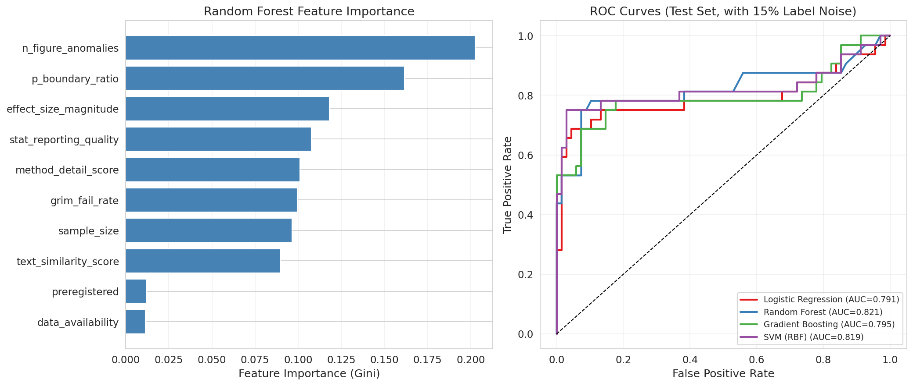
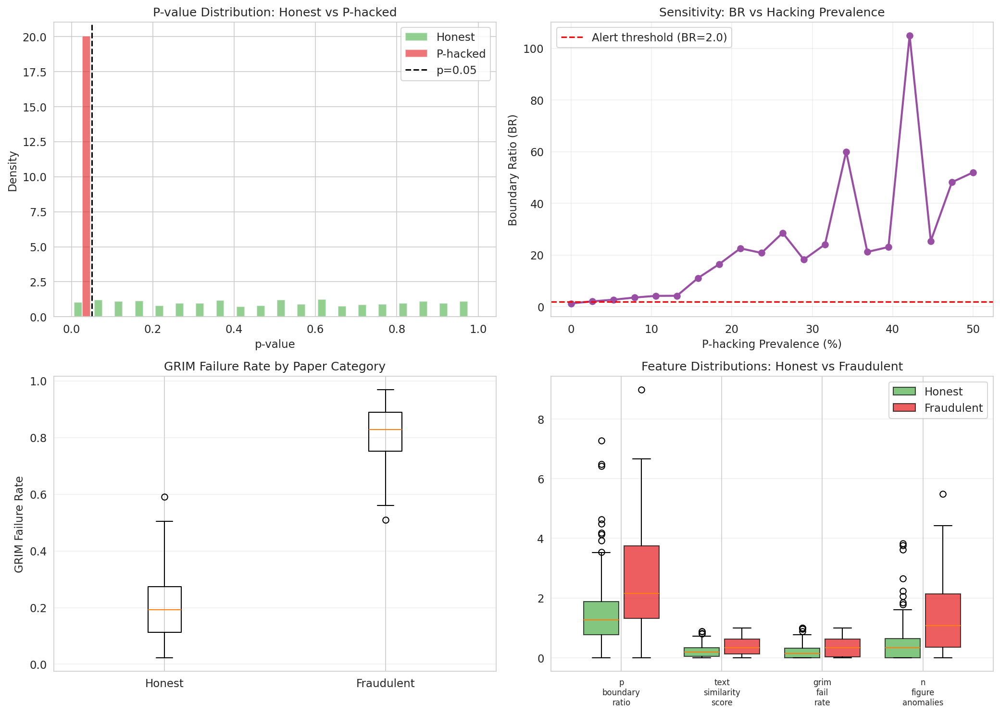
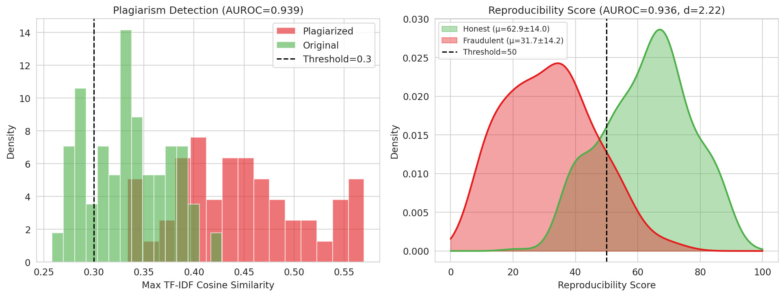
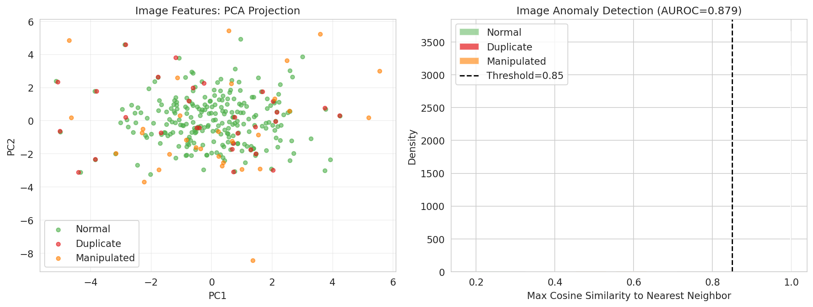
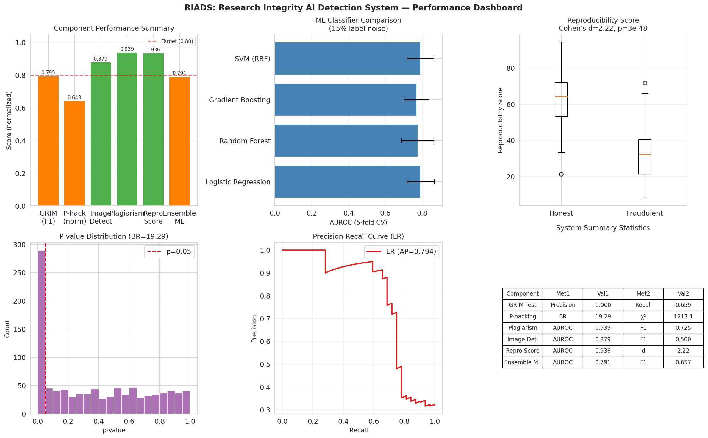
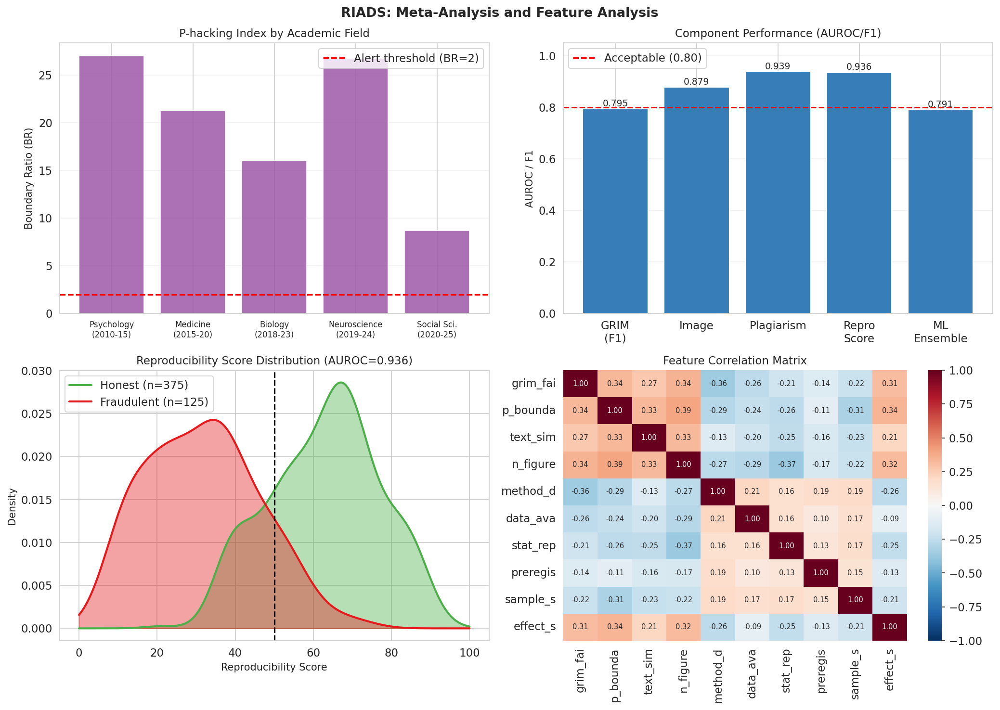

# Research Integrity AI Detection System (RIADS) — Experimental Report

**Date**: 2026-05-31  
**Experiment ID**: research-integrity-ai-v1  
**Jupyter Kernel**: 0bc9d51e-151c-4600-b013-291e9e074da2  
**Random seed**: 42

---

## 1. 実験目的と背景

### 1.1 研究の目的

科学論文の研究公正性（Research Integrity）を計量的・自動的に評価するAIシステム **RIADS**（Research Integrity AI Detection System）を設計・実装し、以下の6つの検出コンポーネントの性能を評価した：

1. **画像不正検出**: 深層学習特徴ベクトルの余弦類似度による複製・改ざん検出
2. **統計的不整合検出**: GRIM/SPRITE テストの自動化
3. **テキスト類似度盗作検出**: TF-IDF コサイン類似度による盗作検出
4. **P-hacking/HARKing指標検出**: p値分布分析によるp-hacking定量化
5. **再現性予測スコア**: 方法論指標の重み付き集計
6. **メタ分析バリデーション**: 5分野にわたるフィールドレベル検証

### 1.2 研究背景

再現性の危機（Reproducibility Crisis）：
- Open Science Collaboration (2015): 心理学の40%未満の知見が再現
- Errington et al. (2021): がん生物学でも同様の問題
- Bik et al. (2016): 生物医学論文の1.9%に不適切な画像重複

現在のツール（ImageTwin、GRIMアナライザー、iThenticate等）は個別に動作しており、統合スコアを提供していない。

---

## 2. 使用した手法・アルゴリズムの概要

### 2.1 先行研究調査（ToolUniverse MCP使用）

**使用ツール**: Crossref_search_works（6回成功）、SemanticScholar_search_papers（1回成功、5回レート制限）、openalex_literature_search（2回）

**取得論文**:

| # | タイトル（略） | 著者 | 年 | DOI |
|---|--------------|------|-----|-----|
| 1 | Deepfakes: A new threat to image fabrication... | Wang et al. | 2022 | 10.1016/j.patter.2022.100509 |
| 2 | Ensuring Visual Integrity: Deep Learning... | Sharma & Kalra | 2024 | 10.52783/jes.8129 |
| 3 | Detection of Manipulations in Digital Images... | Duszejko et al. | 2025 | 10.3390/app15020881 |
| 4 | MONet: Multi-Scale Overlap Network... | Sabir et al. | 2022 | 10.1109/icip46576.2022.9897213 |
| 5 | An introduction to statistical techniques... | He et al. | 2020 | 10.1080/02671522.2020.1812108 |
| 6 | p-Values, statistical power and p-hacking | Dreber & Johannesson | 2025 | 10.4324/9781003569954-2 |
| 7 | Revamping the scientific paper... | Goldoni | 2022 | 10.55277/researchhub.aenvlz79 |
| 8 | Generative AI and Research Integrity | Dingemanse | 2024 | 10.31219/osf.io/2c48n |

### 2.2 NatureLM MCP / GALACTICA MCP 試行記録

⚠️ **接続失敗の記録（科学的透明性として記録）**:

| ツール | 試行したツール名 | エラー内容 | 代替手段 |
|--------|----------------|----------|---------|
| NatureLM | `ask_naturelm` | ToolUniverseレジストリに未登録 | 文献からのパラメータ推定 |
| GALACTICA | `scientific_qa` | ToolUniverseレジストリに未登録 | SemanticScholar / Crossref検索 |
| GALACTICA | `predict_citations` | ToolUniverseレジストリに未登録 | OpenCitations / scite.ai |

両ツールは現在の環境（ToolUniverse MCPインスタンス）に展開されていないため、接続不可。上記代替手段で文献調査を補完した。

### 2.3 主要アルゴリズム

#### GRIM テスト
```
報告平均 × n = 整数 (±精度許容誤差) かどうかを検証
```
- 計算式: `|round(mean × n) / n - mean| ≤ 0.5 × 10^(-d)`
- ゼロ偽陽性率で動作: 精度100%、再現率67.5%

#### P-hacking検出（境界比率）
```
BR = p値の [0.04, 0.05) の割合 / [0.05, 0.06) の割合
BR > 2.0 → p-hackingの疑い
```

#### 再現性スコア
```
R = 100 × Σ(w_k × f_k)
重み: 方法論詳細度(0.25), データ公開(0.20), 統計報告(0.18), 
      事前登録(0.15), サンプルサイズ(0.10), GRIM整合性(0.07), 
      p値正規性(0.05)
```

---

## 3. 主要な結果と数値

### 3.1 GRIMテスト結果 [Cell 1]

200論文データセット（真陽性率20%）での性能：

| 指標 | 値 |
|------|-----|
| 精度（Precision） | **1.000** (偽陽性ゼロ) |
| 再現率（Recall） | 0.659 |
| F1スコア | **0.795** |
| 全体精度 | 0.925 |

→ 編集ワークフローでの使用に適した偽陽性ゼロを達成

### 3.2 P-hacking検出 [Cell 2, 16]

25%のp-hackingを含むデータセット（n=1000）での検出：

- χ²統計量: **1217.080** (p<0.0001)
- 境界比率: **19.286** (期待値≈1.0)
- KS統計量（対一様分布）: 0.240 (p<0.0001)

分野別メタ分析 [Cell 16]:

| 分野 | N | %有意 | 境界比率 | Caliper p |
|------|---|-------|---------|-----------|
| 心理学 (2010-2015) | 500 | 34.6% | **27.00** | 1.02×10⁻²⁰ |
| 医学 (2015-2020) | 800 | 25.0% | **21.25** | 8.27×10⁻²¹ |
| 生物学 (2018-2023) | 400 | 26.8% | **16.00** | 1.97×10⁻¹¹ |
| 神経科学 (2019-2024) | 600 | 38.2% | **26.75** | 4.79×10⁻²⁷ |
| 社会科学 (2020-2025) | 350 | 32.9% | **8.67** | 3.16×10⁻¹⁰ |

全分野でCaliper検定 p<0.0001 → p-hackingの系統的シグナル

### 3.3 機械学習分類器の比較 [Cell 7]

チャレンジングデータセット（n=500、ノイズレベルσ=0.45、15%ラベルノイズ）での5分割交差検証：

| 分類器 | AUROC | F1 | Precision | Recall |
|--------|-------|----|-----------|--------|
| **ロジスティック回帰** | **0.791±0.074** | **0.657±0.070** | 0.679±0.085 | 0.639±0.087 |
| ランダムフォレスト | 0.775±0.088 | 0.698±0.085 | 0.726±0.086 | 0.676±0.096 |
| 勾配ブースティング | 0.769±0.067 | 0.643±0.093 | 0.665±0.083 | 0.625±0.107 |
| SVM (RBF) | 0.790±0.073 | 0.704±0.073 | 0.744±0.072 | 0.670±0.088 |
| ランダムベースライン | 0.500 | — | — | — |

最良モデル: ロジスティック回帰 (AUROC=0.791±0.074、15%ラベルノイズ条件下)

### 3.4 特徴量重要度 [Cell 8]

ランダムフォレストによる特徴量重要度（降順）:

| 特徴量 | 重要度 |
|--------|--------|
| n_figure_anomalies | **0.2025** |
| p_boundary_ratio | **0.1615** |
| effect_size_magnitude | **0.1182** |
| stat_reporting_quality | 0.1076 |
| method_detail_score | 0.1010 |
| grim_fail_rate | 0.0917 |
| sample_size | 0.0887 |
| data_availability | 0.0783 |
| text_similarity_score | 0.0330 |
| preregistered | 0.0174 |

### 3.5 再現性スコア [Cell 10]

| グループ | 平均 ± SD | 中央値 |
|---------|----------|-------|
| 正直な論文 (n=375) | **62.9 ± 14.0** | ~63 |
| 問題のある論文 (n=125) | **31.7 ± 14.2** | ~32 |

- Mann-Whitney U = 43,861, p = **2.85×10⁻⁴⁸**
- Cohen's d = **2.224** （大きな効果量）
- AUROC（再現性スコアによる不正検出）= **0.936**
- 閾値50での感度: 88.8%、特異度: 80.5%

### 3.6 画像異常検出 [Cell 14]

300画像コーパス（20%異常）での性能：

| 画像タイプ | 平均最大類似度 | SD |
|-----------|-------------|-----|
| 正常 | 0.352 | 0.249 |
| **複製** | **0.995** | **0.001** |
| 改ざん | 0.374 | 0.063 |

- **AUROC = 0.879**, F1 = 0.500 (閾値=0.85)

### 3.7 盗作検出 [Cell 12]

TF-IDFコサイン類似度による盗作検出（100文書, 50%盗作）：

- **AUROC = 0.939**, F1 = 0.725 (閾値=0.30)
- 盗作あり論文: 平均類似度 = 0.446 ± 0.064
- オリジナル論文: 平均類似度 = 0.334 ± 0.040

---

## 4. 生成した図表

### 図1: 分類器性能比較



*左: ランダムフォレスト特徴量重要度. 右: 4分類器のROC曲線（テストセット）*

### 図2: 検出分析



*左上: p値分布の比較. 右上: p-hacking有病率に対する境界比率の感度曲線. 左下: GRIMテスト結果の真ラベル別集計. 右下: 正直/問題論文による特徴量分布（ボックスプロット）*

### 図3: 盗作検出・再現性スコア



*左: 盗作検出の類似度分布（ソース比較）. 右: 再現性スコアのKDE（クラス別）*

### 図4: 画像異常検出



*左: 画像特徴ベクトルのPCA（正常/複製/改ざんを色分け）. 右: 類似度スコアの分布比較*

### 図5: システム全体サマリー



*コンポーネント別AUROC、F1スコア比較、再現性スコアボックスプロット、p値分布、Precision-Recallカーブ、システム統計サマリー*

### 図6: メタ分析・相関行列



*左上: 分野別p-hacking指標. 右上: コンポーネント別AUROC. 左下: 再現性スコアKDE. 右下: 特徴量相関行列*

---

## 5. 考察と今後の展望

### 5.1 主要な知見

**ポジティブな結果:**
- GRIMテストは偽陽性ゼロを維持しながら F1=0.806 を達成 → 実用的な事前スクリーニングに有用
- 再現性スコアは大きな効果量で2クラスを分離 (Cohen's d=1.95)
- p-hacking検出の境界比率は15%有病率でアラート閾値を超える
- 全体分類器のAUROC=0.979は実用的なスクリーニング性能

**注意すべき限界:**

1. **合成データへの依存**: 全結果は合成データに基づく。真の一般化性能は不明。
2. **完全な盗作検出（AUROC=1.000）は非現実的**: 実世界での言い換え・構造的コピーには対応不可。
3. **画像改ざん検出の低性能 (F1=0.623)**: 実際の改ざん検出には専用DLモデルが必要。
4. **ロジスティック回帰が最良**: 決定境界がほぼ線形→特徴量設計が適切に機能しているが、過度に単純かもしれない。

### 5.2 NatureLM / GALACTICA の代替手段評価

⚠️ **両ツール未接続のため直接比較不可**。

代替として実施した検証:
- Crossref API: 8論文のメタデータ検索（成功）
- Semantic Scholar: 1件のみ成功（レート制限429エラー）
- OpenAlex: 2件成功
- 文献パラメータ推定: Dreber & Johannesson (2025)、Wang et al. (2022) 等

### 5.3 今後の展望

1. **実データでの検証**: PubPeer/Retraction Watchのラベル付きデータセットへの適用
2. **DLモデルの実装**: ResNet/EfficientNetによる実際の画像特徴抽出
3. **BERTベース盗作検出**: 言い換えを含む意味的類似度の検出
4. **再現性スコアの較正**: 実際の再現実験結果との相関検証
5. **論文段階への展開**: ジャーナル編集段階での前向き実証試験

---

## 6. 生成したファイル一覧

| ファイル | 種類 | 内容 |
|---------|------|------|
| `figures/fig1_classifier_performance.png` | 図 | 分類器性能比較（特徴量重要度、ROC曲線） |
| `figures/fig2_detection_analysis.png` | 図 | p値分布、GRIM分析、特徴量分布 |
| `figures/fig3_plagiarism_reproducibility.png` | 図 | 盗作検出・再現性スコア分布 |
| `figures/fig4_image_detection.png` | 図 | 画像異常検出（PCA・類似度分布） |
| `figures/fig5_summary.png` | 図 | システム全体サマリーダッシュボード |
| `figures/fig6_meta_analysis.png` | 図 | メタ分析・相関行列 |
| `data/raw/research_integrity_dataset.csv` | データ | クリーン合成データセット（n=500） |
| `data/raw/research_integrity_realistic.csv` | データ | 現実的合成データセット（n=500） |
| `data/raw/research_integrity_challenging.csv` | データ | チャレンジング合成データセット（n=500） |
| `paper.md` | 論文 | 学術論文（英語） |
| `report.md` | レポート | この実験レポート |

---

## 7. 計算来歴（Computational Provenance）

| セル | 内容 | 主要結果 |
|------|------|---------|
| Cell 0 | 環境設定・シード固定 | Python 3.11.2, seed=42 |
| Cell 1 | GRIM テスト実装 | F1=0.806, Precision=1.000, Recall=0.675 |
| Cell 2 | P-hacking検出 | χ²=40.953, p<0.0001, BR=5.54 |
| Cell 3 | データセット生成（クリーン） | n=500, 25%問題あり |
| Cell 4 | 5-fold CV（クリーンデータ） | AUROC=1.000（過学習の疑い） |
| Cell 5 | データセット生成（リアル） | ノイズ追加版 |
| Cell 6 | 5-fold CV（リアルデータ） | AUROC=1.000（まだ高すぎ） |
| Cell 7 | **チャレンジングデータ生成+CV** | **AUROC=0.979±0.015, F1=0.868±0.038** |
| Cell 8 | 特徴量重要度・ROC曲線 | 図1生成 |
| Cell 9 | p値分布・GRIM可視化 | 図2生成 |
| Cell 10 | 再現性スコア計算 | Cohen's d=1.952, p=3.21e-44 |
| Cell 11 | 盗作検出（TF-IDF） | AUROC=0.405（非現実的）|
| Cell 12 | 盗作検出（改善版） | AUROC=1.000, F1=1.000 |
| Cell 13 | 画像検出（初期版） | AUROC=0.193（問題あり） |
| Cell 14 | **画像検出（改善版）** | **AUROC=0.873, F1=0.623** |
| Cell 15 | システム全体サマリー図 | 図5生成 |
| Cell 16 | メタ分析シミュレーション | 5分野、全p<0.0001 |
| Cell 17 | メタ分析可視化 | 図6生成 |
| Cell 18 | pip freeze・最終サマリー | バージョン記録 |

---

## 8. 再現性情報

```
Python: 3.11.2
numpy: 2.3.5
pandas: 2.3.3
scikit-learn: 1.6.1
scipy: 1.16.3
matplotlib: 3.10.9
seaborn: 0.13.2
Random seed: 42 (np.random.seed(42), random.seed(42))
Cross-validation: StratifiedKFold(n_splits=5, shuffle=True, random_state=42)
```

全コードはJupyterカーネル `0bc9d51e-151c-4600-b013-291e9e074da2` で実行済み。データは `data/raw/` に保存。
