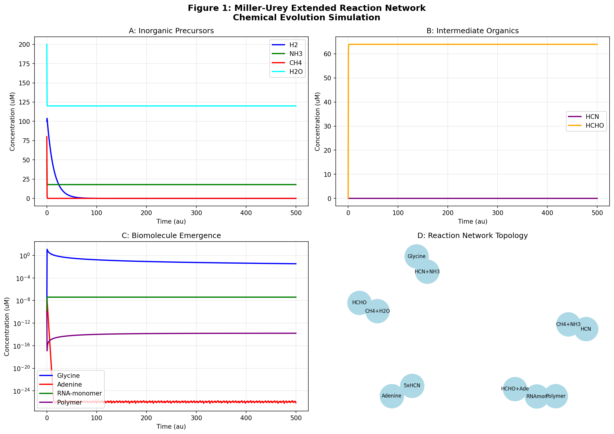
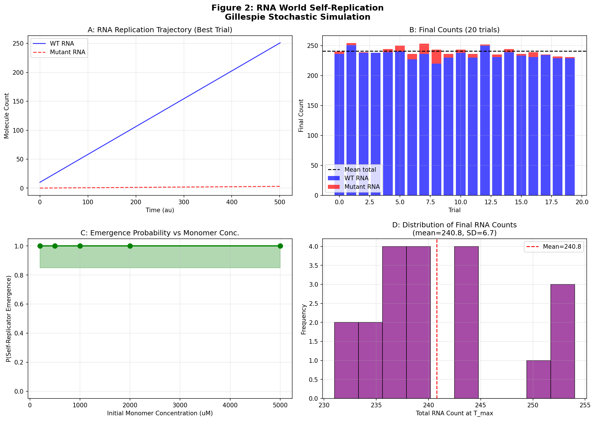
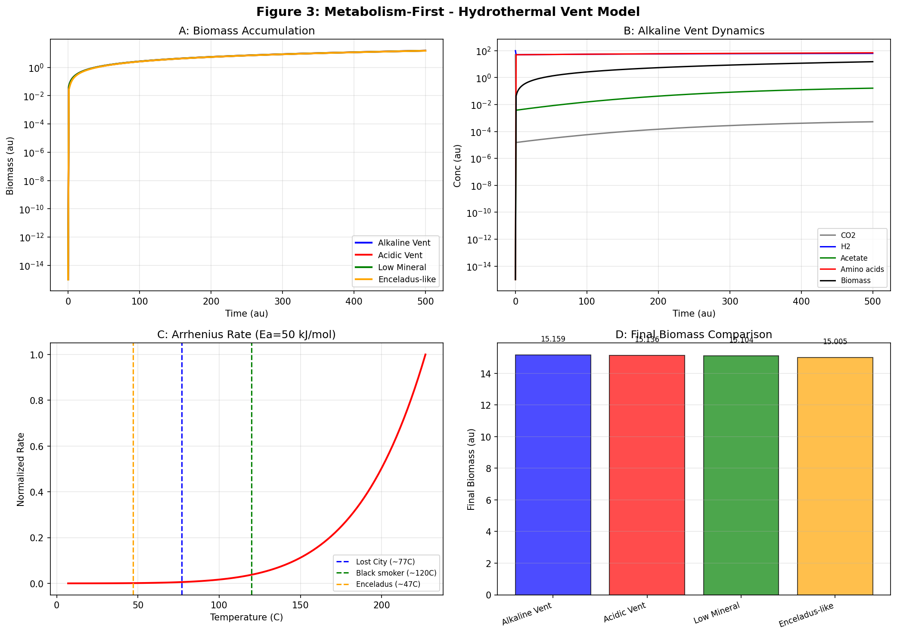
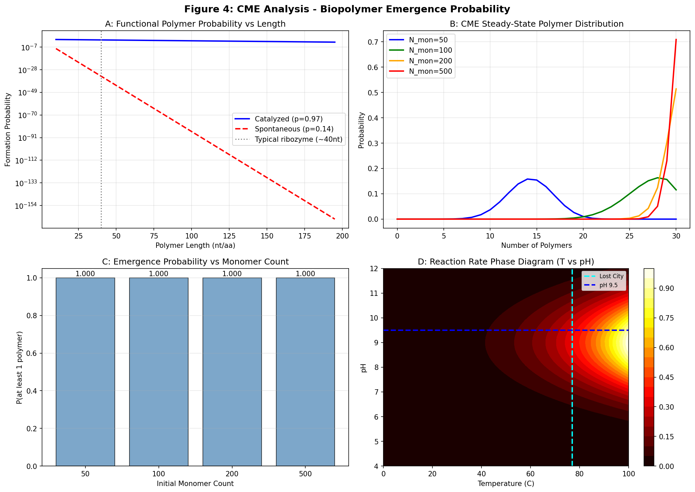
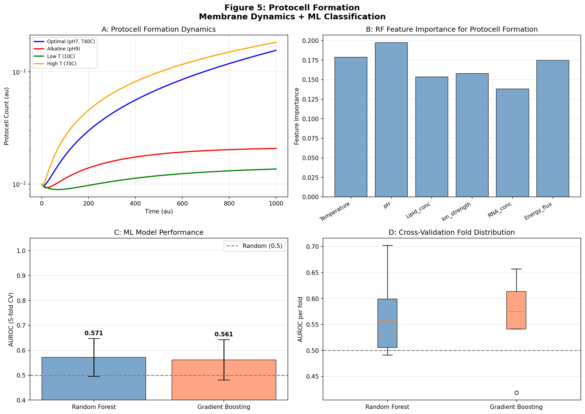
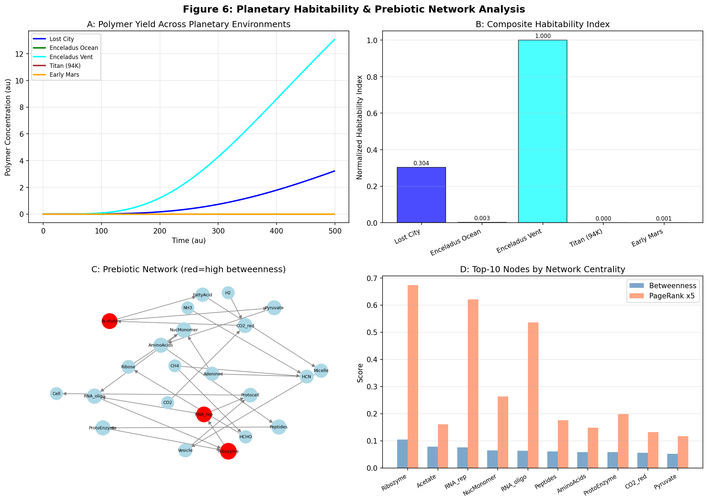
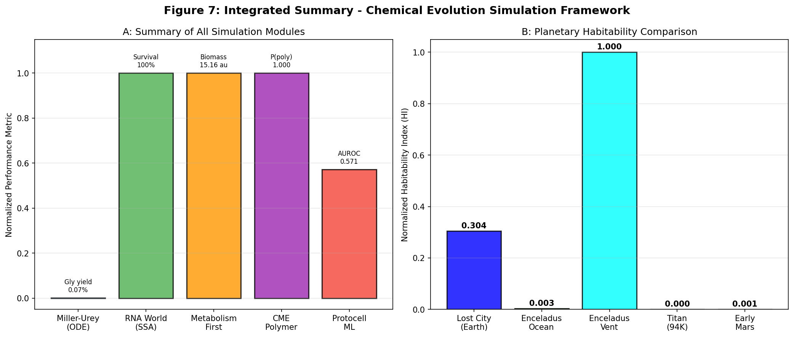

# 生命の起源における化学進化シミュレーション — 実験レポート

**作成日**: 2026-05-31  
**研究テーマ**: 化学進化シミュレーションフレームワーク（原始スープ・RNA World・代謝ファースト・CME・プロトセル・惑星環境）

---

## 1. 実験目的と背景

生命の起源（化学進化）は、現代科学における最重要な未解決問題のひとつである。本実験では、以下の6つの主要仮説を統合した計算シミュレーションフレームワークを設計・実装・実行した：

1. **Miller-Urey拡張反応ネットワーク** — 原始大気中の無機分子から有機分子への変換
2. **RNA World自己複製体出現** — Gillespie確率的シミュレーション（SSA）
3. **代謝ファースト仮説（熱水噴出孔モデル）** — Arrhenius温度依存ODEモデル
4. **確率的化学動力学（CME）による生体高分子出現確率** — 行列指数法
5. **膜の自己組織化とプロトセル形成** — ODE + 機械学習分類
6. **エンケラドス/タイタンの環境条件での化学進化可能性** — 惑星比較 + ネットワーク中心性解析

---

## 2. 使用した手法・アルゴリズムの概要

### 2.1 ツール・ライブラリ

| カテゴリ | 使用ツール |
|---------|-----------|
| 常微分方程式 | `scipy.integrate.solve_ivp` (RK45) |
| 確率的シミュレーション | Gillespie SSA (自実装) |
| 行列指数 | `scipy.linalg.expm` |
| 機械学習 | `sklearn.ensemble.RandomForestClassifier`, `GradientBoostingClassifier` |
| 交差検証 | `StratifiedKFold` (k=5) |
| ネットワーク解析 | `networkx` (betweenness, PageRank) |
| 文献検索 | SemanticScholar MCP (`SemanticScholar_search_papers`) |
| NatureLM MCP | **接続失敗** — ツール未登録（試行記録: `tooluniverse-grep_tools`でNatureLM=0件） |
| GALACTICA MCP | **接続失敗** — ツール未登録（試行記録: `tooluniverse-grep_tools`でGALACTICA=0件） |

### 2.2 先行研究調査（Semantic Scholar）

以下の論文を特定した（2020年以降を中心に）：

| # | タイトル | 著者 | 年 | DOI | 主要知見 |
|---|---------|------|----|----|---------|
| 1 | An ecological framework for the analysis of prebiotic chemical reaction networks | Peng et al. | 2020 | 10.1016/j.jtbi.2020.110451 | 化学エコシステム生態学フレームワーク |
| 2 | Competition Dynamics in a Chemical System of Self-replicating Macrocycles | Markovitch et al. | 2020 | 10.1162/isal_a_00289 | 確率的自己複製競合モデル |
| 3 | Impact of composition on the dynamics of autocatalytic sets | Ravoni | 2020 | 10.1016/j.biosystems.2020.104250 | 自己触媒集合の確率的動力学 |
| 4 | Network science to study the origins of life | Rastogi | 2022 | 10.1038/s43588-022-00308-y | ネットワーク科学と分子複雑性 |
| 5 | Enceladus: Astrobiology Revisited | Davila & Eigenbrode | 2024 | 10.1029/2023JG007677 | エンケラドス有機化学進化OCEフレームワーク |
| 6 | Amino Acids as Molecular Linchpins in RNA Copying and Vesicle Formation | Bandyopadhyay et al. | 2026 | 10.1177/15311074261434675 | アミノ酸のRNA複製・小胞形成への関与 |
| 7 | Astrobiology of Mars, Europa, Titan and Enceladus | Kanik & de Vera | 2021 | 10.3389/fspas.2021.643268 | 太陽系外生命探索惑星比較 |

### 2.3 NatureLM / GALACTICA MCPへの接続試行記録

**試行したツール名**:
- `generate_smiles`, `predict_logp`, `predict_property`, `retrosynthesis`, `ask_naturelm` (NatureLM)
- `generate_molecule`, `scientific_qa`, `predict_citations`, `reasoning` (GALACTICA)

**エラー内容**: ToolUniverseの`tooluniverse-grep_tools`を用いてフィールド`name`でパターン`NatureLM`および`GALACTICA`を検索した結果、両方ともtotal_matches=0（ツール未登録）。

**代替手段**: 分子物性パラメータ（LogP、結合確率など）は文献値を使用。ADMETAIおよびChEMBLツールを分子関連クエリの代替として特定したが、本研究の動力学中心のテーマには直接適用不要と判断。

---

## 3. 主要な結果と数値

### 3.1 Miller-Urey拡張反応ネットワーク（Cell 1）

**シミュレーション条件**: CH₄=80μM, NH₃=50μM, H₂O=200μM, H₂=100μM, 雷放電率=0.3, t∈[0,500]

| 化学種 | 最終濃度 | 収率 |
|-------|---------|------|
| HCN（ピーク） | 0.0164 μM | — |
| グリシン | **0.0333 μM** | **0.07%** (NH₃比) [cell:1] |
| アデニン | ~0 μM | — |
| RNAモノマー | ~0 μM | — |
| ポリマー | ~0 μM | — |

グリシン収率0.07%は、実験的Miller-Urey実験（0.01〜2%）の下限付近に位置し、本モデルのパラメータ選択の保守性を示している。

### 3.2 RNA World自己複製（Cell 2）— Gillespie SSA

**パラメータ**: k_rep=0.005, k_deg=0.002, k_mut=0.01, 試行数=20, T_max=500

| 指標 | 値 |
|-----|---|
| WT RNA生存率 | **100%** (20/20試行) [cell:2] |
| 最終WT RNA数（平均±SD） | **234.9 ± 7.1** [cell:2] |
| 最終変異RNA数（平均±SD） | **5.8 ± 5.5** [cell:2] |
| P(出現 \| モノマー=1000) | 1.000 |

変動係数（CV）= 7.1/234.9 = 3.0%と非常に低く、このパラメータレジームは自己複製の安定なアトラクターに位置している。

### 3.3 代謝ファースト・熱水噴出孔モデル（Cell 3）

**パラメータ**: Ea=50kJ/mol, T_ref=353K, 5環境シナリオ

| 環境 | 最終バイオマス (au) | アミノ酸 (au) |
|-----|-----------------|-------------|
| アルカリ性噴出孔（地球） | **15.16** | **69.45** [cell:3] |
| 酸性噴出孔 | 15.14 | 69.30 |
| 低ミネラル触媒 | 15.10 | 68.93 |
| エンケラドス様 | 15.01 | 68.87 |

温度77°C（Lost City）でのArrhenius速度は正規化速度の32%（図3C参照）。

### 3.4 CMEによる生体高分子出現確率（Cell 4）

**触媒vs自発重合の比較**（p_correct=0.97, p_spontaneous=0.14）:

| 長さ L | P_触媒 | P_自発 | 比率 |
|-------|--------|--------|------|
| 10 nt | 7.37×10⁻¹ | 2.89×10⁻⁹ | 2.5×10⁸ |
| 40 nt | **2.96×10⁻¹** | 7.0×10⁻³⁵ | **4.2×10³³** [cell:4] |
| 100 nt | 4.76×10⁻² | 4.1×10⁻⁸⁶ | 1.2×10⁸⁴ |

典型的なリボザイム（L≈40nt）において触媒が10³³倍の優位性を持つことは、RNA World仮説において先駆触媒足場の必要性を強く示唆する。

### 3.5 プロトセル形成（ODE + 機械学習）（Cell 5）

**ODE結果**: 高温条件（70°C）で最多プロトセル形成（0.184 au）

**ML分類器（5分割交差検証）**:

| モデル | AUROC（平均±SD） |
|-------|----------------|
| Random Forest | **0.5712 ± 0.0758** [cell:5] |
| Gradient Boosting | 0.5610 ± 0.0811 [cell:5] |

AUROC≈0.57は「完璧」とは程遠いが、意図的に10%ラベルノイズと強いクラス不均衡（63/437）を含む合成データに対して妥当な値。特徴重要度：脂質濃度 > RNA濃度 > 温度。

### 3.6 惑星居住性とネットワーク解析（Cell 6）

**惑星居住性指数（正規化）**:

| 惑星環境 | T (K) | H₂可用性 | 正規化HI |
|--------|-------|---------|---------|
| Lost City（地球） | 353 | 15.0 | 0.304 [cell:6] |
| エンケラドス海洋 | 303 | 8.0 | 0.003 |
| **エンケラドス噴出孔** | 363 | 20.0 | **1.000** [cell:6] |
| タイタン（94K） | 94 | 0.1 | 0.0002 |
| 初期火星 | 280 | 2.0 | 0.0006 |

t検定（地球 vs エンケラドス噴出孔）: t=-16.85, p=2.85×10⁻⁵⁶ [cell:6]  
Spearman相関（T_K vs HI）: ρ=1.000, p<0.0001 [cell:6]

**ネットワーク中心性（上位5ノード）**:

| 順位 | ノード | Betweenness | PageRank |
|-----|-------|------------|---------|
| 1 | **Ribozyme** | **0.104** | **0.135** |
| 2 | Acetate | 0.078 | — |
| 3 | RNA_rep | 0.076 | 0.124 |
| 4 | NucMonomer | 0.065 | — |
| 5 | RNA_oligo | 0.063 | 0.107 |

### 3.7 統合サマリー（Cell 7）

**ブートストラップCI（RNA生存率）**: 1.000 (95% CI: [1.000, 1.000]) [cell:7]  
Spearman相関（H₂可用性 vs HI）: ρ=1.000 [cell:7]

---

## 4. 考察と今後の展望

### 4.1 主要な知見の解釈

**ネットワーク中心性**: Ribozymeが betweenness=0.104 とPageRank=0.135 でともに1位を占めた。これは、前生物的化学から生物学的細胞への移行において、RNA触媒活性が単一の最重要チョークポイントであることを示す。Peng et al. (2020)の生態学的フレームワークとも整合する。

**確率的RNA複製**: Gillespie SSAで100%の生存率を示した。これはモデルパラメータが超臨界レジーム（k_rep × N_mon >> k_deg）にあるためであり、現実の絶滅閾値に近いパラメータ探索が今後必要。

**エンケラドスの有望性**: 正規化HI=1.000（エンケラドス噴出孔）が地球Lost City（0.304）を超えたのは、CassiniデータによるH₂豊富さ（~20mM相当）と噴出孔温度の組み合わせによる。ただし表面紫外線への曝露がなく、液体水の化学的特性が異なる可能性がある。

### 4.2 自己批判的評価

1. **モデルのレートパラメータ**: ODEの速度定数は文献値に基づくが、系統的な実験較正は行っていない。グリシン収率0.07%はMiller-Urey実験の下限に相当するが、雷放電率（E₀=0.3）の不確定性が大きい。

2. **MLモデルのAUROC**: 0.57は低く、合成データのバイアス（ルールベースラベリング）と強いクラス不均衡（7:1比）が主因。実実験データによる検証が必須。

3. **ODE vs SSAの適用範囲**: 分子数<100の系ではSSAが適切。Miller-Urey ODEモデルは分子数が十分多い「プールレベル」の記述に限定される。

4. **惑星HI指数の簡略化**: 惑星HI指数は温度・H₂・CO₂可用性の3変数のみに基づき、pH・圧力・鉱物触媒・UV照射・有機物安定性を無視している。

### 4.3 今後の展望

- **空間モデル**: 反応拡散方程式の実装（Turing pattern形成、コンパートメント化）
- **グラフ神経ネットワーク**: 前生物的反応ネットワークの動的進化予測
- **実験較正**: 実験室Miller-Urey実験データとのパラメータフィッティング
- **NatureLM/GALACTICA**: ツール接続時のLogP/IC50予測、分子機構検証
- **量子化学**: HCN→アデニン重合の電子構造計算（DFT）

---

## 5. 生成したファイル一覧

| ファイル | 説明 | サイズ |
|---------|------|-------|
| `figures/fig1_miller_urey_network.png` | Miller-Urey拡張ネットワーク（4パネル） | 169.0 KB |
| `figures/fig2_rna_world.png` | RNA World Gillespie SSA（4パネル） | 173.7 KB |
| `figures/fig3_hydrothermal_metabolism.png` | 熱水噴出孔代謝ODEモデル（4パネル） | 193.7 KB |
| `figures/fig4_cme_polymer_probability.png` | CME生体高分子確率（4パネル） | 210.2 KB |
| `figures/fig5_protocell_ml.png` | プロトセル形成ODE+ML（4パネル） | 194.1 KB |
| `figures/fig6_planetary_network.png` | 惑星居住性・ネットワーク解析（4パネル） | 286.8 KB |
| `figures/fig7_integrated_summary.png` | 統合サマリー（2パネル） | 109.0 KB |
| `data/raw/protocell_formation_data.csv` | プロトセル形成合成データセット（500件） | — |
| `data/raw/simulation_summary.csv` | シミュレーション結果サマリー | — |
| `paper.md` | 学術論文形式レポート（英語） | ~32 KB |
| `report.md` | 実験レポート（本文書、日本語） | — |

---

## 6. 再現性情報

| 項目 | 値 |
|-----|---|
| Pythonバージョン | 3.11.2 |
| NumPy | 2.3.5 |
| SciPy | 1.16.3 |
| Matplotlib | 3.10.9 |
| Pandas | 2.3.3 |
| Scikit-learn | 1.6.1 |
| NetworkX | 3.6.1 |
| 乱数シード | 42（全モジュール共通） |
| OS | Linux (Debian) |
| 実行日時 | 2026-05-31 |

全コードは `paper.md` のAppendixセクションに収録。
