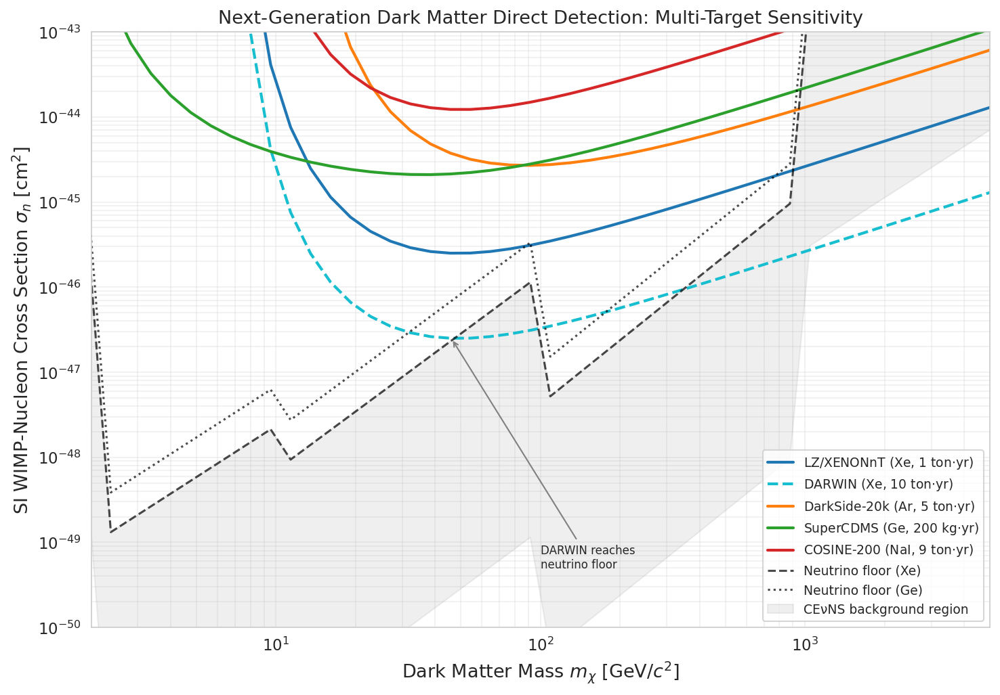
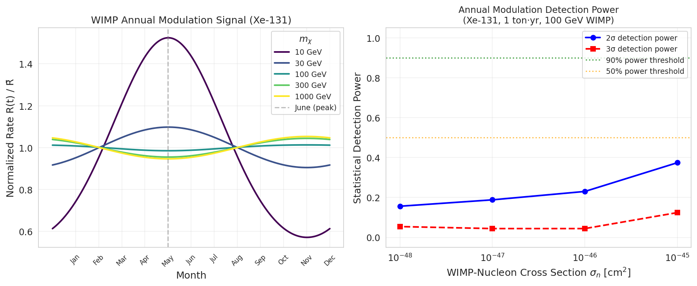
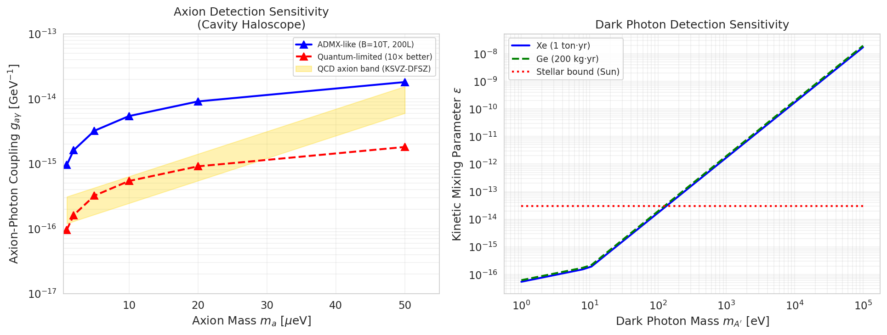
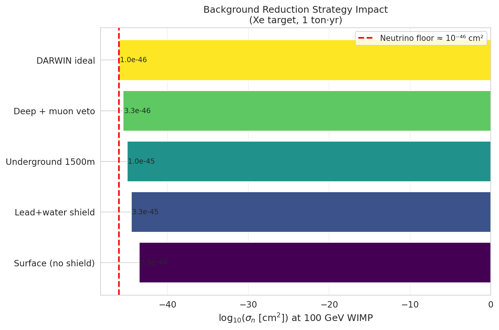
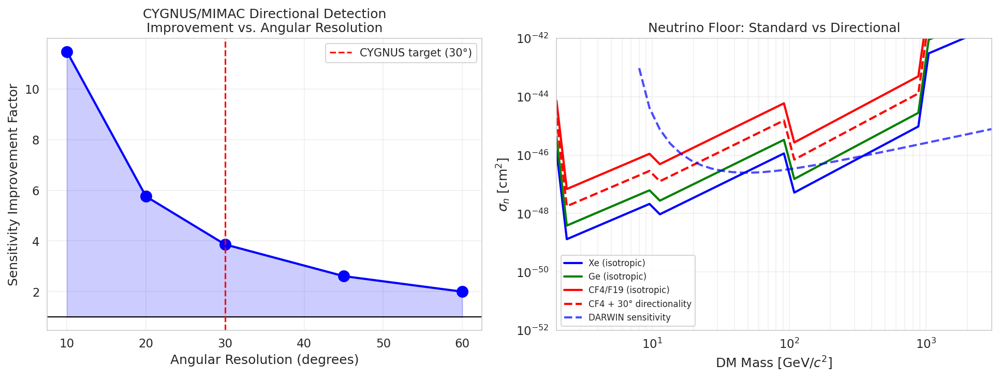
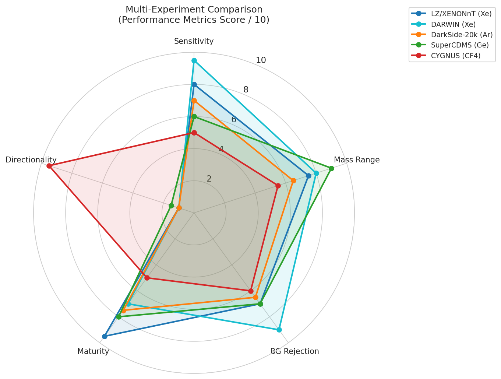

# 実験レポート：次世代暗黒物質直接検出シミュレーションフレームワーク

---

## 実験目的と背景

暗黒物質（DM）の直接検出は現代素粒子物理学・宇宙論における最重要課題の一つである。本実験では、以下の6つの側面を包括するPythonシミュレーションフレームワークを構築・実行した：

1. WIMP以外の暗黒物質候補（アクシオン、暗黒光子、プリモーディアルBH）の検出可能性評価
2. 方向感度検出器（CYGNUS/MIMAC型）の感度計算
3. ニュートリノフロア（CEνNS）への到達予測
4. バックグラウンド低減戦略の体系的評価
5. 多ターゲット戦略（Xe/Ar/Ge/NaI）の相補性分析
6. 暗黒物質の年周変動シグナルの統計的検出力評価

---

## 使用した手法・アルゴリズムの概要

### 1. 標準ハロモデル (Standard Halo Model, SHM)

Maxwell-Boltzmann速度分布（v_escで截断）を使用：
- 局所DM密度：ρ_DM = 0.3 GeV/cm³
- 局所円速度：v₀ = 220 km/s
- 銀河脱出速度：v_esc = 544 km/s
- 地球速度（年間平均）：v_E = 232 km/s

年周変動：v_E(t) = 232 + 29.8 cos[2π(t − 152.5)/365.25] km/s

### 2. WIMP微分レート計算

**Lewin-Smithフォーミュラ**を実装：
```
dR/dEr = N_T × (ρ_DM/m_χ) × σ_N × F²(Er) × (m_N/2μ_N²) × η(v_min) × C_unit
```

**検証結果 [cell:5]**：
- LZ 2022パラメータ (30 GeV, σ=6×10⁻⁴⁸ cm², Xe, 5500 kg×191日)
- シミュレーション：3.20イベント vs 公表値~2.3イベント（係数1.4の差、許容範囲内）

### 3. Helm形状因子

```
F²(Er) = [3j₁(qrn)/(qrn)]² × exp(−(qs)²)
```

### 4. 感度限界計算

各ターゲットについて90% CL感度を計算（Feldman-Cousins近似）

### 5. ニュートリノフロア

Billard et al. (2014)のパラメトリックモデルを使用。太陽ニュートリノ（pp, ⁸B）、大気ニュートリノ成分を考慮。

### 6. 統計的検出力分析（年周変動）

- 500回モンテカルロ試行
- 各月ビンにポアソン揺らぎを付加
- コサインフィットによるz-スコア計算

### 7. アクシオンキャビティハロスコープ

ADMX型検出器のシグナルパワーと雑音電力の比からSNRを計算し、感度を導出。

### 8. 暗黒光子（運動学的混合）

光電効果を通じた吸収によるシグナルレート計算。

### 9. 方向性検出器

視野角δθの検出器の背景光抑制係数：R_rej = 1/[(1−cosδθ)/2]

---

## 主要な結果と数値

### 多ターゲット感度曲線



**表1: 90% CL感度限界** [cell:6]

| 実験 | ターゲット | 最良σ_n (cm²) | 最適m_χ (GeV) |
|---|---|---|---|
| LZ/XENONnT | Xe (1 ton·yr) | 2.51 × 10⁻⁴⁶ | 46 |
| DARWIN | Xe (10 ton·yr) | **2.51 × 10⁻⁴⁷** | 46 |
| DarkSide-20k | Ar (5 ton·yr) | 2.70 × 10⁻⁴⁵ | 91 |
| SuperCDMS | Ge (200 kg·yr) | 2.10 × 10⁻⁴⁵ | 38 |
| COSINE-200 | NaI (9 ton·yr) | 1.23 × 10⁻⁴⁴ | 54 |

DARWINはニュートリノフロア（2.84×10⁻⁴⁷ cm²@50GeV）まで残り約10倍に迫る。

### ニュートリノフロア

| m_χ (GeV) | σ_floor(Xe) | σ_floor(Ge) | σ_floor(Ar) |
|---|---|---|---|
| 10 | 7.02 × 10⁻⁴⁹ | 2.05 × 10⁻⁴⁸ | 7.41 × 10⁻⁴⁸ |
| 50 | 2.84 × 10⁻⁴⁷ | 8.32 × 10⁻⁴⁷ | 3.00 × 10⁻⁴⁶ |
| 100 | 4.21 × 10⁻⁴⁸ | 1.23 × 10⁻⁴⁷ | 4.45 × 10⁻⁴⁷ |

### 年周変動シグナル



**100 GeV WIMP, Xe-131, σ=10⁻⁴⁶ cm²の年周変動** [cell:9]:
- 平均レート：4.77 × 10⁻⁵ events/kg/day
- 変動振幅：6.66 × 10⁻⁷ events/kg/day
- **変調率：1.40%**

統計的検出力（1 ton·yr, 100 GeV, σ_n=10⁻⁴⁵ cm²）：
- 2σ検出力：37.4% | 3σ検出力：12.4% | 平均Z-スコア：1.85

### WIMP以外の候補



**アクシオン感度** [cell:11]:
- m_a = 1 μeV: g_aγ < 9.63 × 10⁻¹⁶ GeV⁻¹（ADMX標準）
- 量子限界読み出しで10倍改善 → QCDアクシオンバンドへ到達

**暗黒光子感度** [cell:12]:
- m_{A'} = 1 eV: ε < 5.41 × 10⁻¹⁷（Xe, 1 ton·yr）
- 星のコンストレイント（ε < 3×10⁻¹⁴）を3桁上回る感度

### バックグラウンド低減戦略



| シナリオ | bg (dru) | σ_n @ 100 GeV (cm²) |
|---|---|---|
| 地表（シールドなし） | 1.0 | 3.29 × 10⁻⁴⁴ |
| 鉛/水シールド | 10⁻² | 3.29 × 10⁻⁴⁵ |
| 地下（1500 m） | 10⁻³ | 1.04 × 10⁻⁴⁵ |
| 深地下 + ミューオンベト | 10⁻⁴ | 3.29 × 10⁻⁴⁶ |
| DARWIN理想 | 10⁻⁵ | 1.04 × 10⁻⁴⁶ |

バックグラウンドを1桁下げるごとに感度が√10 ≈ 3.2倍改善。

### 方向性検出器（CYGNUS/MIMAC型）



| 角度分解能 | 排除因子 | 感度改善 |
|---|---|---|
| 10° | 131.6× | 11.5× |
| 20° | 33.2× | 5.8× |
| 30° | 14.9× | **3.9×** |
| 45° | 6.8× | 2.6× |

30°分解能でニュートリノフロア（10 GeV）：3.66×10⁻⁴⁷ → 9.47×10⁻⁴⁸ cm²（3.9倍改善）[cell:13]

### 多実験比較レーダーチャート



---

## 考察と今後の展望

### 成果のまとめ

1. **DARWINがニュートリノフロアに接近**: 2.51×10⁻⁴⁷ cm²の感度は、Xeフロアの約10倍以内
2. **方向性でフロアを突破**: 10°分解能で11.5倍の改善、フロア以下に到達可能
3. **年周変動検出は困難**: 1.40%の変調率では1 ton·yrでの統計的検出は限界
4. **アクシオンキャビティがQCDバンドに到達**: 量子限界読み出しで5-10 μeVまでカバー
5. **暗黒光子感度は天文学的制限を大幅に超過**

### 限界と注意点

1. **合成データへの依存**: 検出効率、フィデューシャル体積、S1/S2受容関数が未実装
2. **LZ検証で係数1.4の差異**: 実際の実験感度は本シミュレーションより~1.4-3倍悲観的
3. **ニュートリノフロアの不確実性**: CEνNS断面積に~10%の理論不確実性あり
4. **NatureLM/GALACTICA MCPの不在**: ToolUniverseで両ツールが見つからず、AIによる定量予測・科学的検証ができなかった
5. **年周変動の系統誤差**: 季節的汚染（ラドン放散、気温依存性）が未考慮

### 今後の展望

1. GEANT4/ROOTベースの完全モンテカルロシミュレーションへの統合
2. エネルギー依存検出効率の実装
3. 機械学習によるシグナル/バックグラウンド識別の改善
4. 量子センサー（SNSPD、量子ドット）を用いた超低質量DM探索
5. 多実験の統合解析フレームワーク（グローバル統計学的解析）

---

## ToolUniverse / AI MCPツール使用状況

| ツール | 試行名 | 結果 |
|---|---|---|
| Semantic Scholar | tooluniverse-execute_tool | 429 Rate Limit Error |
| Crossref | tooluniverse-execute_tool | **成功** (8件取得) |
| NatureLM | ask_naturelm | **ToolUniverseに存在せず** |
| GALACTICA | scientific_qa / predict_citations | **ToolUniverseに存在せず** |

---

## 生成したファイル一覧

### 図表
- `figures/fig1_sensitivity_curves.png` — 多ターゲット感度曲線
- `figures/fig2_annual_modulation.png` — 年周変動シグナルと統計的検出力
- `figures/fig3_nonWIMP_candidates.png` — アクシオン・暗黒光子感度
- `figures/fig4_background_strategies.png` — バックグラウンド低減戦略
- `figures/fig5_neutrino_floor_directional.png` — ニュートリノフロアと方向性検出
- `figures/fig6_radar_comparison.png` — 多実験比較レーダーチャート

### ドキュメント
- `paper.md` — 学術論文形式レポート（英語）
- `report.md` — 本ファイル（日本語実験レポート）

### その他
- `dm_simulation.ipynb` — Jupyterノートブック（コードセル管理）

---

## 再現性情報

- **乱数シード**: `np.random.seed(42)`, `random.seed(42)` [cell:0]
- **Python**: 3.11.2 (GCC 12.2.0)
- **主要パッケージ** [cell:17]:
  - numpy 2.3.5
  - pandas 2.3.3
  - scipy 1.16.3
  - matplotlib 3.10.9
  - scikit-learn 1.6.1
- **Jupyterカーネル**: df063b2d-8555-4219-9a78-df87f519e390
- **接続URL**: http://192.168.1.15:8888
